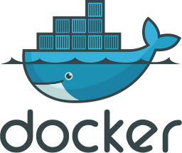

<h1 align="center">Hi 👋, I'm Phạm Thanh Tân</h1>
<h3 align="center">DevOps Engineer Intern from Vietnam</h3>

  

### Resume / CV

  
  &nbsp;
  

**About Me**  
- 🔭 I’m a recent graduate of **FPT University**  
- 🌱 Currently exploring **Docker and Kubernetes** to build private cloud infrastructures  
- 💬 Interested in discussing **Simple ML and DL** concepts  
- 📫 Reach me at **Phamthanhtanlop92@gmail.com**  
- 💼 Experience: **Under 2 years in DevOps-related roles**  
- ⚡ Fun fact: **I believe in hard work and continuous learning**

I’m a DevOps Engineer with a passion for automation, scalability, and problem-solving. My background includes experience with Python, Django, Flutter, VMware ESXi, Microservices, and various backend technologies. I’m always eager to socialize, learn, and take on new challenges.

---

### Connect with me

  
  
  

---

### Languages and Tools

   
   
   
  
   
  
   
  

---

### GitHub Stats

  <!-- Stats card (shows commits, PRs, issues, stars) -->
  
  &nbsp;
  <!-- Streak card -->
  
  &nbsp;
  <!-- Top languages card (compact layout) -->
  

---

### Fun Visuals

  

