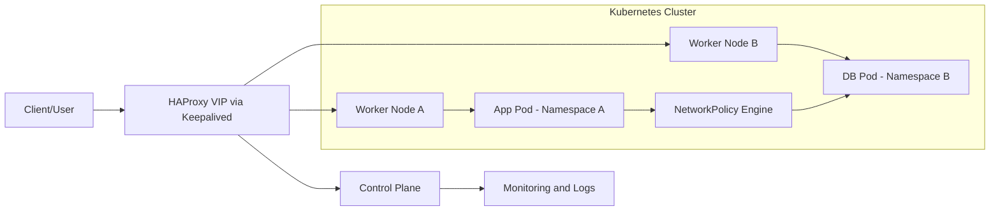

<h1 align="center">Phạm Thanh Tân | DevOps and Virtualization Engineer</h1>
<h3 align="center">Operating on-prem infrastructure and cloud-native Kubernetes platforms with an automation-first mindset.</h3>

  
  
  

  
  

  
  
  

  

---

## About Me

- 🎓 Graduate from **FPT University** in Information Assurance
- 🛠️ Built strong fundamentals through **IT Helpdesk** and **IT System operations** (incident handling, user support, system maintenance)
- 🧑‍💼 Managed **Office 365 / Entra ID**, **Exchange**, **Teams**, user licensing, and Microsoft Purview compliance/eDiscovery automation with PowerShell
- 🌐 Configured **DNS servers**, AD policy baselines, and endpoint management using **Desktop Central**
- 🏗️ Hands-on in **VMware vSphere** operations (ESXi, vCenter, vSAN, Horizon) for on-prem infrastructure
- ☸️ Built and operated **Kubernetes HA** environments with **HAProxy**, **Keepalived**, and policy-driven networking
- 🐳 Automated delivery workflows using **Gitlab CICD**, **Docker**, **Portainer**, **Traefik**, and Python scripting
- 🔐 Applied practical networking and security with Cisco switching, VLAN/L2/L3, and firewall stacks (pfSense, OPNsense, Sophos, Fortigate)
- 🌐 Documented branch connectivity and operations patterns for **MPLS network** environments
- 📈 Focused on reliability, scalability, and continuous operational improvement

  
  
  
  

---

## English Version

Short profile in English is summarized in **About Me**.
For full details, use [CV English](https://raw.githubusercontent.com/tanpham380/tanpham380/main/cv/PhamThanhTan-ENG.pdf).

## Phien Ban Tieng Viet

Tom tat tieng Viet da duoc rut gon trong **About Me**.
Chi tiet day du xem tai [CV Vietnamese](https://raw.githubusercontent.com/tanpham380/tanpham380/main/cv/PhamThanhTan-VIE.pdf).

---

## Connect

  
  
  

---

## Skills Matrix

| Category | Stack |
| --- | --- |
| Cloud and Containers |    |
| CI/CD and Ops Tools |     |
| IT System and Support |    |
| Languages and Backend |    |
| Data and Platform |   |

---

## Featured Projects

- **Software Defined Networking Demo on Kubernetes**
  Capstone project implementing secure service communication and high availability in Kubernetes with **NetworkPolicy**, **HAProxy**, **Keepalived**, and Python automation.
   
  [Project overview](./SDN/README.md) | [Main report](./SDN/Report/CP_Report_ver5.pdf) | [Configs](./SDN/configure/) | [Source code](./SDN/DevCode/)

- **More repositories**
  Explore additional labs and projects on [my GitHub repositories](https://github.com/tanpham380?tab=repositories).

- **Real-world use cases (Experiment Lab)**
  Place practical scenarios, PoCs, and architecture tests in [experiment](./experiment/) to keep the profile clean while showing hands-on depth.

- **Technical Guides (Network and Ops)**
  Internal-style documentation for operational standards and implementation playbooks, including [MPLS Network Technical Guide](./experiment/network/MPLS-network-technical-guide.md).

  
<strong>SDN architecture flow (Mermaid demo)</strong>

---

## GitHub Analytics

  
  
  

---

## Contributions Visual

  

