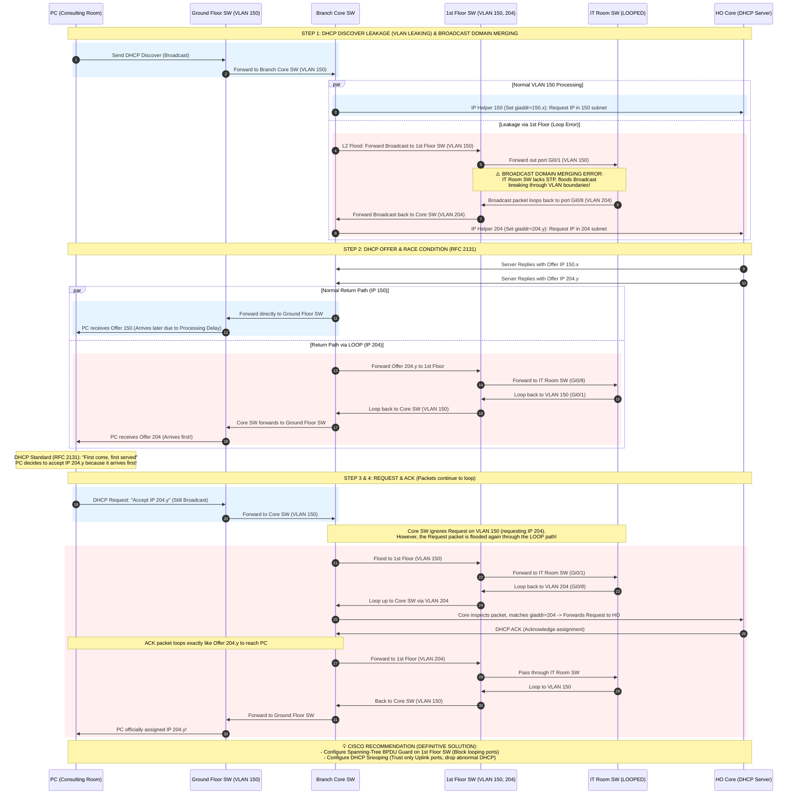

### 📌 Overview

This repository serves as a technical sandbox for researching, documenting, and implementing advanced solutions in Network infrastructure, System automation, and On-premise services.

#### 1. Network Infrastructure

Focuses on protocol stability and troubleshooting complex loop issues.

* **MPLS Technical Guide:** Detailed configuration and label switching logic.

* **VLAN Leaking & Layer 2 Loops:**
  * *Use Case:* Preventing broadcast storms in enterprise environments using STP and proper VLAN tagging. 
  * *Problem:* The PC in the Consulting Room belongs to VLAN 150, but it ultimately received an IP address from VLAN 204, which is designated for a different range.
  * *Diagram:*

#### 2. System Administration & High-Performance Computing

* **AI Infrastructure & Cloud GPU Provisioning**
* **Use Case:** Architecting and managing hybrid computing environments for heavy AI/Deep Learning workloads, balancing local resources and cloud scalability.
* **Experience & Solution:** Directly deployed and administered an on-premise AI server infrastructure featuring 4x NVIDIA A5000 GPUs. Implemented **vGPU** virtualization to optimize resource sharing. Combined containerization (**Docker**) with dynamic cloud GPU scaling via **Vast.ai** to ensure flexible, cost-effective, and highly secure computing resources.

* **Enterprise Application Lifecycle & CI/CD Automation**
* **Use Case:** End-to-end development, automation, and release management of enterprise applications (e.g., Portal Á Âu, Bảo Trì Á Âu) with strict security and platform compliance.
* **Experience & Solution:** Built cross-platform UIs using **Flutter** and developed **Python** scripts for system task automation. Designed and maintained **GitLab CI/CD** pipelines to fully automate the build, test, infrastructure setup, and deployment processes, ensuring secure public releases and compliance with the latest Google Play APIs.

