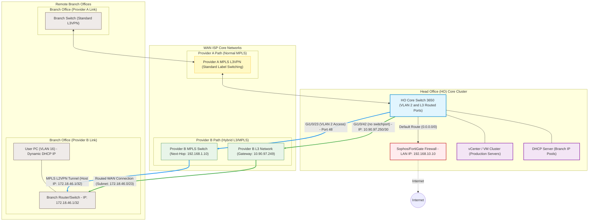
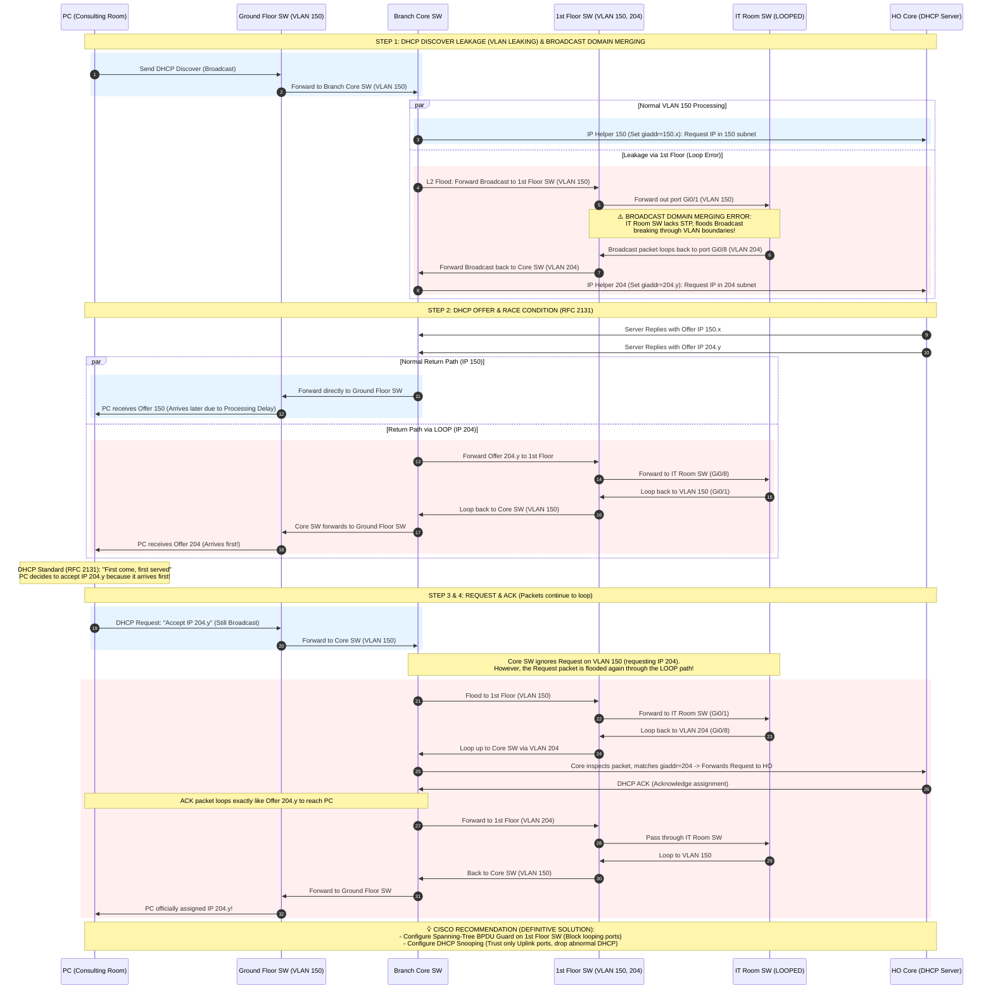
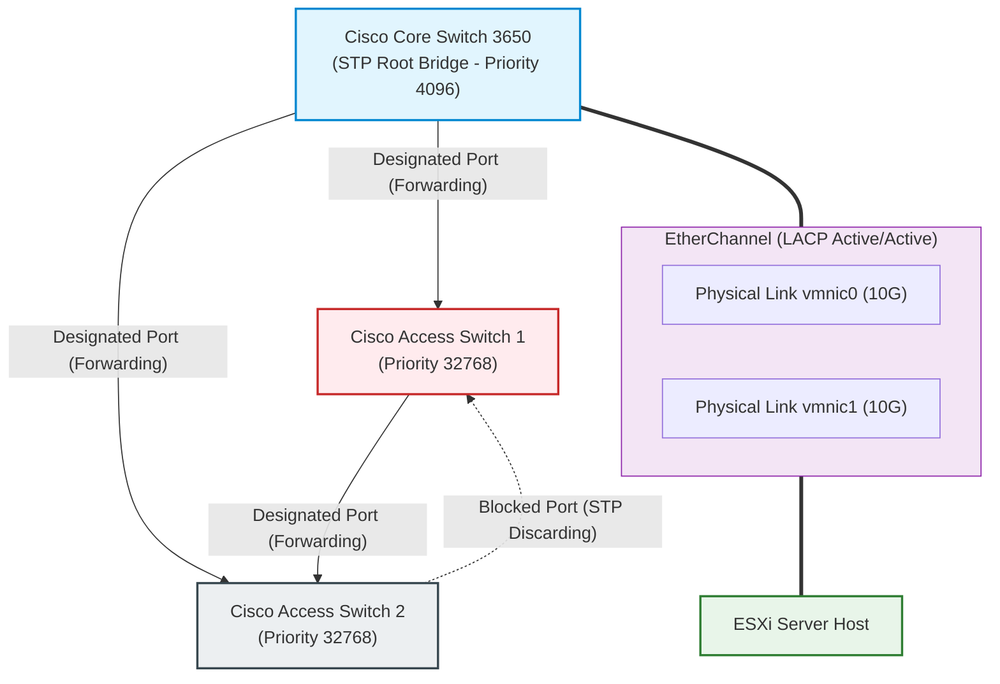
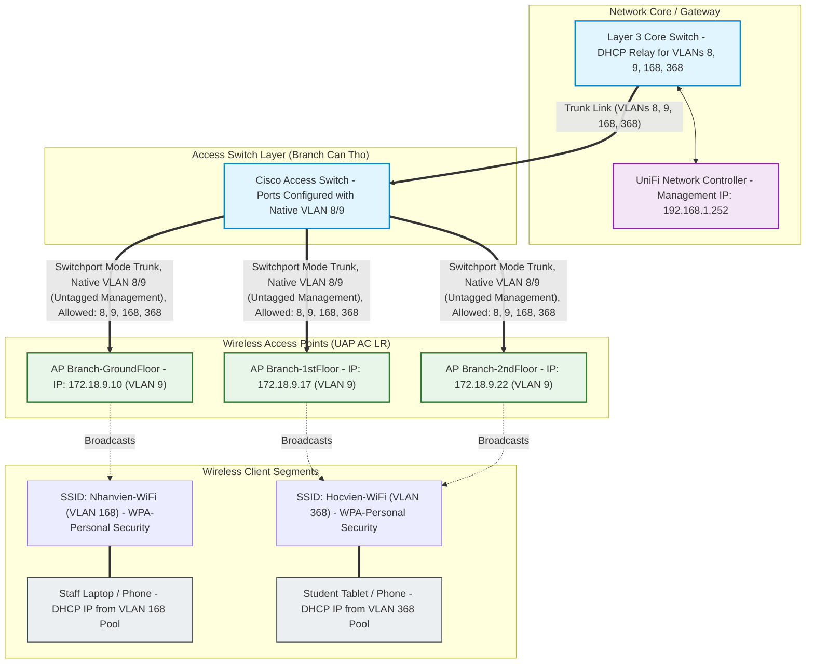
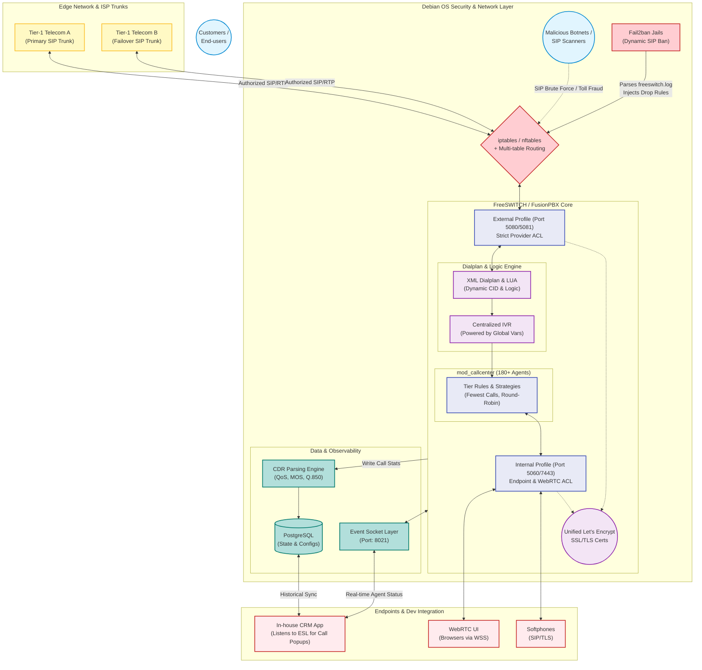
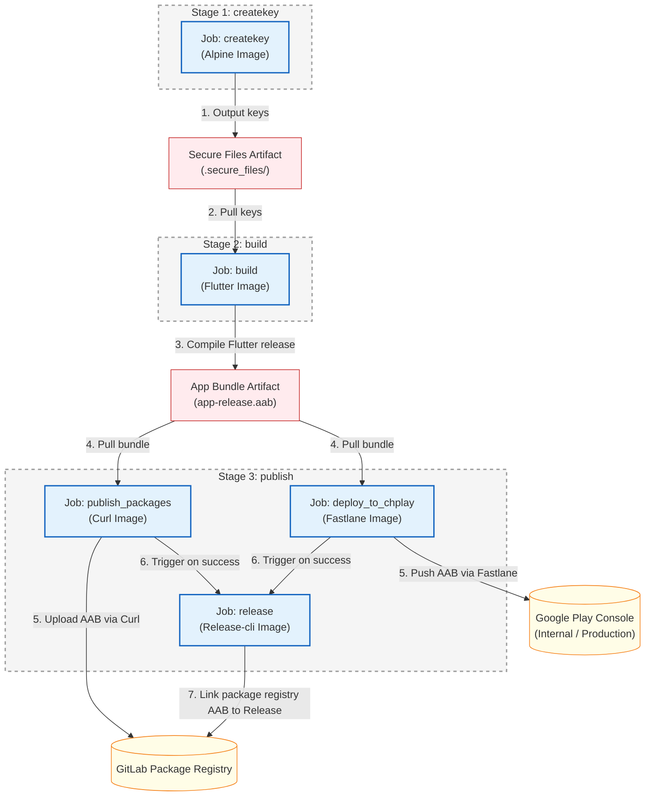
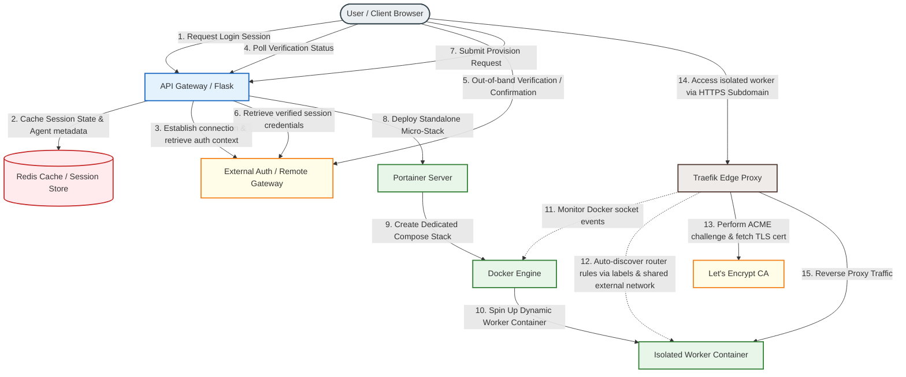

```mermaid
graph TD
    %% Styling Definitions
    classDef switch fill:#e1f5fe,stroke:#0288d1,stroke-width:2px;
    classDef host fill:#e8f5e9,stroke:#2e7d32,stroke-width:2px;
    classDef vds fill:#f3e5f5,stroke:#8e24aa,stroke-width:2px;
    classDef vss fill:#fff3e0,stroke:#ff9800,stroke-width:2px;
    classDef storage fill:#fff8e1,stroke:#ff8f00,stroke-width:2px;
    classDef vm fill:#eceff1,stroke:#37474f,stroke-width:1px;

    %% PHYSICAL SWITCHES
    subgraph Physical_Network ["Physical Network (Leaf-Spine)"]
        Switch_A["Top-of-Rack Switch A (10G/25G Trunk)"]:::switch
        Switch_B["Top-of-Rack Switch B (10G/25G Trunk)"]:::switch
    end

    %% vCENTER SERVER
    vCenter["vCenter Server (Active Cluster Management)"]:::vds

    %% PHYSICAL ESXi HOSTS
    subgraph ESXi_Cluster ["ESXi Host Cluster"]
        subgraph ESXi_Node ["Single ESXi Host Instance"]
            %% Physical Uplinks
            vmnic0["Physical Uplink vmnic0 (10G SFP+)"]
            vmnic1["Physical Uplink vmnic1 (10G SFP+)"]
            vmnic2["Physical Uplink vmnic2 (1G Cu)"]
            vmnic3["Physical Uplink vmnic3 (1G Cu)"]
            
            %% vSphere Distributed Switch
            subgraph vDS_Switch ["vSphere Distributed Switch (vDS)"]
                direction TB
                Uplink_Group["Distributed Uplink Group (LACP Port Channel)"]
                
                %% vDS Port Groups
                pg_vsan["dvPortGroup-vSAN (Storage VLAN) - MTU 9000"]
                pg_vmotion["dvPortGroup-vMotion (Migration VLAN) - MTU 9000"]
                pg_mgmt["dvPortGroup-Management (Mgmt VLAN) - MTU 1500"]
                pg_staff["dvPortGroup-Staff (Employee VLAN) - MTU 1500"]
                pg_guest["dvPortGroup-Guest (Guest VLAN) - MTU 1500"]
            end

            %% vSphere Standard Switch
            subgraph vSS_Switch ["vSphere Standard Switch (vSS)"]
                direction TB
                Standard_Uplink["vSS Uplink Group (NIC Teaming)"]
                
                %% vSS Port Groups
                pg_pfsense_lan["PortGroup-Firewall_LAN (LAN VLAN)"]
                pg_pfsense_wan["PortGroup-Firewall_WAN (Untagged)"]
            end
            
            %% VMkernel Adapters
            vmk0["vmk0 (Management IP)"]
            vmk1["vmk1 (vSAN Storage IP)"]
            vmk2["vmk2 (vMotion Migration IP)"]
        end
    end

    %% VIRTUAL MACHINES
    vCenter_VM["vCenter Appliance VM"]:::vm
    Firewall_VM["Virtual Firewall VM"]:::vm
    Prod_VM["Production Guest VMs"]:::vm
    
    %% DATASTORES
    vSAN_DS[("vSAN Clustered Datastore")]:::storage
    NFS_DS[("Network Backup Storage (NFS)")]:::storage

    %% CONNECTIONS
    vCenter -. Manages .-> vDS_Switch
    vCenter -. Manages .-> vSS_Switch

    %% VM to Port Group mappings
    vCenter_VM --- pg_mgmt
    Prod_VM --- pg_staff
    Prod_VM --- pg_guest
    Firewall_VM --- pg_pfsense_lan
    Firewall_VM --- pg_pfsense_wan

    %% VMkernel to Port Groups
    vmk0 --- pg_mgmt
    vmk1 --- pg_vsan
    vmk2 --- pg_vmotion

    %% Storage connections
    vmk1 -. Low-Latency Storage Traffic .-> vSAN_DS
    vCenter_VM -. Network Backup .-> NFS_DS

    %% Port Groups to Uplinks
    pg_vsan ---> Uplink_Group
    pg_vmotion ---> Uplink_Group
    pg_mgmt ---> Uplink_Group
    pg_staff ---> Uplink_Group
    pg_guest ---> Uplink_Group

    pg_pfsense_lan ---> Standard_Uplink
    pg_pfsense_wan ---> Standard_Uplink

    %% Uplinks to Physical NICS
    Uplink_Group === vmnic0
    Uplink_Group === vmnic1
    Standard_Uplink === vmnic2
    Standard_Uplink === vmnic3

    %% Physical NICs to Physical Switches
    vmnic0 <== LACP Trunk ==> Switch_A
    vmnic1 <== LACP Trunk ==> Switch_B
    vmnic2 <== Trunk ==> Switch_A
    vmnic3 <== Trunk ==> Switch_B
```

### 📌 Overview

This repository serves as a technical sandbox for researching, documenting, and implementing advanced solutions in Network infrastructure, System automation, and On-premise services.

---

### 1. Network Infrastructure

#### 1.1. MPLS & Hybrid Layer 3/MPLS Data Forwarding

##### Use Case
Ensuring secure, isolated, and fast communication between Branch Offices and the Head Office (HO) Core/vCenter utilizing dual WAN transport routes (Provider A and Provider B) with distinct forwarding architectures.

##### Problem / Scenario & Solution
**Problem:** Remote branch workstations need to access Virtual Machines (VMs) on the vCenter cluster at the Head Office. The setup must offer network redundancy and separate administrative management traffic from generic data subnets using dual WAN providers with non-identical network designs.
**Solution:** Engineered a hybrid forwarding topology across dual ISPs. Provider A acts as a standard MPLS L3VPN for primary data routing. Provider B implements a hybrid structure: Layer 3 routing over a WAN subnet (gateway `10.90.97.249`) to forward generic data subnets, combined with an MPLS L2VPN tunnel (next-hop `192.168.1.10`) to carry untagged management frames and DHCP traffic. Configured Cisco Core switches with subinterfaces, specific static routes, and L2 port mappings to isolate and balance traffic.

##### Architecture Diagram


##### Technical Details
| Component | Technology | Description |
| :--- | :--- | :--- |
| **Primary Route** | **MPLS L3VPN** | Provider A link routing main enterprise subnets securely. |
| **Secondary Ingress** | **MPLS L2VPN Tunnel** | Provider B link carrying bridged management traffic to HO core. |
| **Edge Routing Switch** | **Cisco Catalyst 3650** | Core Layer 3 switch terminating WAN trunks and dynamic routing policies. |
| **Security Gateway** | **FortiGate / Sophos FW** | Border firewall managing Internet egress and security policies. |

---

#### 1.2. VLAN Leaking, Spanning Tree (STP) & EtherChannel Ingress Control

##### Use Case
Preventing broadcast storms and Layer 2 loops in multi-VLAN enterprise environments while ensuring physical link redundancy and traffic load balancing.

##### Problem / Scenario & Solution
**Problem:** In a branch office network, a workstation in a consulting room assigned to VLAN 150 incorrectly received a DHCP lease from VLAN 204. Investigation revealed that an IT Room switch, lacking Spanning Tree Protocol (STP), was connected with a physical loop that bridged VLAN 150 and VLAN 204 ports. This broadcast domain leakage caused DHCP Discover packets to loop, creating a race condition where the incorrect VLAN 204 IP offer arrived first.
**Solution:** Deployed **Rapid Spanning Tree Protocol (Rapid-PVST+)** across all switches, designating the Core switch as the Root Bridge using priority values (e.g., `spanning-tree vlan 150,204 root primary`). Enabled **BPDU Guard** and **PortFast** on all edge ports to immediately disable ports receiving unauthorized BPDUs (preventing loops from rogue switches). To provide high-availability link redundancy to the servers, we implemented **EtherChannel** using Link Aggregation Control Protocol (LACP) in Active mode, using destination-IP load balancing to distribute traffic. We set up **IP SLA Tracking** on the uplink gateways to dynamically update routes during ISP failure.

##### Architecture Diagram


##### Cisco Switch Spanning Tree & EtherChannel Architecture


##### Technical Details
| Component / Concept | Technology | Description |
| :--- | :--- | :--- |
| **Spanning Tree Protocol** | **Cisco Rapid-PVST+** | Rapid Per-VLAN Spanning Tree electing Root Bridge and blocking redundant paths in sub-seconds. |
| **Loop Protection** | **BPDU Guard & PortFast** | Instantly err-disables edge ports if a BPDU is received, protecting against rogue switches. |
| **Link Aggregation** | **LACP (802.3ad)** | Aggregates physical interfaces into a logical Port-Channel for high-throughput and failover. |
| **Load Balancing** | **src-dst-ip Hash** | Distributes packets across EtherChannel bundle based on source and destination IP addresses. |
| **Egress Monitoring** | **Cisco IP SLA Tracking** | Periodically ping tests external gateways to dynamically adjust L3 routing tables upon link failure. |

---

#### 1.3. Multi-SSID Enterprise Wireless Infrastructure (UniFi Deployment)

##### Use Case
Providing secure, high-density, and isolated wireless access for employees and students/guests across multi-floor branch offices while maintaining strict management plane isolation.

##### Problem / Scenario & Solution
**Problem:** Setting up a multi-AP wireless network using **UAP AC LR** APs and a **UniFi Network Controller** (running at `192.168.1.252`) where guest wireless clients are isolated from employee data and the AP management interfaces.
**Solution:** Isolated AP management traffic onto **VLAN 8/9** (Management Plane) and client traffic to distinct VLANs (SSID `Nhanvien-WiFi` mapped to **VLAN 168**, and SSID `Hocvien-WiFi` / portal mapped to **VLAN 368**). Configured Cisco access switchports as trunks with **Native VLAN 8/9** to deliver untagged management frames to APs for zero-touch controller adoption and DHCP addressing, while tagging VLANs 168 and 368 to keep client networks secure and isolated.

##### Architecture Diagram


##### Technical Details
```cisco
! --- Cisco Switchport Configuration for UniFi APs ---
interface GigabitEthernet1/0/12
 description CONNECT-TO-UNIFI-AP-LR
 switchport trunk encapsulation dot1q
 switchport trunk native vlan 9      ! Management VLAN (APs receive Untagged IP via DHCP)
 switchport trunk allowed vlan 8,9,168,368
 switchport mode trunk
 spanning-tree portfast trunk       ! Enable PortFast for instant AP discovery
```

---

### 2. System & Virtualization Infrastructure

#### 2.1. Enterprise vSphere Distributed Switch (vDS) & vSAN Clustered Storage

##### Use Case
Designing a high-throughput, low-latency, and redundant virtualized networking and storage topology to support a vCenter-managed ESXi cluster, live VM migrations (vMotion), and clustered vSAN storage.

##### Problem / Scenario & Solution
**Problem:** Maintaining consistent virtual port group configurations, security profiles, and link aggregation (LACP) across 7 ESXi cluster nodes while isolating latency-sensitive storage (vSAN) and migration (vMotion) traffic from production guest VM workloads.
**Solution:** Configured a central **vSphere Distributed Switch (vDS)** across the 7 ESXi host cluster to eliminate port group configuration drift. Implemented **vSphere Standard Switches (vSS)** on individual hosts to isolate edge firewall interfaces (PfSense WAN/LAN). Established uplink redundancy using **LACP Link Aggregation (Active/Active)** over dual 10G/25G SFP+ physical ports (`vmnic0` and `vmnic1`). Configured dedicated VMkernel ports with **Jumbo Frames (MTU 9000)** for vSAN storage (VLAN 30) and vMotion (VLAN 20) to maximize throughput and minimize CPU overhead, while keeping the ESXi Management VMkernel on a separate VLAN at MTU 1500.

##### Architecture Diagram


##### Technical Details
| Component | Technology | Description |
| :--- | :--- | :--- |
| **Hypervisor Platform** | **VMware ESXi** | Bare-metal hypervisor running on physical servers to host virtualized compute resources. |
| **Central Management** | **VMware vCenter Server** | Centralized administration platform orchestrating cluster HA, vMotion, vDS configurations, and storage policies. |
| **Clustered Storage** | **VMware vSAN** | Software-defined storage tier aggregating local host drives into a unified, shared datastore. |
| **Virtual Networking** | **vSphere Distributed Switch (vDS)** | Centralized switch fabric providing consistent port groups, LACP trunking, and VLAN tagging across cluster hosts. |
| **Local Virtual Switch** | **vSphere Standard Switch (vSS)** | Host-level switch isolating local virtual appliance uplinks (e.g., edge firewalls) from the distributed fabric. |

---

#### 2.2. Virtualized Desktop Infrastructure (VDI) with vGPU & PCIe Passthrough

##### Use Case
Delivering high-performance, graphics-accelerated virtual environments for online learning classes without deploying expensive physical workstations to each remote user.

##### Problem / Scenario & Solution
**Problem:** Students of online classes require virtual desktops capable of running graphics-intensive applications (e.g., video editing, design, or 3D modeling) with low latency. Allocating a dedicated physical GPU to each individual VM is highly inefficient and creates resource bottlenecks.
**Solution:** Implemented an on-premise Virtualized Desktop Infrastructure (VDI) powered by **VMware Horizon** and **NVIDIA vGPU technology**. Physical GPUs (e.g., NVIDIA A5000 24GB cards installed in Supermicro/Dell servers) are virtualized using the **NVIDIA vGPU Manager** running on the ESXi hypervisor, allowing physical frames to be sliced into specific virtual GPU profiles (such as `A5000-8Q` or `A5000-12Q` profiles) allocated dynamically to virtual machines. For workloads requiring extreme performance, dedicated **PCIe Passthrough (DirectPath I/O)** maps physical GPUs directly to target VMs. Desktops running Zorin OS or Windows 11 are provisioned in pools via vCenter, allowing remote students to connect securely using the VMware Horizon Client over the Blast Extreme or PCoIP protocol.

##### Architecture Diagram


##### Technical Details
| Component | Technology | Description |
| :--- | :--- | :--- |
| **Connection Broker** | **VMware Horizon Connection Server** | Manages client connections, user authentication, and routes sessions to available desktops. |
| **Gateway Access** | **Horizon UAG (Unified Access Gateway)** | Secure edge gateway proxying client traffic into the internal VDI network. |
| **GPU Virtualization** | **NVIDIA vGPU Manager (VIB)** | Kernel-level driver installed on ESXi host to slice physical GPU memory and cores. |
| **Hardware Acceleration** | **NVIDIA A5000 24GB GPUs** | Physical PCIe graphics cards providing hardware rendering resources. |
| **Direct Device Mapping** | **PCIe DirectPath I/O Passthrough** | Bypasses hypervisor overhead to map a physical GPU directly to a single high-performance VM. |
| **Virtual Desktops** | **Zorin OS & Windows 11** | Optimized template VMs pre-installed with Horizon Agent for remote desktop delivery. |

---

#### 2.3. Enterprise VoIP & High-Capacity Call Center

##### Use Case
Architecting, securing, and operating a high-capacity, multi-tenant Call Center infrastructure capable of processing massive concurrent inbound/outbound calls for various enterprise branches and educational institutions.

##### Problem / Scenario & Solution
**Problem:** Managing a PBX system handling 180+ active agents with high call volumes while securing the VoIP gateway against persistent external SIP brute-force scans and preventing audio packet loss or call dropped issues.
**Solution:** Deployed FreeSWITCH and FusionPBX on a secure Debian OS. Hardened security by configuring **Fail2ban** to parse FreeSWITCH log events and dynamically block offending IPs via **iptables/nftables** rules, and isolated telco SIP traffic using multi-table routing. Unified Let's Encrypt SSL/TLS certificates across both **Internal** (WebRTC/WSS port `7443`) and **External** (SIP-TLS port `5081`) profiles to guarantee zero mismatch during TLS handshakes. Integrated custom **Lua scripts** within the XML dialplan to dynamically map outbound Caller IDs (campaign masking) and track QoS metrics. Exposed the FreeSWITCH **Event Socket Layer (ESL)** to allow CRM integration for instant client record popups.

##### Architecture Diagram


##### Technical Details
| Component | Technology | Description |
| :--- | :--- | :--- |
| **VoIP Engine** | **FreeSWITCH / FusionPBX** | Core PBX handling SIP signaling, WebRTC gateways, media routing, and call queues. |
| **Operating System** | **Debian Linux** | Secure, stable platform with multi-table routing for telco trunk isolation. |
| **Border Security** | **Fail2ban + iptables/nftables** | Dynamic firewall rules blocking unauthorized SIP brute-force attempts. |
| **Transport Security** | **SIP-TLS & WebRTC (WSS)** | Secured signaling using unified Let's Encrypt certificates. |
| **CRM Integration** | **FreeSWITCH Event Socket (ESL)** | Programmatic socket bridge triggering real-time client popups in custom CRM. |
| **Dialplan Scripting** | **Lua (mod_lua)** | Script hook injecting dynamic routing and Caller ID masking. |

```xml
<!-- Example: Advanced Outbound Dialplan with Lua Injection -->
<extension name="ENTERPRISE-OUTBOUND-ROUTING" continue="false">
    <condition field="${user_exists}" expression="false"/>
    <condition field="destination_number" expression="^(\d{10,11})$">
        <!-- 1. Dev/CRM Integration: Exporting UUID and Account Codes -->
        <action application="set" data="sip_h_X-accountcode=${accountcode}"/>
        <action application="export" data="call_direction=outbound"/>
        <action application="export" data="sip_h_X-Call_UUID=${uuid}"/>
        
        <!-- 2. Lua Script Injection: Synchronize exact answer time for CRM billing -->
        <action application="export" data="execute_on_answer=lua reset_answered_time.lua ${uuid}"/>
        
        <!-- 3. QoS Preparation & Dynamic CID Mapping -->
        <action application="set" data="rtp_jitter_buffer=true"/>
        <action application="unset" data="call_timeout"/>
        <action application="set" data="hangup_after_bridge=true"/>
        
        <!-- Injecting Masked/Dynamic Outbound Caller ID -->
        <action application="set" data="effective_caller_id_number=$${global_outbound_caller_id}"/>
        
        <!-- 4. Bridge to Tier-1 Provider SIP Gateway -->
        <action application="bridge" data="sofia/gateway/provider-primary-gateway/$1"/>
    </condition>
</extension>
```

---

### 3. DevOps & Automation Infrastructure

#### 3.1. Enterprise Application Lifecycle & CI/CD Pipelines

##### Use Case
End-to-end development, automation, and release management of enterprise applications with strict security and platform compliance.

##### Problem / Scenario & Solution
**Problem:** Ensuring secure, repeatable, and automated building, signing, and publishing of cross-platform applications without exposing secure Keystore files or manual developer builds.
**Solution:** Designed and maintained a multi-stage **GitLab CI/CD pipeline** running on dedicated self-hosted runners. The pipeline automates the retrieval of security keys, builds production Android App Bundles (AAB) using **Flutter**, runs automated testing, uploads build artifacts to the **GitLab Package Registry**, and deploys directly to internal and production tracks of the **Google Play Console** using **Fastlane**.

##### Architecture Diagram


##### Technical Details
```yaml
variables:
  FLUTTERVER: 3.19.5

stages:
  - createkey
  - build
  - publish

createkey:
  stage: createkey
  image: "alpine:latest"
  before_script:
    - echo "Install bash and curl"
    - apk add --no-cache bash curl
  variables:
    GIT_STRATEGY: clone
  script:
    - chmod +x ./scripts/download-secure
    - bash ./scripts/download-secure
  tags:
    - flutter-runner
  only:
    - tags
  artifacts:
    expire_in: 1 hour
    paths:
      - .secure_files/

build:
  stage: build
  image: "instrumentisto/flutter:${FLUTTERVER}"
  needs:
    - createkey
  variables:
    GIT_STRATEGY: clone
  before_script:
    - flutter pub global activate rps
    - export PATH="$PATH":"$HOME/.pub-cache/bin"
  script:
    - rps reset
    - rps generate all
    - cp .secure_files/* ./android/app/
    - echo "storeFile=./upload-keystore.jks" >> android/key.properties
    - echo "storePassword=${passwordKeyandStore}" >> android/key.properties
    - echo "keyPassword=${passwordKeyandStore}" >> android/key.properties
    - echo "keyAlias=${keyAlias}" >> android/key.properties
    - "APP_VERSION=$(grep -o 'version: [0-9]\\+\\.[0-9]\\+\\.[0-9]\\+' pubspec.yaml | awk '{print $2}')"
    - BUILD_NUMBER=$(TZ=UTC date -d "$CI_JOB_STARTED_AT" "+%Y%m%d%M")
    - flutter build appbundle --build-name=${APP_VERSION} --build-number=${BUILD_NUMBER} --release
  artifacts:
    expire_in: 1 hour
    paths:
      - build/app/outputs/bundle/release/app-release.aab
  dependencies:
    - createkey
  tags:
    - flutter-runner
  only:
    - tags

publish_packages:
  stage: publish
  needs: 
    - build
  image: curlimages/curl:latest
  dependencies: 
    - build
  script:
      - cp -r build/app/outputs/bundle/release ./
      - 'curl --header "JOB-TOKEN: $CI_JOB_TOKEN" --upload-file ./release/app-release.aab "${CI_API_V4_URL}/projects/${CI_PROJECT_ID}/packages/generic/drift-survivors/${CI_COMMIT_TAG}/app-release.aab"'
  only:
    - tags
  tags:
    - flutter-runner

deploy_to_chplay:
  stage: publish
  image: cijumbo/fastlane:2.220.0
  variables:
    GIT_STRATEGY: clone
  dependencies:
    - build
  needs: 
    - build
  before_script:
    - cp -r build/app/outputs/bundle/release ./
    - apt install -y curl bash
    - chmod +x ./scripts/download-secure
    - bash ./scripts/download-secure
    - cp ./.secure_files/google_play_service_account.json ./google_play_api_key.json  
    - bundle update fastlane
  script: 
    - "APP_VERSION=$(grep -o 'version: [0-9]\\+\\.[0-9]\\+\\.[0-9]\\+' pubspec.yaml | awk '{print $2}')"
    - bundle exec fastlane supply --track internal --aab  ./release/app-release.aab --json_key ./google_play_api_key.json --package_name ${Packages_name}
    - bundle exec fastlane supply --track internal --track_promote_to production --changes_not_sent_for_review false  --json_key ./google_play_api_key.json  --package_name ${Packages_name}
  after_script:
    - rm ./google_play_api_key.json
  tags:
    - flutter-runner
  only:
    - tags

release:
  stage: publish
  needs: 
    - publish_packages
    - deploy_to_chplay
  image: registry.gitlab.com/gitlab-org/release-cli:latest
  before_script:
    - apk add git
  script:
    - echo "Creating release $CI_COMMIT_TAG..."
  release:
    tag_name: $CI_COMMIT_TAG
    description: |
      Changes:
      $(git log $(git describe --abbrev=0 --tags --exclude=$CI_COMMIT_TAG).$CI_COMMIT_TAG --oneline --no-decorate --reverse | sed "s/^[^ ]* /- /g")
    assets:
      links:
        - name: AAB
          url: ${CI_API_V4_URL}/projects/${CI_PROJECT_ID}/packages/generic/drift-survivors/${CI_COMMIT_TAG}/app-release.aab
          link_type: package
  only:
    - tags
  tags:
    - flutter-runner
```

---

#### 3.2. On-Demand Container Provisioning & Traefik Edge Ingress

##### Use Case
Scaling independent, isolated worker/service container instances on-demand while automating Layer 7 routing, subdomain mapping, and TLS certificate generation for multi-tenant applications.

##### Problem / Scenario & Solution
**Problem:** Scaling dynamically-provisioned user workspaces where each user session requires a dedicated docker container. Traditional dynamic updates to a single massive docker-compose file cause long re-evaluation delays (~15-30 seconds).
**Solution:** Developed a micro-orchestration system using a Python Flask API, Redis, and the Portainer API. When a user requests a session, the API deploys an isolated **Micro-Stack** (individual standalone docker-compose file) via Portainer API endpoints, reducing deployment times to **1-2 seconds**. Configured **Traefik** as the edge reverse proxy, which dynamically discovers the new container's labels via the Docker provider, maps a unique subdomain, and requests SSL certificates from Let's Encrypt.

##### Architecture Diagram


##### Technical Details
| Component | Technology | Description |
| :--- | :--- | :--- |
| **API Gateway & Logic** | **Python Flask (asyncio, PyYAML)** | Handles dynamic session management, parses Docker Compose configurations, and integrates with the orchestrator API. |
| **State Storage & Cache**| **Redis** | Caches session tokens, active execution locks, and temporary verification states to prevent request collision. |
| **Orchestration Client** | **Portainer API** | Programmatically provisions standalone **Micro-Stacks** (standalone compose files) via the Portainer API (`POST /api/stacks/create/standalone/string`), resolving monolithic compose re-evaluation overhead (~15-30s reduced to sub-second). |
| **Edge Ingress Proxy** | **Traefik (Docker Provider)** | Dynamically registers routing paths, binds subdomains, handles SSL challenge via Let's Encrypt (HTTP/DNS challenge), and manages client traffic. |
| **Worker Environment** | **Docker Container** | An isolated workspace instance running on-demand microservices for a specific authenticated user. |

```yaml
networks:
  custom_network:
    name: app_cloud_system_custom_network
    external: true

services:
  account-${phone_number}:
    image: enterprise/app-service:latest
    networks:
      - custom_network
    labels:
      - "traefik.enable=true"
      - "traefik.http.services.service-${service_id}.loadbalancer.server.port=5001"
      - "traefik.http.routers.service-${service_id}-https.rule=Host(`service-${service_id}.domain.com`)"
      - "traefik.http.routers.service-${service_id}-https.entrypoints=websecure"
      - "traefik.http.routers.service-${service_id}-https.tls=true"
      - "traefik.http.routers.service-${service_id}-https.tls.certresolver=letsencrypt"
```
