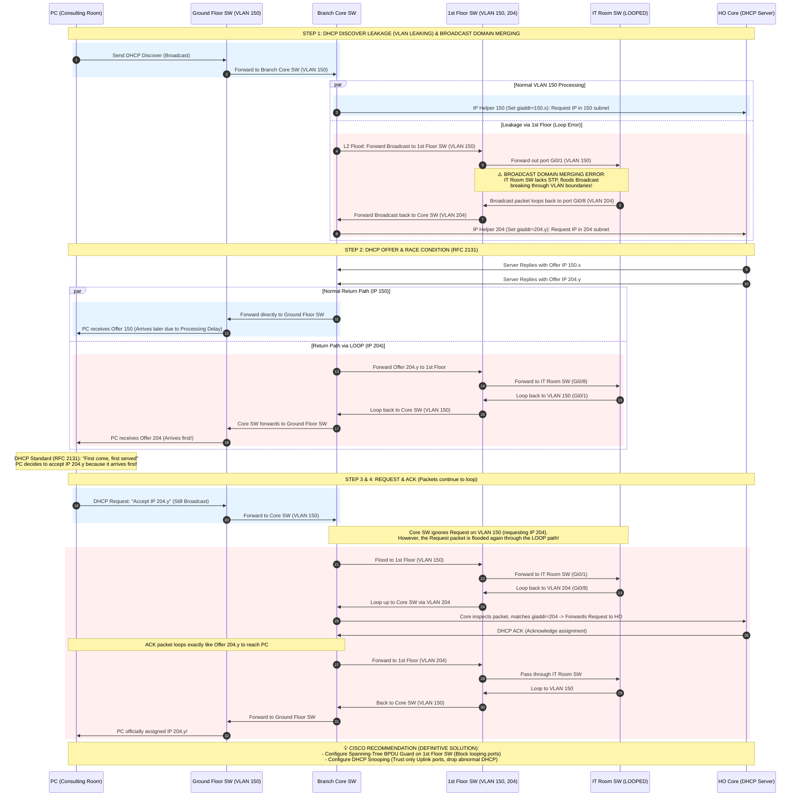

### 📌 Overview

This repository serves as a technical sandbox for researching, documenting, and implementing advanced solutions in Network infrastructure, System automation, and On-premise services.

#### 1. Network Infrastructure

* **MPLS L3VPN Data Forwarding (Branch to HO):**
* *Use Case:* Ensuring secure, isolated, and fast communication between Branch Offices (e.g., Branch A) and Head Office (Vcenter) without exposing internal private IP routes to the ISP Core routers.
* *Problem/Scenario:* A User PC in Branch A (VLAN 16) wants to access a Virtual Machine (VM) hosted on the Vcenter at Head Office. How does the packet traverse the complex ISP MPLS network without traditional IP routing lookups at every hop?
* *Diagram:*



```mermaid
graph TD
    %% System color definitions
    classDef isp fill:#e1f5fe,stroke:#0288d1,stroke-width:2px;
    classDef fw fill:#ffcdd2,stroke:#c62828,stroke-width:2px;
    classDef core fill:#b3e5fc,stroke:#0277bd,stroke-width:2px;
    classDef providerA fill:#f0f4c3,stroke:#827717,stroke-width:1px;
    classDef providerB fill:#e8f5e9,stroke:#2e7d32,stroke-width:1px;

    %% WAN ISP Providers
    subgraph ISPs ["WAN ISP Providers to Firewall"]
        ISP_A((Provider A WAN))
        ISP_B((Provider B WAN))
        ISP_C((Provider C WAN))
    end

    %% HEAD OFFICE
    subgraph HO ["Head Office - Enterprise Cluster"]
        FW["Firewall (Sophos / FortiGate)<br/>LAN IP: 192.168.10.10<br/>Security gateway to WAN"]
        
        CoreHO["Core Switch 3650<br/>Routing IP: 192.168.10.20<br/>(Routing enabled for internal traffic)"]
        
        BranchCore["Branch Core Switch<br/>IP: 192.168.1.10<br/>Handles branch VLAN routing"]
        
        Synology[(Storage System)]
        Vcenter_4Host[[Vcenter Cluster<br/>4 Hosts & VMs]]
    end

    %% MPLS TRANSPORT BACKBONE
    subgraph Transport ["WAN/MPLS Transport Backbone"]
        MPLS_A["Provider A MPLS Transport<br/>(Metro area coverage)"]
        
        MPLS_B["Provider B MPLS Transport<br/>(National coverage)"]
    end

    %% BRANCHES VIA PROVIDER A
    subgraph ProviderA_Branches ["Branches via Provider A MPLS"]
        subgraph BranchA ["Branch A"]
            PC_A["User PC A<br/>(VLAN 17)"]
            SW_A[Access Switch A]
        end
        BranchB["Branch B"]
        BranchC["Branch C"]
        BranchD["Branch D"]
    end

    %% BRANCHES VIA PROVIDER B
    subgraph ProviderB_Branches ["Branches via Provider B MPLS"]
        subgraph BranchE ["Branch E"]
            SW_E[Access Switch E]
            VLAN_102((VLAN 102)) --- SW_E
        end
        
        subgraph BranchF ["Branch F"]
            SW_F[Access Switch F]
            VLAN_168((VLAN 168)) --- SW_F
        end

        subgraph BranchG ["Branch G"]
            SW_G[Access Switch G]
            VLAN_157((VLAN 157)) --- SW_G
        end
        
        OtherProviderB["Other regional branches"]
    end

    %% PHYSICAL CONNECTIONS AND TRUNK/LACP DETAILS
    ISP_A --> FW
    ISP_B --> FW
    ISP_C --> FW
    CoreHO --- Synology
    CoreHO -- "Internal routing connection" --> BranchCore
    
    %% DEFAULT ROUTE TO INTERNET
    CoreHO -- "Default Route (0.0.0.0/0) to Internet" --> FW
    
    MPLS_A -.-> BranchB
    MPLS_A -.-> BranchC
    MPLS_A -.-> BranchD
    MPLS_B -.-> OtherProviderB

    %% 1. Core HO connection to Provider A MPLS via port pair
    CoreHO ===|interface GigabitEthernet1/0/44 & 1/0/45<br/>switchport mode trunk<br/>channel-protocol lacp<br/>channel-group 1 mode active| MPLS_A

    %% 2. Branch core connection to Provider B MPLS via port pair
    BranchCore ===|interface GigabitEthernet1/0/19 & 1/0/20<br/>switchport trunk encapsulation dot1q<br/>switchport mode trunk<br/>channel-group 1 mode active| MPLS_B

    %% PACKET FLOW ILLUSTRATION
    
    %% [RED PATH]: Provider A example from Branch A
    PC_A == "(1) Send IP Packet<br/>Src: VLAN 17 -> Dst: VM" ==> SW_A
    SW_A == "(2) Forward over Provider A MPLS" ==> MPLS_A
    MPLS_A == "(3) Remove MPLS label -> Enter channel group 1" ==> CoreHO

    %% [BLUE PATH]: Provider B example from Branch E
    VLAN_102 == "(A) Send IP Packet<br/>Src: VLAN 102 -> Dst: VM" ==> SW_E
    SW_E == "(B) Label and push into backbone" ==> MPLS_B
    MPLS_B == "(C) MPLS label switch to HO" ==> BranchCore
    BranchCore == "(D) Forward to Core HO" ==> CoreHO

    %% [COMMON PATH AT HO]: Core switch performs L3 routing
    CoreHO == "(4 / E) Receive and route traffic (L3 Routing)<br/>Forward directly to servers" ==> Vcenter_4Host

    %% PROVIDER PHYSICAL PE CONNECTION TO FIREWALL
    MPLS_B -. "Provider edge switch uplink<br/>(Two physical WAN lines to Sophos / FortiGate)" .-> ISP_B

    %% Component style assignment
    class ISP_A,ISP_B,ISP_C,MPLS_A,MPLS_B isp;
    class FW fw;
    class CoreHO,BranchCore core;
    class BranchA,BranchB,BranchC,BranchD providerA;
    class BranchE,BranchF,BranchG,OtherProviderB providerB;
    
    %% PACKET FLOW STYLES
    %% Provider A path (red)
    linkStyle 14,15,16 stroke:#ff1744,stroke-width:4px;
    
    %% Provider B path (blue)
    linkStyle 17,18,19,20 stroke:#2979ff,stroke-width:4px;
    
    %% Common L3 routing path at Core (purple)
    linkStyle 21 stroke:#9c27b0,stroke-width:4px;
```

* **VLAN Leaking & Layer 2 Loops:**
  * *Use Case:* Preventing broadcast storms in enterprise environments using STP and proper VLAN tagging. 
  * *Problem:* The PC in the Consulting Room belongs to VLAN 150, but it ultimately received an IP address from VLAN 204, which is designated for a different range.
  * *Diagram:*



#### 2. System Administration & High-Performance Computing

* **AI Infrastructure & Cloud GPU Provisioning**
* **Use Case:** Architecting and managing hybrid computing environments for heavy AI/Deep Learning workloads, balancing local resources and cloud scalability.
* **Experience & Solution:** Directly deployed and administered an on-premise AI server infrastructure featuring 4x NVIDIA A5000 GPUs. Implemented **vGPU** virtualization to optimize resource sharing.


* **Enterprise Application Lifecycle & CI/CD Automation**
* **Use Case:** End-to-end development, automation, and release management of enterprise applications with strict security and platform compliance.
* **Experience & Solution:** Built cross-platform UIs using **Flutter** and developed **Python** scripts for system task automation. Designed and maintained **GitLab CI/CD** pipelines to fully automate the build, test, infrastructure setup, and deployment processes, ensuring secure public releases and compliance with the latest Google Play APIs.

#### 3. On-Demand Container Provisioning & Automated Edge Ingress Architecture

* **Dynamic Container Micro-Orchestration & Auto-SSL Mapping System**
  * **Use Case:** Scaling independent, isolated worker/service container instances on-demand while automating Layer 7 routing, subdomain mapping, and TLS certificate generation for multi-tenant applications.
  * **Experience & Solution:** Designed and implemented a high-performance infrastructure automation system leveraging a Python Flask API gateway, Redis state caching, Portainer API orchestration, and Traefik edge reverse proxy. When a client authenticates via a dynamic interactive session flow, the gateway extracts session tokens and dynamically deploys an isolated **Micro-Stack (standalone Docker Compose file)** per container via the Portainer API. This decentralized approach eliminates the re-evaluation delays of a monolithic stack, dropping provisioning times from 30 seconds to **1-2 seconds**. Traefik automatically discovers the new container's labels via the Docker provider, maps a unique subdomain, and provisions an SSL certificate via Let's Encrypt.

##### System Architecture & Workflow Diagram


##### Core Technological Components

| Component | Technology | Description |
| :--- | :--- | :--- |
| **API Gateway & Logic** | **Python Flask (asyncio, PyYAML)** | Handles dynamic session management, parses Docker Compose configurations, and integrates with the orchestrator API. |
| **State Storage & Cache**| **Redis** | Caches session tokens, active execution locks, and temporary verification states to prevent request collision. |
| **Orchestration Client** | **Portainer API** | Programmatically provisions standalone **Micro-Stacks** (standalone compose files) via the Portainer API (`POST /api/stacks/create/standalone/string`), resolving monolithic compose re-evaluation overhead (~15-30s reduced to sub-second). |
| **Edge Ingress Proxy** | **Traefik (Docker Provider)** | Dynamically registers routing paths, binds subdomains, handles SSL challenge via Let's Encrypt (HTTP/DNS challenge), and manages client traffic. |
| **Worker Environment** | **Docker Container** | An isolated workspace instance running on-demand microservices for a specific authenticated user. |

##### Core API Endpoints

1. **System & Health Diagnostics**
   * **`GET /api/v1/self/health`**: Simple gateway health check.
   * **`GET /api/v1/self/check-logic`**: Real-time diagnostic suite testing active dependency modules, configuration schemas, Redis cache, and Portainer orchestration availability.

2. **Session Verification & Auth Lifecycle**
   * **`GET /api/v1/self/login`**: Initializes a background verification thread with dynamic client agent metadata.
   * **`GET /api/v1/self/login/get-qr-status`**: Polls the status of the verification session. Returns verification token and extracted session credentials upon successful user approval.

3. **Instance Provisioning**
   * **`POST /api/v1/self/login/create-new-account`**: Deploys an isolated worker container instance by programmatically deploying a dedicated Micro-Stack on the Portainer API, mapping internal network to the host's central `zalo_cloud_sytem_custom_network` as external, and performing automatic container migration.
   * **`DELETE /api/v1/self/login/delete-account`**: De-provisions the isolated instance, removing the dedicated Micro-Stack or cleaning up the service mapping from the historical monolithic stack.

##### Automated Routing via Traefik Labels & External Network
When the API provisions a new container, the following configuration metadata labels and network definitions are dynamically injected into the compose service block, prompting Traefik to register the ingress route and request SSL certificates:
```yaml
networks:
  custom_network:
    name: zalo_cloud_sytem_custom_network
    external: true

services:
  account-${phone_number}:
    image: zalocloud/zalo_cloud:latest
    networks:
      - custom_network
    labels:
      - "traefik.enable=true"
      - "traefik.http.services.service-${service_id}.loadbalancer.server.port=5001"
      - "traefik.http.routers.service-${service_id}-https.rule=Host(`service-${service_id}.domain.com`)"
      - "traefik.http.routers.service-${service_id}-https.entrypoints=websecure"
      - "traefik.http.routers.service-${service_id}-https.tls=true"
      - "traefik.http.routers.service-${service_id}-https.tls.certresolver=letsencrypt"
```
