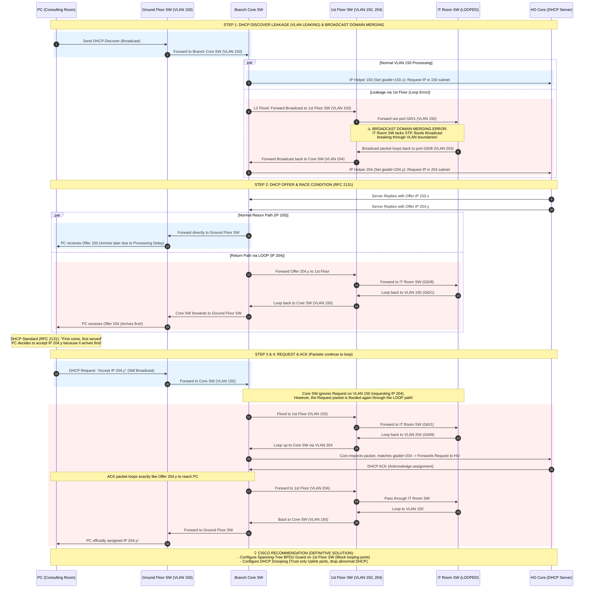
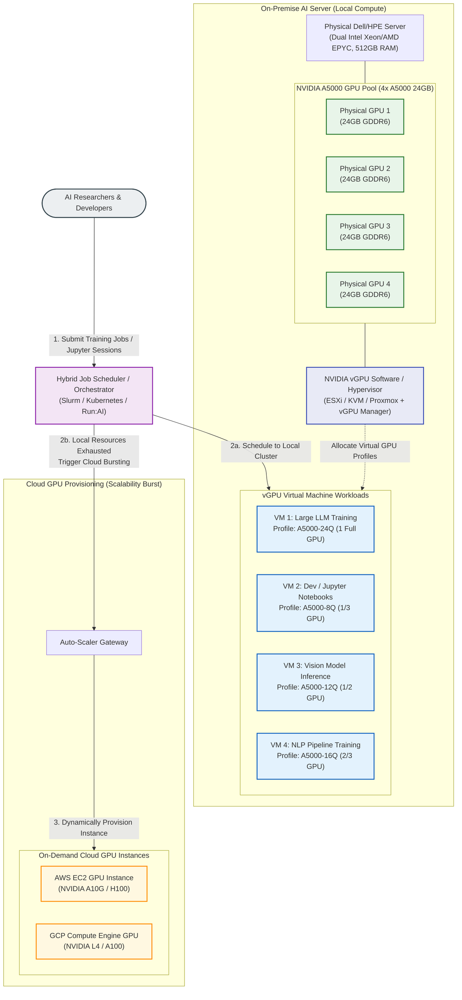
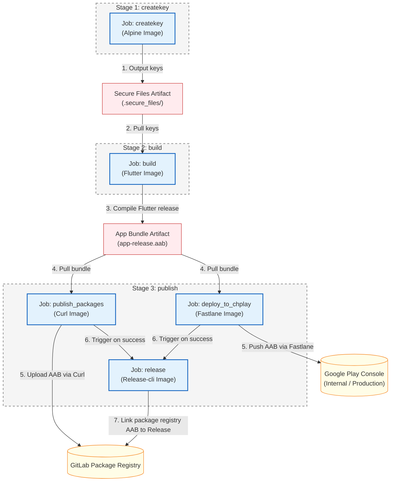
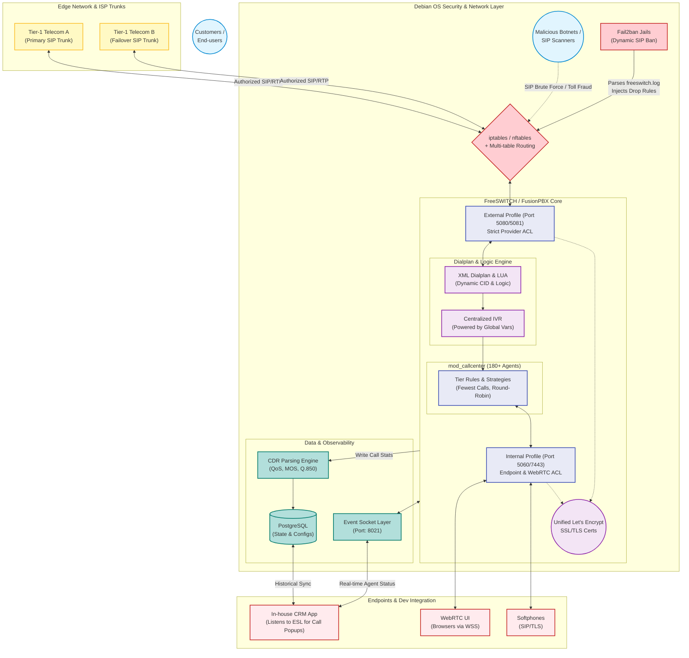

### 📌 Overview

This repository serves as a technical sandbox for researching, documenting, and implementing advanced solutions in Network infrastructure, System automation, and On-premise services.

### 1. Network Infrastructure

* **MPLS L3VPN Data Forwarding (Branch to HO):**
* *Use Case:* Ensuring secure, isolated, and fast communication between Branch Offices (e.g., Branch A) and Head Office (Vcenter) without exposing internal private IP routes to the ISP Core routers.
* *Problem/Scenario:* A User PC in Branch A (VLAN 16) wants to access a Virtual Machine (VM) hosted on the Vcenter at Head Office. How does the packet traverse the complex ISP MPLS network without traditional IP routing lookups at every hop?
* *Diagram:*



```mermaid
graph TD
    %% System color definitions
    classDef isp fill:#e1f5fe,stroke:#0288d1,stroke-width:2px;
    classDef fw fill:#ffcdd2,stroke:#c62828,stroke-width:2px;
    classDef core fill:#b3e5fc,stroke:#0277bd,stroke-width:2px;
    classDef providerA fill:#f0f4c3,stroke:#827717,stroke-width:1px;
    classDef providerB fill:#e8f5e9,stroke:#2e7d32,stroke-width:1px;

    %% WAN ISP Providers
    subgraph ISPs ["WAN ISP Providers to Firewall"]
        ISP_A((Provider A WAN))
        ISP_B((Provider B WAN))
        ISP_C((Provider C WAN))
    end

    %% HEAD OFFICE
    subgraph HO ["Head Office - Enterprise Cluster"]
        FW["Firewall (Sophos / FortiGate)<br/>LAN IP: 192.168.10.10<br/>Security gateway to WAN"]
        
        CoreHO["Core Switch 3650<br/>Routing IP: 192.168.10.20<br/>(Routing enabled for internal traffic)"]
        
        BranchCore["Branch Core Switch<br/>IP: 192.168.1.10<br/>Handles branch VLAN routing"]
        
        Synology[(Storage System)]
        Vcenter_4Host[[Vcenter Cluster<br/>4 Hosts & VMs]]
    end

    %% MPLS TRANSPORT BACKBONE
    subgraph Transport ["WAN/MPLS Transport Backbone"]
        MPLS_A["Provider A MPLS Transport<br/>(Metro area coverage)"]
        
        MPLS_B["Provider B MPLS Transport<br/>(National coverage)"]
    end

    %% BRANCHES VIA PROVIDER A
    subgraph ProviderA_Branches ["Branches via Provider A MPLS"]
        subgraph BranchA ["Branch A"]
            PC_A["User PC A<br/>(VLAN 17)"]
            SW_A[Access Switch A]
        end
        BranchB["Branch B"]
        BranchC["Branch C"]
        BranchD["Branch D"]
    end

    %% BRANCHES VIA PROVIDER B
    subgraph ProviderB_Branches ["Branches via Provider B MPLS"]
        subgraph BranchE ["Branch E"]
            SW_E[Access Switch E]
            VLAN_102((VLAN 102)) --- SW_E
        end
        
        subgraph BranchF ["Branch F"]
            SW_F[Access Switch F]
            VLAN_168((VLAN 168)) --- SW_F
        end

        subgraph BranchG ["Branch G"]
            SW_G[Access Switch G]
            VLAN_157((VLAN 157)) --- SW_G
        end
        
        OtherProviderB["Other regional branches"]
    end

    %% PHYSICAL CONNECTIONS AND TRUNK/LACP DETAILS
    ISP_A --> FW
    ISP_B --> FW
    ISP_C --> FW
    CoreHO --- Synology
    CoreHO -- "Internal routing connection" --> BranchCore
    
    %% DEFAULT ROUTE TO INTERNET
    CoreHO -- "Default Route (0.0.0.0/0) to Internet" --> FW
    
    MPLS_A -.-> BranchB
    MPLS_A -.-> BranchC
    MPLS_A -.-> BranchD
    MPLS_B -.-> OtherProviderB

    %% 1. Core HO connection to Provider A MPLS via port pair
    CoreHO ===|interface GigabitEthernet1/0/44 & 1/0/45<br/>switchport mode trunk<br/>channel-protocol lacp<br/>channel-group 1 mode active| MPLS_A

    %% 2. Branch core connection to Provider B MPLS via port pair
    BranchCore ===|interface GigabitEthernet1/0/19 & 1/0/20<br/>switchport trunk encapsulation dot1q<br/>switchport mode trunk<br/>channel-group 1 mode active| MPLS_B

    %% PACKET FLOW ILLUSTRATION
    
    %% [RED PATH]: Provider A example from Branch A
    PC_A == "(1) Send IP Packet<br/>Src: VLAN 17 -> Dst: VM" ==> SW_A
    SW_A == "(2) Forward over Provider A MPLS" ==> MPLS_A
    MPLS_A == "(3) Remove MPLS label -> Enter channel group 1" ==> CoreHO

    %% [BLUE PATH]: Provider B example from Branch E
    VLAN_102 == "(A) Send IP Packet<br/>Src: VLAN 102 -> Dst: VM" ==> SW_E
    SW_E == "(B) Label and push into backbone" ==> MPLS_B
    MPLS_B == "(C) MPLS label switch to HO" ==> BranchCore
    BranchCore == "(D) Forward to Core HO" ==> CoreHO

    %% [COMMON PATH AT HO]: Core switch performs L3 routing
    CoreHO == "(4 / E) Receive and route traffic (L3 Routing)<br/>Forward directly to servers" ==> Vcenter_4Host

    %% PROVIDER PHYSICAL PE CONNECTION TO FIREWALL
    MPLS_B -. "Provider edge switch uplink<br/>(Two physical WAN lines to Sophos / FortiGate)" .-> ISP_B

    %% Component style assignment
    class ISP_A,ISP_B,ISP_C,MPLS_A,MPLS_B isp;
    class FW fw;
    class CoreHO,BranchCore core;
    class BranchA,BranchB,BranchC,BranchD providerA;
    class BranchE,BranchF,BranchG,OtherProviderB providerB;
    
    %% PACKET FLOW STYLES
    %% Provider A path (red)
    linkStyle 14,15,16 stroke:#ff1744,stroke-width:4px;
    
    %% Provider B path (blue)
    linkStyle 17,18,19,20 stroke:#2979ff,stroke-width:4px;
    
    %% Common L3 routing path at Core (purple)
    linkStyle 21 stroke:#9c27b0,stroke-width:4px;
```

* **VLAN Leaking & Layer 2 Loops:**
  * *Use Case:* Preventing broadcast storms in enterprise environments using STP and proper VLAN tagging. 
  * *Problem:* The PC in the Consulting Room belongs to VLAN 150, but it ultimately received an IP address from VLAN 204, which is designated for a different range.
  * *Diagram:*



### 2. System Administration & High-Performance Computing

#### 2.1. AI Infrastructure & Cloud GPU Provisioning

* **Use Case:** Architecting and managing hybrid computing environments for heavy AI/Deep Learning workloads, balancing local resources and cloud scalability.
* **Experience & Solution:** Directly deployed and administered an on-premise AI server infrastructure featuring 4x NVIDIA A5000 GPUs. Implemented **vGPU** virtualization to optimize resource sharing, allocating flexible GPU profiles to concurrent AI/Deep Learning workloads.

##### Hybrid GPU Infrastructure & vGPU Virtualization Diagram



---

#### 2.2. Enterprise Application Lifecycle & CI/CD Automation


* **Use Case:** End-to-end development, automation, and release management of enterprise applications with strict security and platform compliance.
* **Experience & Solution:** Built cross-platform UIs using **Flutter** and developed **Python** scripts for system task automation. Designed and maintained **GitLab CI/CD** pipelines to fully automate the build, test, infrastructure setup, and deployment processes, ensuring secure public releases and compliance with the latest Google Play APIs.

#### GitLab CI/CD Pipeline Workflow Diagram



#### GitLab CI/CD Pipeline Configuration (`.gitlab-ci.yml`)

```yaml
variables:
  FLUTTERVER: 3.19.5

stages:
  - createkey
  - build
  - publish

createkey:
  stage: createkey
  image: "alpine:latest"
  before_script:
    - echo "Install bash and curl"
    - apk add --no-cache bash curl
  variables:
    GIT_STRATEGY: clone
  script:
    - chmod +x ./scripts/download-secure
    - bash ./scripts/download-secure
  tags:
    - flutter-runner
  only:
    - tags
  artifacts:
    expire_in: 1 hour
    paths:
      - .secure_files/

build:
  stage: build
  image: "instrumentisto/flutter:${FLUTTERVER}"
  needs:
    - createkey
  variables:
    GIT_STRATEGY: clone
  before_script:
    - flutter pub global activate rps
    - export PATH="$PATH":"$HOME/.pub-cache/bin"
  script:
    - rps reset
    - rps generate all
    - cp .secure_files/* ./android/app/
    - echo "storeFile=./upload-keystore.jks" >> android/key.properties
    - echo "storePassword=${passwordKeyandStore}" >> android/key.properties
    - echo "keyPassword=${passwordKeyandStore}" >> android/key.properties
    - echo "keyAlias=${keyAlias}" >> android/key.properties
    - "APP_VERSION=$(grep -o 'version: [0-9]\\+\\.[0-9]\\+\\.[0-9]\\+' pubspec.yaml | awk '{print $2}')"
    - BUILD_NUMBER=$(TZ=UTC date -d "$CI_JOB_STARTED_AT" "+%Y%m%d%M")
    - flutter build appbundle --build-name=${APP_VERSION} --build-number=${BUILD_NUMBER} --release
  artifacts:
    expire_in: 1 hour
    paths:
      - build/app/outputs/bundle/release/app-release.aab
  dependencies:
    - createkey
  tags:
    - flutter-runner
  only:
    - tags

publish_packages:
  stage: publish
  needs: 
    - build
  image: curlimages/curl:latest
  dependencies: 
    - build
  script:
      - cp -r build/app/outputs/bundle/release ./
      - 'curl --header "JOB-TOKEN: $CI_JOB_TOKEN" --upload-file ./release/app-release.aab "${CI_API_V4_URL}/projects/${CI_PROJECT_ID}/packages/generic/drift-survivors/${CI_COMMIT_TAG}/app-release.aab"'
  only:
    - tags
  tags:
    - flutter-runner

deploy_to_chplay:
  stage: publish
  image: cijumbo/fastlane:2.220.0
  variables:
    GIT_STRATEGY: clone
  dependencies:
    - build
  needs: 
    - build
  before_script:
    - cp -r build/app/outputs/bundle/release ./
    - apt install -y curl bash
    - chmod +x ./scripts/download-secure
    - bash ./scripts/download-secure
    - cp ./.secure_files/google_play_service_account.json ./google_play_api_key.json  
    - bundle update fastlane
  script: 
    - "APP_VERSION=$(grep -o 'version: [0-9]\\+\\.[0-9]\\+\\.[0-9]\\+' pubspec.yaml | awk '{print $2}')"
    - bundle exec fastlane supply --track internal --aab  ./release/app-release.aab --json_key ./google_play_api_key.json --package_name ${Packages_name}
    - bundle exec fastlane supply --track internal --track_promote_to production --changes_not_sent_for_review false  --json_key ./google_play_api_key.json  --package_name ${Packages_name}
  after_script:
    - rm ./google_play_api_key.json
  tags:
    - flutter-runner
  only:
    - tags

release:
  stage: publish
  needs: 
    - publish_packages
    - deploy_to_chplay
  image: registry.gitlab.com/gitlab-org/release-cli:latest
  before_script:
    - apk add git
  script:
    - echo "Creating release $CI_COMMIT_TAG..."
  release:
    tag_name: $CI_COMMIT_TAG
    description: |
      Changes:
      $(git log $(git describe --abbrev=0 --tags --exclude=$CI_COMMIT_TAG).$CI_COMMIT_TAG --oneline --no-decorate --reverse | sed "s/^[^ ]* /- /g")
    assets:
      links:
        - name: AAB
          url: ${CI_API_V4_URL}/projects/${CI_PROJECT_ID}/packages/generic/drift-survivors/${CI_COMMIT_TAG}/app-release.aab
          link_type: package
  only:
    - tags
  tags:
    - flutter-runner
```
---

### 3. On-Demand Container Provisioning & Automated Edge Ingress Architecture

* **Dynamic Container Micro-Orchestration & Auto-SSL Mapping System**
  * **Use Case:** Scaling independent, isolated worker/service container instances on-demand while automating Layer 7 routing, subdomain mapping, and TLS certificate generation for multi-tenant applications.
  * **Experience & Solution:** Designed and implemented a high-performance infrastructure automation system leveraging a Python Flask API gateway, Redis state caching, Portainer API orchestration, and Traefik edge reverse proxy. When a client authenticates via a dynamic interactive session flow, the gateway extracts session tokens and dynamically deploys an isolated **Micro-Stack (standalone Docker Compose file)** per container via the Portainer API. This decentralized approach eliminates the re-evaluation delays of a monolithic stack, dropping provisioning times from 30 seconds to **1-2 seconds**. Traefik automatically discovers the new container's labels via the Docker provider, maps a unique subdomain, and provisions an SSL certificate via Let's Encrypt.

##### System Architecture & Workflow Diagram


##### Core Technological Components

| Component | Technology | Description |
| :--- | :--- | :--- |
| **API Gateway & Logic** | **Python Flask (asyncio, PyYAML)** | Handles dynamic session management, parses Docker Compose configurations, and integrates with the orchestrator API. |
| **State Storage & Cache**| **Redis** | Caches session tokens, active execution locks, and temporary verification states to prevent request collision. |
| **Orchestration Client** | **Portainer API** | Programmatically provisions standalone **Micro-Stacks** (standalone compose files) via the Portainer API (`POST /api/stacks/create/standalone/string`), resolving monolithic compose re-evaluation overhead (~15-30s reduced to sub-second). |
| **Edge Ingress Proxy** | **Traefik (Docker Provider)** | Dynamically registers routing paths, binds subdomains, handles SSL challenge via Let's Encrypt (HTTP/DNS challenge), and manages client traffic. |
| **Worker Environment** | **Docker Container** | An isolated workspace instance running on-demand microservices for a specific authenticated user. |

##### Core API Endpoints

1. **System & Health Diagnostics**
   * **`GET /api/v1/self/health`**: Simple gateway health check.
   * **`GET /api/v1/self/check-logic`**: Real-time diagnostic suite testing active dependency modules, configuration schemas, Redis cache, and Portainer orchestration availability.

2. **Session Verification & Auth Lifecycle**
   * **`GET /api/v1/self/login`**: Initializes a background verification thread with dynamic client agent metadata.
   * **`GET /api/v1/self/login/get-qr-status`**: Polls the status of the verification session. Returns verification token and extracted session credentials upon successful user approval.

3. **Instance Provisioning**
   * **`POST /api/v1/self/login/create-new-account`**: Deploys an isolated worker container instance by programmatically deploying a dedicated Micro-Stack on the Portainer API, mapping internal network to the host's central `zalo_cloud_sytem_custom_network` as external, and performing automatic container migration.
   * **`DELETE /api/v1/self/login/delete-account`**: De-provisions the isolated instance, removing the dedicated Micro-Stack or cleaning up the service mapping from the historical monolithic stack.

##### Automated Routing via Traefik Labels & External Network
When the API provisions a new container, the following configuration metadata labels and network definitions are dynamically injected into the compose service block, prompting Traefik to register the ingress route and request SSL certificates:
```yaml
networks:
  custom_network:
    name: zalo_cloud_sytem_custom_network
    external: true

services:
  account-${phone_number}:
    image: zalocloud/zalo_cloud:latest
    networks:
      - custom_network
    labels:
      - "traefik.enable=true"
      - "traefik.http.services.service-${service_id}.loadbalancer.server.port=5001"
      - "traefik.http.routers.service-${service_id}-https.rule=Host(`service-${service_id}.domain.com`)"
      - "traefik.http.routers.service-${service_id}-https.entrypoints=websecure"
      - "traefik.http.routers.service-${service_id}-https.tls=true"
      - "traefik.http.routers.service-${service_id}-https.tls.certresolver=letsencrypt"
```

### 4. Enterprise VoIP & Advanced Call Center Infrastructure

* **Use Case:** Architecting, securing, and operating a high-capacity, multi-tenant Call Center infrastructure capable of processing massive concurrent inbound/outbound calls for various enterprise branches and educational institutions.
* **Architecture Strategy:** Adopted a deeply systematic approach covering all layers—from Debian OS network routing and perimeter security to FreeSWITCH core processing, dynamic dialplan logic, and external CRM integration. The goal was to build a highly secure, observable, and developer-friendly VoIP ecosystem.

#### System Architecture & Core Integration Diagram



#### Key Engineering Implementations & Systematic Problem Solving

**1. OS-Level Security & Network Topology (Debian Linux)**
*   **Challenge:** Managing distinct subnets for external SIP providers while protecting the PBX from aggressive SIP brute-force and toll-fraud attacks.
*   **Implementation:** Engineered multi-table routing on Debian to strictly isolate Telco VoIP traffic from public internet traffic. Implemented robust perimeter defense using **Fail2ban** integrated with `iptables/nftables`. By writing custom regex filters to parse `/var/log/freeswitch/freeswitch.log`, the system dynamically detects and drops malicious IPs exhibiting anomalous registration attempts or scanning behaviors, drastically reducing CPU overhead and securing the ACLs.

**2. Unified Secure Transport (WebRTC & SIP-TLS)**
*   **Challenge:** Browsers strictly block WebRTC (WSS) without valid SSL, and softphones require secure SIP-TLS, often leading to certificate mismatch errors across different FreeSWITCH profiles.
*   **Implementation:** Systematized the SSL deployment pipeline. Unified Let's Encrypt certificate directories across both the **Internal Profile** (handling WebRTC over WSS on port `7443`) and the **External Profile** (handling SIP-TLS on port `5081`). This unified approach guaranteed zero-mismatch errors during key exchanges, ensuring pristine audio and signaling security for 180+ remote agents.

**3. Advanced Dialplan Engineering & IVR Abstraction**
*   **Challenge:** Managing routing logic for dozens of specific business campaigns without creating spaghetti XML code.
*   **Implementation:** Abstracted hard-coded dialplans into FreeSWITCH **Global Variables**. Built a centralized, dynamic IVR system (`IVR_Hotline`) governed by multi-layered Time Conditions (distinguishing business hours from holidays via cron-based evaluation). For outbound traffic, injected custom **Lua scripts** (`reset_answered_time.lua`) directly into the dialplan to dynamically map specific Virtual Phone Numbers (Caller ID) based on the routed campaign, ensuring strict compliance with Telco SIP headers.

**4. Deep Diagnostics, SIP Tracing & QoS Troubleshooting**
*   **Challenge:** Accurately identifying the root cause of voice quality degradation (e.g., one-way audio, choppy voices) or call routing failures without blind guessing, and isolating issues between the internal IT network and the external Telco provider.
*   **Implementation:** Developed a highly empirical troubleshooting framework utilizing **`sngrep`** (for visual, real-time SIP signaling analysis), `fs_cli`, and raw **Call Detail Records (CDR)**. 
    *   **Tracing the Call Path:** I extract exact variables to paint the full picture of a call: Who initiated it (`caller_id_number`: `16802`), the target (`destination_number`: `0819460897`), the processing gateway/profile (`channel_name`: `sofia/internal/...`), the remote endpoint/telco IP (`sip_network_ip`: `172.18.X.X`), and the local handling interface (`local_media_ip`: `192.168.1.223`). 
    *   **QoS Fault Isolation:** To pinpoint audio degradation, I analyze asymmetric RTP streams. For instance, detecting severe inbound degradation with metrics like `rtp_audio_in_mos: 2.26` (poor Mean Opinion Score), a high `skip_packet_count: 1113`, and massive `jitter_max_variance: 2689.55`, while confirming a flawless outbound stream (`rtp_audio_out_skip_packet_count: 0`). 
    *   By cross-referencing endpoint hardware (`sip_user_agent: Grandstream GXP1610`) and exact protocol-level hangup causes (`sip_reason: Q.850;cause=16;text="NORMAL_CLEARING"` vs `cause=38 NETWORK_OUT_OF_ORDER`), I can definitively prove whether a flaw originated from local LAN packet loss, endpoint malfunction, or external Telco gateway degradation.


**5. Cross-Functional Developer Integration (ESL)**
*   **Challenge:** Enabling the in-house CRM development team to trigger screen-popups and sync agent states (Logged In, On Break, Busy) without them needing to understand SIP protocol intricacies.
*   **Implementation:** Bridged the gap between telecom infrastructure and software development by exposing FreeSWITCH's **Event Socket Layer (ESL)** and backend PostgreSQL database. This allowed developers to seamlessly subscribe to real-time telephony events via APIs, orchestrating automatic customer data popups on inbound calls and tracking accurate billing durations.

#### Technical Snippet: Systematic Dialplan Lua Injection & QoS Tracking

```xml
<!-- Example: Advanced Outbound Dialplan with Lua Injection and Quality Tracking -->
<extension name="ENTERPRISE-OUTBOUND-ROUTING" continue="false" uuid="1e97a789-a30c-4023-ba32-ab12bc71db48">
    <condition field="${user_exists}" expression="false"/>
    <condition field="destination_number" expression="^(\d{10,11})$">
        
        <!-- 1. Dev/CRM Integration: Exporting UUID and Account Codes -->
        <action application="set" data="sip_h_X-accountcode=${accountcode}"/>
        <action application="export" data="call_direction=outbound"/>
        <action application="export" data="sip_h_X-Call_UUID=${uuid}"/>
        
        <!-- 2. Lua Script Injection: Synchronize exact answer time for CRM billing -->
        <action application="export" data="execute_on_answer=lua reset_answered_time.lua ${uuid}"/>
        
        <!-- 3. QoS Preparation & Dynamic CID Mapping -->
        <action application="set" data="rtp_jitter_buffer=true"/>
        <action application="unset" data="call_timeout"/>
        <action application="set" data="hangup_after_bridge=true"/>
        
        <!-- Injecting Masked/Dynamic Outbound Caller ID -->
        <action application="set" data="effective_caller_id_name=${outbound_caller_id_name}"/>
        <action application="set" data="effective_caller_id_number=$${global_outbound_caller_id}"/>
        <action application="set" data="inherit_codec=true"/>
        <action application="set" data="callee_id_number=$1"/>
        
        <!-- 4. Bridge to Tier-1 Provider SIP Gateway -->
        <action application="bridge" data="sofia/gateway/provider-primary-gateway-uuid/$1"/>
    </condition>
</extension>
```
