### 📌 Overview

This repository serves as a comprehensive portfolio of my real-world engineering experience, documenting production-grade architectures, battle-tested network topologies, virtualized systems, and automated DevOps workflows that I have designed, implemented, and operated in enterprise environments.

---

### 1. Network Infrastructure

#### 1.1. MPLS & Hybrid Layer 3/MPLS Data Forwarding

##### Use Case
Ensuring secure, isolated, and fast communication between Branch Offices and the Head Office (HO) Core/vCenter utilizing dual WAN transport routes (Provider A and Provider B) with distinct forwarding architectures.

##### Problem / Scenario & Solution
**Problem:** Remote branch workstations need to access Virtual Machines (VMs) on the vCenter cluster at the Head Office. The setup must offer network redundancy and separate administrative management traffic from generic data subnets using dual WAN providers with non-identical network designs.
**Solution:** Engineered a hybrid forwarding topology across dual ISPs. Provider A acts as a standard MPLS L2VPN tunnel carrying bridged management/DHCP frames back to the Head Office. Provider B implements a hybrid structure: Layer 3 routing over a WAN subnet (gateway `10.90.97.249`) to forward generic data subnets using dynamic routing (**RIP v2** or static routes) to announce branch prefixes, combined with an MPLS L2VPN tunnel (next-hop `192.168.1.10`) to carry untagged management frames. DHCP services are dynamically hosted on a dedicated VM running on the **4-node ESXi cluster** managed by vCenter.

##### Architecture Diagram
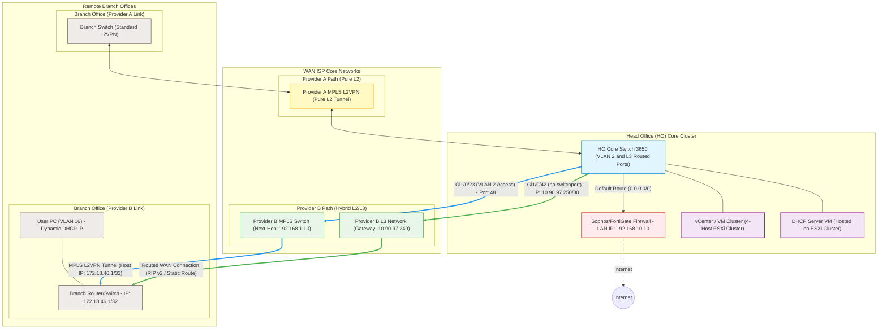

##### Technical Details
| Component | Technology | Description |
| :--- | :--- | :--- |
| **Primary Route (Provider A)** | **MPLS L2VPN Tunnel** | Pure Layer 2 VPN tunnel carrying bridged management/DHCP frames back to the HO Core. |
| **Secondary Ingress (Provider B)** | **Hybrid WAN (L3 / L2VPN)** | Layer 3 routing for data subnets via gateway `10.90.97.249` and L2VPN tunnel via next-hop `192.168.1.10`. |
| **Routing Protocols** | **RIP v2 & Static Routing** | Dynamic and static route advertisements mapping branch network subnets. |
| **DHCP Infrastructure** | **DHCP VM on vCenter** | Virtualized DHCP services running on the 4-node ESXi cluster. |
| **Edge Routing Switch** | **Cisco Catalyst 3650** | Core Layer 3 switch terminating WAN trunks and dynamic routing policies. |

---

#### 1.2. L2 Loop Prevention: Spanning Tree Protocol (STP) & Link Aggregation (LACP)

##### Use Case
Preventing broadcast storms and Layer 2 loops in multi-VLAN enterprise environments while ensuring physical link redundancy and traffic load balancing.

##### Problem / Scenario & Solution
**Problem:** In a branch office network, a workstation in a consulting room assigned to VLAN 150 incorrectly received a DHCP lease from VLAN 204. Investigation revealed that an IT Room switch, lacking Spanning Tree Protocol (STP), was connected with a physical loop that bridged VLAN 150 and VLAN 204 ports. This broadcast domain leakage caused DHCP Discover packets to loop, creating a race condition where the incorrect VLAN 204 IP offer arrived first.
**Solution:** Deployed **Rapid Spanning Tree Protocol (Rapid-PVST+)** across all switches, designating the Core switch as the Root Bridge using priority values. Enabled **BPDU Guard** and **PortFast** on all edge ports to immediately disable ports receiving unauthorized BPDUs (preventing loops from rogue switches). To provide high-availability link redundancy to the servers, we implemented **EtherChannel** using Link Aggregation Control Protocol (LACP) in Active mode, using source-destination IP load balancing (`src-dst-ip hash`) to distribute traffic.

##### Broadcast Storm Sequence Diagram
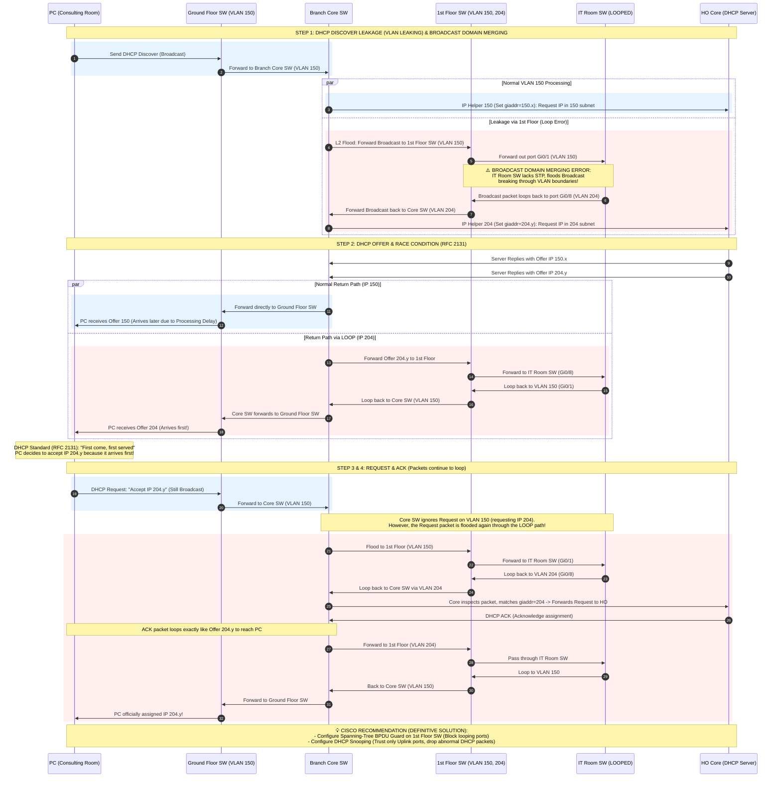

##### Troubleshooting DHCP Leaks & Broadcast Traffic via tcpdump
When diagnosing DHCP leakage or verifying broadcast issues on a client, administrator workstation, or server, you can use `tcpdump` on your network interface (e.g., `en6`) to capture and inspect DHCP packets (bootstrap protocol packets using UDP ports 67 and 68):

```bash
# 1. Standard DHCP capture: Displays basic info for DHCP requests/offers on interface en6
sudo tcpdump -i en6 -n port 67 or port 68

# 2. Verbose DHCP capture: Shows detailed bootp option fields (e.g., transaction ID, IP client, server name, bootp flags, giaddr)
sudo tcpdump -i en6 -n -v port 67 or port 68
```
This allows engineers to inspect the DHCP `giaddr` (gateway IP address) and identify if a DHCP Discover packet is crossing VLANs (revealing broadcast domain merging) or if multiple DHCP servers are responding simultaneously (rogue DHCP server).

###### Cisco Spanning Tree Protocol (STP) Theory & Port Calculations (CCNA Reference)
To prevent Layer 2 loop-storms while maintaining physical redundancy, STP constructs a loop-free logical topology using a deterministic four-step election process:

1. **Root Bridge Election**:
   - Switches exchange **Bridge Protocol Data Unit (BPDU)** packets containing their **Bridge ID (BID)**.
   - The **Bridge ID (BID)** is 8 bytes: **Bridge Priority** (2 bytes, defaults to `32768`, configurable in increments of `4096`) and the switch's unique **MAC Address** (6 bytes).
   - The switch with the **lowest BID** is elected as the **Root Bridge**.
   - > [!IMPORTANT]
     > **Combat Note (Root Protection)**: Never leave Bridge Priority at the default value. If a cheap guest switch or an old switch with a lower MAC address is plugged into the network, it could hijack the Root Bridge role. This routes all company traffic through a sub-optimal path, causing severe bottlenecks or data leaks. Always manually assign a primary core priority of `24576` (`spanning-tree vlan X root primary`) and a secondary core priority of `28672` (`spanning-tree vlan X root secondary`).

2. **STP Port Roles Election (RP, DP, BP)**:
   - Once the Root Bridge (King Switch) is established, STP assigns logical roles to every switch port to decide which links are allowed to forward packets.
   
   ---

   #### A. Root Port (RP)
   * **Theoretical Definition**: The port with the lowest cumulative cost (lowest cumulative Root Path Cost) to reach the Root Bridge on each non-root switch. Every non-root switch elects exactly **one** Root Port.
   * **Simple Definition**: The shortest, cheapest "gateway" for a non-root switch to report back to the Root Bridge.
   * **CCNA Rule of Thumb**: The link partner (opposite end of the cable) connected to a Root Port (RP) is **always** a Designated Port (DP).
   * **Election & Tie-Breaking Rules**:
     1. Choose the port with the lowest cumulative Path Cost to the Root Bridge.
        - **Path Cost Table (IEEE 802.1D)**:
          * **10 Mbps**: Cost = `100` | **100 Mbps**: Cost = `19` | **1 Gbps**: Cost = `4` | **10 Gbps**: Cost = `2`
          * *Note (RSTP 32-bit)*: 1 Gbps cost = `20,000`, 10 Gbps cost = `2,000`.
     2. **If two parallel links are connected (Dual Links)** as shown below: Because path costs are identical, the non-root switch elects the port connected to the **lowest sender Bridge ID** (since both connect to the same upstream Core, this is a tie).
     3. Compare which port connects to the **lowest sender Port Priority** (defaults to `128`).
     4. Choose the port connecting to the **lowest sender Port ID** (e.g., the port wired to `Gi1/0/1` of the Core Switch is preferred over the one wired to `Gi1/0/2`). The other port is blocked.
     
     ```mermaid
     graph TD
         classDef root fill:#ffebee,stroke:#c62828,stroke-width:2px;
         classDef nonroot fill:#e1f5fe,stroke:#0288d1,stroke-width:2px;
         
         subgraph Core ["Core Switch (Root Bridge)"]
             C1["Gi1/0/1 (DP - Forwarding)"]:::root
             C2["Gi1/0/2 (DP - Forwarding)"]:::root
         end
         
         subgraph Access ["Access Switch"]
             A1["Gi1/0/1 (RP - Root Port)"]:::nonroot
             A2["Gi1/0/2 (BP - Blocked Port)"]:::nonroot
         end
         
         C1 ===|"Link 1 (Preferred path connected to Gi1/0/1)"| A1
         C2 -.-|"Link 2 (Blocked path connected to Gi1/0/2)"| A2
     ```

   ---

   #### B. Designated Port (DP)
   * **Theoretical Definition**: The port that forwards traffic onto a specific network segment with the lowest cost path back to the Root Bridge.
   * **Simple Definition**: Every physical cable connecting two switches must have exactly **one** "active port" responsible for forwarding traffic onto that segment. The other end, if not an RP, is blocked to prevent loops.
   * **Election Rules**:
     1. All active ports on the **Root Bridge** are automatically Designated Ports (DP) - always forwarding.
     2. For a link between two non-root switches: The switch closer to the Root Bridge (lowest path cost) wins the DP role. The opposite port on the further switch is blocked.
     
     ```mermaid
     graph TD
         classDef root fill:#ffebee,stroke:#c62828,stroke-width:2px;
         classDef switch fill:#e1f5fe,stroke:#0288d1,stroke-width:2px;
         
         Root["Root Bridge (Root Switch)"]:::root
         SWA["Switch A (Closer to Root - Cost 4)"]:::switch
         SWB["Switch B (Further from Root - Cost 8)"]:::switch
         
         Root ===|"DP <---> RP (Cost 4)"| SWA
         Root ===|"DP <---> RP (Cost 4)"| SWB
         SWA ===|"DP (Forwarding)"| SWB
         SWB -.-|"BP (Blocked)"| SWA
         
         linkStyle 2 stroke:#2ecc71,stroke-width:2px;
         linkStyle 3 stroke:#e74c3c,stroke-width:2px,stroke-dasharray: 5 5;
     ```

   ---

   #### C. Blocked Port (BP)
   * **Theoretical Definition**: Any port that is neither a Root Port nor a Designated Port. It is placed in the Blocking state (or Discarding in RSTP) to break the loop.
   * **Simple Definition**: A backup port that is temporarily blocked. It continues to listen to BPDU frames so it can instantly open if the primary path fails.

   ---

   > [!TIP]
   > **Manual Traffic Engineering (STP Cost & Priority Tuning)**:
   > In the dual-link topology shown above, Link 1 defaults to forwarding (active) and Link 2 is blocked (backup). To reverse this behavior (make Link 2 active and Link 1 backup):
   > 
   > * **Option A: Tune Path Cost (Configured on Access Switch - Receiving End)**:
   >   Increase the cost on the port you want to block.
   >   ```cisco
   >   Access-Switch(config)# interface GigabitEthernet1/0/1
   >   Access-Switch(config-if)# spanning-tree cost 100        ! Increase cost to 100 (default is 19). Access Switch blocks Gi1/0/1.
   >   ```
   > 
   > * **Option B: Tune Port Priority (Configured on Core Switch - Sender End)**:
   >   Lower the priority value of the sender port you want to prefer (lower values are preferred).
   >   ```cisco
   >   Core-Switch(config)# interface GigabitEthernet1/0/2
   >   Core-Switch(config-if)# spanning-tree port-priority 64   ! Lower priority to 64 (default is 128). Access Switch opens Gi1/0/2 as RP.
   >   ```
   > 
   > * **Option C: Per-VLAN Load Balancing (Real-World Practice)**:
   >   Configure VLAN 10 to active on Link 1 and VLAN 20 to active on Link 2 to balance traffic:
   >   ```cisco
   >   Access-Switch(config)# interface GigabitEthernet1/0/1
   >   Access-Switch(config-if)# spanning-tree vlan 20 cost 100   ! Link 1 blocks VLAN 20 (VLAN 10 forwards)
   >   
   >   Access-Switch(config)# interface GigabitEthernet1/0/2
   >   Access-Switch(config-if)# spanning-tree vlan 10 cost 100   ! Link 2 blocks VLAN 10 (VLAN 20 forwards)
   >   ```

    - > [!IMPORTANT]
      > **Combat Note (Edge Security)**: Edge access ports connected directly to user endpoints must have **PortFast** and **BPDU Guard** enabled. PortFast bypasses the Listening/Learning states to bring interfaces to Forwarding instantly upon link up. BPDU Guard automatically shuts down (places in `err-disabled` state) the port if a rogue switch is connected and sends a BPDU.

```cisco
! --- Cisco Switch Edge Port Security Configuration ---
interface GigabitEthernet1/0/24
 description USER-PC-ACCESS
 switchport mode access
 switchport access vlan 150
 spanning-tree portfast
 spanning-tree bpduguard enable
 spanning-tree recovery cause bpduguard   ! Auto-recover err-disabled ports
 spanning-tree recovery interval 300      ! Recover after 5 minutes (300 seconds)
```

##### Battle-Tested Spanning Tree Diagnostics & Fiber Failover Safeguards (CLI Debugging & Recovery Protocol)

When a Layer 2 Loop or Broadcast Storm occurs, the switch's CPU spikes to 99-100% and MAC tables flap constantly, paralyzing the network. Use the following commands and procedures on the Cisco Switch CLI to diagnose and recover:

###### 1. Terminal Logging and Syslog Monitoring
- **Terminal Monitor**: When connecting via SSH/Telnet, system logs do not print to the terminal by default. Run the following command to display logs in real time:
  ```bash
  Switch# terminal monitor
  ```
- **Disable Monitor**: To stop log streams on the current session:
  ```bash
  Switch# terminal no monitor
  ```
- **Logging Level**: Configure the logging level to debugging to capture comprehensive details:
  ```cisco
  Switch(config)# logging monitor debugging
  Switch(config)# logging console debugging
  ```
- **View Log Buffer**: If the terminal hangs due to high traffic, checking the buffered logs is the safest recovery method:
  ```bash
  Switch# show logging
  ```

###### 2. Real-Time STP Debug Tools (Warning: CPU Intensive)
- > [!WARNING]
  > **CPU EXHAUSTION DANGER**: Running `debug` commands on the Control Plane during a Broadcast Storm can lock up or crash the switch CPU. Always be prepared to disable debugging immediately.
- **Trace STP Events**:
  ```bash
  Switch# debug spanning-tree events        ! Monitor STP port state changes (Blocking -> Forwarding) and Topology Change Notifications (TCN)
  ```
- **Trace BPDU Packets**:
  ```bash
  Switch# debug spanning-tree bpdu          ! View raw BPDU content (Only use to locate rogue switch BPDUs)
  ```
- **Emergency Undebug**:
  If the switch CPU spikes or terminal output becomes overwhelming, immediately execute the emergency disable command:
  ```bash
  Switch# undebug all                      ! Disable all active debug processes
  ! Or shorthand:
  Switch# un all
  ```
- **Check Active Debugs**:
  ```bash
  Switch# show debugging
  ```

###### 3. Verification & State Inspection Commands
- **Check STP Summary**:
  ```bash
  Switch# show spanning-tree summary       ! View active STP mode (PVST/MST) and port states counts
  ```
- **Check STP for a Specific VLAN**:
  ```bash
  Switch# show spanning-tree vlan 150      ! View Root Bridge ID, Local Bridge ID, Port Costs, and Roles
  ```
- **Trace TCN (Topology Change Notification) Source**:
  ```bash
  Switch# show spanning-tree detail | include ieee|occur|from|is
  ! Pinpoints which port flapped and triggered the STP re-calculation
  ```
- **Check EtherChannel & LACP Status**:
  ```bash
  Switch# show etherchannel summary        ! Verify Port-Channel status (look for 'U' - Up and 'P' - Bundled in Port-Channel)
  ```
- **Check LACP Neighbor Details**:
  ```bash
  Switch# show lacp neighbor               ! Verify LACP neighbor settings (Active/Passive matching)
  ```
- **Check EtherChannel Port States**:
  ```bash
  Switch# show etherchannel port           ! View detailed status of local ports bundled in the Port-Channel
  ```
- **Check MAC Address Table**:
  ```bash
  Switch# show mac address-table           ! View global MAC address table with VLAN and interface mapping
  Switch# show mac address-table address 001a.a1b2.c3d4  ! Check specific port associated with a MAC address
  ```
- **Check VLAN Configurations**:
  ```bash
  Switch# show vlan brief                  ! View active VLAN IDs, names, and their assigned physical ports
  ```
- **Check Connected Devices (CDP & LLDP)**:
  ```bash
  Switch# show cdp neighbors               ! View connected Cisco devices, local/remote interfaces, and device platforms
  Switch# show cdp neighbors detail        ! Detailed neighbor status, including IP addresses of adjacent switches
  ! For wireless APs and non-Cisco devices (LLDP must be enabled globally):
  Switch(config)# lldp run                 ! Enable Link Layer Discovery Protocol globally
  Switch# show lldp neighbors              ! View details of non-Cisco neighbors (e.g., UniFi APs, servers)
  ```

###### 4. Trunk and Fiber Protection (Root Guard & Loop Guard)

To protect the topology from STP instability and unidirectional link failures, Cisco switches support three crucial security mechanisms.

> [!WARNING]
> **Design Note (Mutual Exclusion Rule)**: `Root Guard` and `Loop Guard` **cannot** be enabled simultaneously on the same port because they serve completely opposite roles:
> - **Root Guard**: Configured only on downstream ports (**Designated Ports - DP**).
> - **Loop Guard**: Configured only on upstream or blocked ports (**Root Ports - RP** or **Blocked/Alternate Ports - BP**).

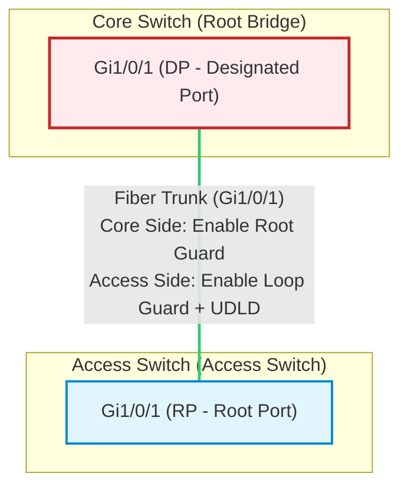

* **Root Guard (Root Bridge Protection)**:
  * **Why it is needed**: Prevents a downstream switch with a lower priority from hijacking the Root Bridge role, which would completely disrupt the traffic path of the network.
  * **How it works**: Configured on downstream ports of the Core Switch. If it receives a superior BPDU, it transitions the port to a `root-inconsistent` (blocking) state. It automatically recovers once the rogue BPDUs stop.
  * **Configuration Location**: Downstream Designated Ports (DP) on Core/Distribution switches.

* **Loop Guard (Unidirectional BPDU Loss Protection)**:
  * **Why it is needed**: On fiber connections, a unidirectional link failure (e.g., Rx fiber cut, while Tx remains active) stops BPDUs from arriving. The downstream switch assumes no loop exists and transitions its Blocked Port to Forwarding, causing a devastating Layer 2 loop.
  * **How it works**: If BPDUs stop arriving on an active port, Loop Guard transitions it to a `loop-inconsistent` (blocking) state instead of allowing it to transition to forwarding.
  * **Configuration Location**: Upstream Root Ports (RP) or Blocked/Alternate Ports (BP) on Access switches.

* **UDLD Aggressive (Physical Unidirectional Link Detection)**:
  * **Why it is needed**: Operates at the physical and data link layers to actively detect fiber unidirectionality by exchanging periodic probe packets.
  * **How it works**: If the remote end stops responding, UDLD aggressively shuts down the port, placing it in an `err-disabled` state.
  * **Configuration Location**: Configured on both ends of a fiber trunk link.

```cisco
! ==========================================
! CORE SWITCH CONFIGURATION (Downstream Ports)
! ==========================================
interface GigabitEthernet1/0/1
 description TO-ACCESS-SWITCH-01
 switchport mode trunk
 spanning-tree guard root                  ! Enable Root Guard (Prevents Root Hijacking)
 udld port aggressive                      ! Enable UDLD (Prevents Physical Unidirectional Loop)

! ==========================================
! ACCESS SWITCH CONFIGURATION (Upstream Ports)
! ==========================================
interface GigabitEthernet1/0/1
 description TO-CORE-SWITCH
 switchport mode trunk
 spanning-tree guard loop                  ! Enable Loop Guard (Prevents Loop on BPDU Loss)
 udld port aggressive                      ! Enable UDLD (Prevents Physical Unidirectional Loop)
```

##### Cisco Switch Spanning Tree & EtherChannel Link Aggregation

The following diagram models a production enterprise network architecture combining **Cisco StackWise** at the Core layer, **LACP EtherChannel** for high-throughput uplink redundancy, and **Rapid-PVST+** for loop prevention at the Access layer:

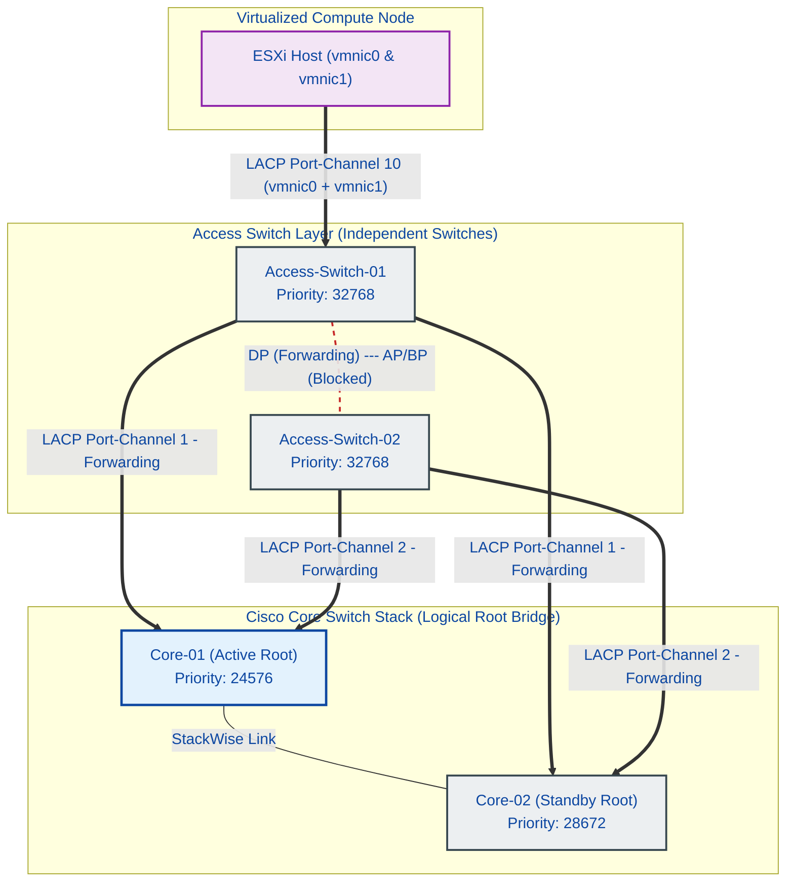

##### Technical Details
| Component / Concept | Technology | Description |
| :--- | :--- | :--- |
| **Spanning Tree Protocol** | **Cisco Rapid-PVST+** | Rapid Per-VLAN Spanning Tree electing Root Bridge and blocking redundant paths in sub-seconds. |
| **Loop Protection** | **BPDU Guard & PortFast** | Instantly err-disables edge ports if a BPDU is received, protecting against rogue switches. |
| **Trunk Guards** | **Root Guard & Loop Guard** | Protects designated trunks from downstream root hijacks and unidirectional Rx path failure loops. |
| **Link Aggregation** | **LACP (802.3ad)** | Aggregates physical interfaces into a logical Port-Channel for high-throughput and failover. |
| **Load Balancing** | **src-dst-ip Hash** | Distributes packets across EtherChannel bundle based on source and destination IP addresses. |

---

#### 1.3. L3 Ingress Gateway Redundancy & IP SLA WAN Tracking

##### Use Case
Ensuring high-availability WAN link redundancy and dynamic path failover at the Layer 3 edge to prevent traffic black-holing during next-hop ISP gateway outages.

##### Problem / Scenario & Solution
**Problem:** Basic static routing on the L3 Core switch points traffic to a single gateway. If that gateway fails or its WAN connections go down, the physical port connecting the L3 switch to the firewall remains `UP`, keeping the primary static route active in the routing table and resulting in traffic black-holing. Furthermore, in environments deploying heterogeneous firewalls (different brands like FortiGate and Sophos), a native Active-Passive HA cluster is impossible since they cannot exchange heartbeats or synchronize session states.
**Solution:** Deployed both firewalls on separate LAN-side IP addresses: FortiGate (Primary) at `192.168.10.1` and Sophos XG (Backup) at `192.168.10.2`.
1. **LAN-side Ingress Failover (Core Switch):** Configured **Cisco IP SLA Tracking** on the Core Switch to ping the Primary Firewall (`192.168.10.1`). If the primary firewall fails, the static route is withdrawn and traffic shifts to the Backup Firewall (`192.168.10.2`, AD 10).
2. **WAN-side Egress Failover (Firewalls):** Instead of manual SLA routes, each firewall runs native **SD-WAN** (or Link Monitor) to manage connections to multiple ISPs, performing WAN SLA probes to public DNS servers (like `8.8.8.8`) to switch outbound paths between ISP 1 and ISP 2.

##### L3 Ingress Gateway Redundancy & SD-WAN WAN SLA
The L3 Core Switch manages ingress path failover between different firewall brands using Cisco IP SLA, while each firewall independently runs SD-WAN SLA health checks to monitor and failover between ISP connections.

```cisco
! --- Cisco L3 Core Switch IP SLA & Track Configuration (Heterogeneous Firewalls) ---
ip sla 1
 icmp-echo 192.168.10.1 source-interface GigabitEthernet1/0/1  ! Ping Primary Firewall (FortiGate)
 threshold 250                                                ! Timeout threshold in ms
 timeout 1000                                                 ! Wait time in ms
 frequency 5                                                  ! Probe interval (seconds)
exit
ip sla schedule 1 start-time now life forever

!
track 1 ip sla 1 reachability
 delay down 10 up 30                                         ! Flap prevention: delay transition
exit

!
ip route 0.0.0.0 0.0.0.0 192.168.10.1 track 1                ! Primary Route via FortiGate
ip route 0.0.0.0 0.0.0.0 192.168.10.2 10                     ! Backup Route via Sophos XG (AD 10)
```

```cisco
! --- FortiGate CLI SD-WAN Member & SLA Health Check Configuration ---
config system sdwan
    config members
        edit 1
            set interface "wan1"
            set gateway 203.0.113.1                          ! ISP 1 Gateway
        next
        edit 2
            set interface "wan2"
            set gateway 198.51.100.1                         ! ISP 2 Gateway
        next
    end
    config health-check
        edit "DNS_SLA"
            set server "8.8.8.8"                             ! Public DNS SLA Target
            set members 1 2
            set proto ping
            set interval 5
            set failtime 3
            set recoverytime 5
        next
    end
end
```

##### L3 Ingress Redundancy & SLA Probe Topology
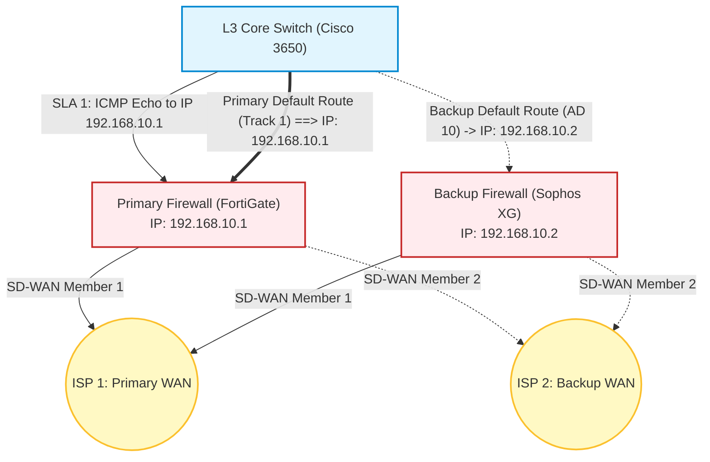

##### Technical Details
| Component / Concept | Technology | Description |
| :--- | :--- | :--- |
| **LAN-side Ingress HA** | **Cisco IP SLA Tracking** | Core Switch tracks the primary firewall's LAN IP (`192.168.10.1`) and fails over to the backup firewall (`192.168.10.2` AD 10) if pings fail. |
| **Heterogeneous Failover** | **Tracked Static Routes** | Resolves the inability of different firewall vendors (FortiGate & Sophos) to form a native HA cluster by routing dynamically at the L3 Switch level. |
| **WAN-side Egress HA** | **Firewall SD-WAN SLA** | Inside each firewall, SD-WAN health-checks (pings to `8.8.8.8`) automatically shift outbound traffic between ISP 1 and ISP 2. |

---

#### 1.4. Multi-SSID Enterprise Wireless Infrastructure (UniFi Deployment)

##### Use Case
Providing secure, high-density, and isolated wireless access for employees and students/guests across multi-floor branch offices while maintaining strict management plane isolation.

##### Problem / Scenario & Solution
**Problem:** Setting up a multi-AP wireless network using **UAP AC LR** APs and a **UniFi Network Controller** (running at `192.168.1.252`) where guest wireless clients are isolated from employee data and the AP management interfaces.
**Solution:** Isolated AP management traffic onto **VLAN 8/9** (Management Plane) and client traffic to distinct VLANs (SSID `Nhanvien-WiFi` mapped to **VLAN 168**, and SSID `Hocvien-WiFi` / portal mapped to **VLAN 368**). Configured Cisco access switchports as trunks with **Native VLAN 8/9** to deliver untagged management frames to APs for zero-touch controller adoption and DHCP addressing, while tagging VLANs 168 and 368 to keep client networks secure and isolated.

##### Architecture Diagram
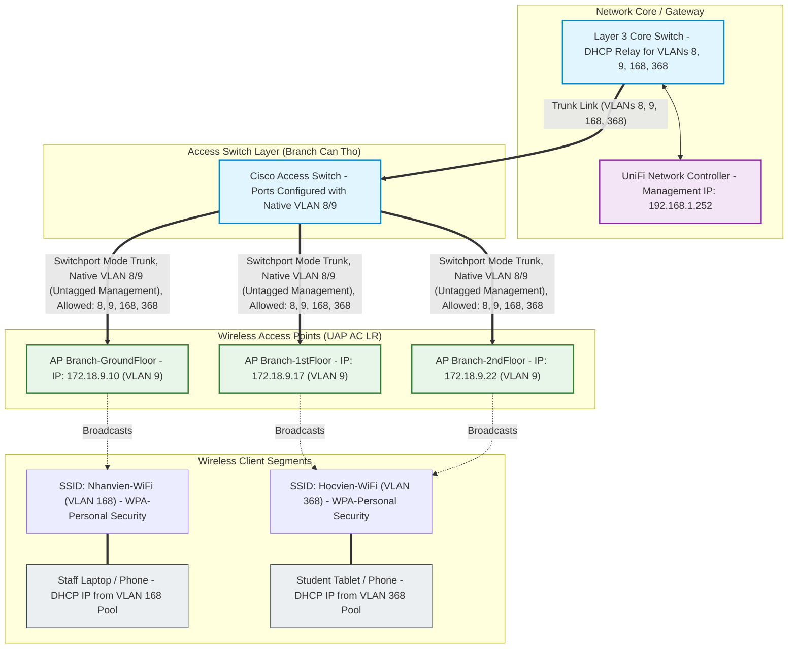

##### Technical Details
```cisco
! --- Cisco Switchport Configuration for UniFi APs ---
interface GigabitEthernet1/0/12
 description CONNECT-TO-UNIFI-AP-LR
 switchport trunk encapsulation dot1q
 switchport trunk native vlan 9      ! Management VLAN (APs receive Untagged IP via DHCP)
 switchport trunk allowed vlan 8,9,168,368
 switchport mode trunk
 spanning-tree portfast trunk       ! Enable PortFast for instant AP discovery
```

---

#### 1.5. Edge Firewall Security & Address Translation (NAT/PAT: FortiGate & Sophos)

##### Use Case
Enabling secure, controlled internet access (outbound) for internal private networks and exposing internal production services (inbound) to the public internet using Network Address Translation (NAT/PAT) on FortiGate and Sophos XG firewalls.

##### Problem / Scenario & Solution
**Problem:** Internal enterprise servers and workstations use private IPv4 addresses (RFC 1918) which are non-routable on the internet. They require a mechanism to communicate with external hosts without exposing their real internal IPs. Conversely, public-facing services (e.g. an internal Web/API Server at `192.168.10.50` or a VoIP gateway) must be safely reachable from the internet on specific ports (e.g. `TCP 443`, `UDP 5060`) over a single public WAN IP.
**Solution:** Configured Network Address Translation (NAT) policies on the edge firewalls:
1. **Source NAT (SNAT / Masquerade) for Outbound Traffic:** Outbound internet traffic has its source IP replaced with the firewall's public WAN IP (or a WAN IP pool) using Port Address Translation (PAT) to map multiple internal IPs to a single public IP.
2. **Destination NAT (DNAT / Port Forwarding) for Inbound Traffic:** Inbound traffic arriving at the public WAN IP on specific ports is dynamically redirected to the target internal server's private IP and port.

##### NAT Operations & Packet Flow
The diagram below shows how source and destination IP/port addresses are modified as packets cross the firewall boundary:

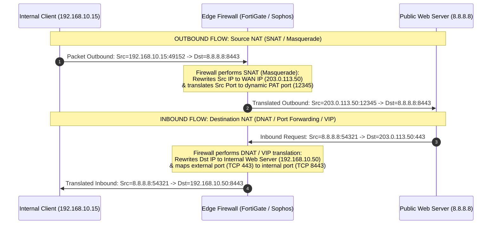

##### Firewall-Specific Implementations

###### 1. FortiGate Firewall Configuration
FortiGate uses **Virtual IPs (VIP)** for Destination NAT and policy-based or IP pool-based translation for Source NAT.

- **Source NAT (SNAT vs. Masquerade) Concepts on FortiGate:**
  * **Masquerade (Outgoing Interface Address):** Configured by enabling NAT in the Firewall Policy and choosing `Use Outgoing Interface Address`. This is the default PAT method, ideal for dynamic WAN IPs (PPPoE/DHCP). During link flaps or IP changes, FortiGate aggressively clears the connection tracking (conntrack) cache for the outgoing interface to force clients to negotiate new sessions with the new IP.
  * **Static SNAT (Dynamic IP Pool):** Configured by choosing `Use Dynamic IP Pool` (with Overload or One-to-One modes) and assigning a defined static public IP pool. This requires a static WAN IP configuration. It has very low CPU overhead because the system does not need to constantly monitor the outgoing interface's IP state. During transient link flaps, FortiGate retains conntrack entries to allow session recovery.
- **Destination NAT (Inbound Port Forwarding via VIP):**
  A Virtual IP object maps a public IP and external port to an internal server IP and internal port.

```cisco
! --- FortiGate CLI Configuration for NAT ---

! 1. Define the Destination NAT Object (Virtual IP with Port Forwarding)
config firewall vip
    edit "VIP_Web_Server"
        set extip 203.0.113.50                  ! Firewall Public WAN IP
        set extport 443                         ! Public Port exposed to internet
        set mappedip 192.168.10.50              ! Internal Server Private IP
        set mappedport 8443                     ! Internal Server Listening Port
        set portforward enable                  ! Enable Port Translation (PAT)
        set protocol tcp                        ! Protocol mapping
    next
end

! 2. Apply Destination NAT in Inbound Policy (WAN to LAN)
config firewall policy
    edit 10
        set name "Allow_Inbound_HTTPS"
        set srcintf "wan1"
        set dstintf "internal"
        set srcaddr "all"
        set dstaddr "VIP_Web_Server"            ! Reference the VIP object
        set action accept
        set schedule "always"
        set service "HTTPS"                     ! Allowed protocol port
    next
end

! 3. Configure Outbound Policy with SNAT/Masquerade (LAN to WAN)
config firewall policy
    edit 20
        set name "LAN_to_Internet"
        set srcintf "internal"
        set dstintf "wan1"
        set srcaddr "all"
        set dstaddr "all"
        set action accept
        set schedule "always"
        set service "ALL"
        set nat enable                          ! Enable Source NAT (IP Masquerade)
    next
end
```

###### 2. Sophos XG Firewall Configuration
Sophos XG decouples NAT policies from firewall security policies using a dedicated **NAT Rule Table**.

- **Source NAT (SNAT vs. Masquerade) Concepts on Sophos XG:**
  * **Masquerade (MASQ):** Configured in a NAT rule with `Translated Source (SNAT) = MASQ`. Sophos dynamically translates internal LAN IPs to the outbound WAN interface's current IP. Ideal for dynamic WAN configurations (DHCP/PPPoE). If the link flaps and receives a new IP, Sophos instantly clears all conntrack entries associated with the interface.
  * **Static SNAT:** Configured with `Translated Source (SNAT) = [IP Host Object / IP Range / IP Pool]`. Maps LAN traffic to specific static public IPs. It has low CPU overhead and retains conntrack cache states during transient link flaps.
- **Destination NAT (Inbound DNAT Rule):**
  Maps the original destination WAN IP to the translated destination internal IP, with port translation configured in the services parameters.

```cisco
! --- Sophos XG CLI/Concept Logical Structure ---

! 1. Outbound SNAT NAT Rule (LAN to WAN IP Masquerade)
NAT Rule: "SNAT_LAN_to_WAN"
  Original Source: "LAN_Subnet"                ! Matches source subnet of internal LAN clients (192.168.10.0/24)
  Translated Source: "MASQ"                     ! Dynamically uses current WAN interface IP (IP Masquerade)
  Original Destination: "Any"                   ! Applies to outbound internet traffic
  Translated Destination: "Original"            ! No destination translation performed
  Original Service: "Any"                       ! Matches all outgoing ports (TCP/UDP/ICMP)
  Translated Service: "Original"                ! No destination port translation performed
  Inbound Interface: "LAN"                      ! Rule applies to packets entering LAN interface
  Outbound Interface: "WAN"                     ! Rule applies to packets exiting WAN interface

! 2. Inbound DNAT Rule (Port Forwarding to Internal Web Server)
NAT Rule: "DNAT_WAN_to_HTTPS_Server"
  Original Source: "Any"
  Translated Source: "Original"
  Original Destination: "WAN_Port_IP"           ! Public WAN Interface IP (203.0.113.50)
  Translated Destination: "Web_Server_IP"       ! Internal Private IP (192.168.10.50)
  Original Service: "HTTPS_443"                 ! Incoming Public Port
  Translated Service: "Custom_8443"              ! Internal Listening Port
  Inbound Interface: "WAN"
  Outbound Interface: "LAN"

! 3. Accompanying Security Policy (Firewall Rule allowing Inbound Traffic)
Firewall Rule: "Allow_HTTPS_to_Server"
  Source Zone: "WAN"
  Source Networks: "Any"
  Destination Zone: "LAN"
  Destination Networks: "Web_Server_IP"         ! Mapped private IP
  Services: "Custom_8443"                       ! Internal port allowed
  Action: "Accept"
```

##### Technical Details
| Translation Type | Common Name | Primary Function | Config Element (FortiGate) | Config Element (Sophos) |
| :--- | :--- | :--- | :--- | :--- |
| **Source NAT** | **IP Masquerade / SNAT** | Translates internal private IPs to a public IP for internet access. | Policy: `set nat enable` | NAT Rule: `Translated Src = MASQ` |
| **Destination NAT** | **Port Forwarding / DNAT** | Maps a public WAN IP and port to an internal server IP and port. | Virtual IP Object (VIP) | NAT Rule: `Translated Dst = Server` |
| **Port Address Translation** | **PAT / Overload** | Maps multiple private IPs to a single public IP using unique source ports. | Automatic dynamic port mapping | Automatic dynamic port mapping |
---

### 2. System & Virtualization Infrastructure

#### 2.1. Enterprise vSphere Distributed Switch (vDS) & vSAN Clustered Storage

##### Use Case
Designing a high-throughput, low-latency, and redundant virtualized networking and storage topology to support a vCenter-managed ESXi cluster, live VM migrations (vMotion), and clustered vSAN storage.

##### Problem / Scenario & Solution
**Problem:** Maintaining consistent virtual port group configurations, security profiles, and link aggregation (LACP) across 7 ESXi cluster nodes while isolating latency-sensitive storage (vSAN) and migration (vMotion) traffic from production guest VM workloads.
**Solution:** Configured a central **vSphere Distributed Switch (vDS)** across the 7 ESXi host cluster to eliminate port group configuration drift. Implemented **vSphere Standard Switches (vSS)** on individual hosts to isolate edge firewall interfaces (PfSense WAN/LAN). Established uplink redundancy using **LACP Link Aggregation (Active/Active)** over dual 10G/25G SFP+ physical ports (`vmnic0` and `vmnic1`). Configured dedicated VMkernel ports with **Jumbo Frames (MTU 9000)** for vSAN storage (VLAN 30) and vMotion (VLAN 20) to maximize throughput and minimize CPU overhead, while keeping the ESXi Management VMkernel on a separate VLAN at MTU 1500.

##### Architecture Diagram
```mermaid
graph TD
    %% Styling Definitions
    classDef switch fill:#e1f5fe,stroke:#0288d1,stroke-width:2px;
    classDef host fill:#e8f5e9,stroke:#2e7d32,stroke-width:2px;
    classDef vds fill:#f3e5f5,stroke:#8e24aa,stroke-width:2px;
    classDef vss fill:#fff3e0,stroke:#ff9800,stroke-width:2px;
    classDef storage fill:#fff8e1,stroke:#ff8f00,stroke-width:2px;
    classDef vm fill:#eceff1,stroke:#37474f,stroke-width:1px;

    %% PHYSICAL SWITCHES
    subgraph Physical_Network ["Physical Network (Leaf-Spine)"]
        Switch_A["Top-of-Rack Switch A (10G/25G Trunk)"]:::switch
        Switch_B["Top-of-Rack Switch B (10G/25G Trunk)"]:::switch
    end

    %% vCENTER SERVER
    vCenter["vCenter Server (Active Cluster Management)"]:::vds

    %% PHYSICAL ESXi HOSTS
    subgraph ESXi_Cluster ["ESXi Host Cluster"]
        subgraph ESXi_Node ["Single ESXi Host Instance"]
            %% Physical Uplinks
            vmnic0["Physical Uplink vmnic0 (10G SFP+)"]
            vmnic1["Physical Uplink vmnic1 (10G SFP+)"]
            vmnic2["Physical Uplink vmnic2 (1G Cu)"]
            vmnic3["Physical Uplink vmnic3 (1G Cu)"]
            
            %% vSphere Distributed Switch
            subgraph vDS_Switch ["vSphere Distributed Switch (vDS)"]
                direction TB
                Uplink_Group["Distributed Uplink Group (LACP Port Channel)"]
                
                %% vDS Port Groups
                pg_vsan["dvPortGroup-vSAN (Storage VLAN) - MTU 9000"]
                pg_vmotion["dvPortGroup-vMotion (Migration VLAN) - MTU 9000"]
                pg_mgmt["dvPortGroup-Management (Mgmt VLAN) - MTU 1500"]
                pg_staff["dvPortGroup-Staff (Employee VLAN) - MTU 1500"]
                pg_guest["dvPortGroup-Guest (Guest VLAN) - MTU 1500"]
            end

            %% vSphere Standard Switch
            subgraph vSS_Switch ["vSphere Standard Switch (vSS)"]
                direction TB
                Standard_Uplink["vSS Uplink Group (NIC Teaming)"]
                
                %% vSS Port Groups
                pg_pfsense_lan["PortGroup-Firewall_LAN (LAN VLAN)"]
                pg_pfsense_wan["PortGroup-Firewall_WAN (Untagged)"]
            end
            
            %% VMkernel Adapters
            vmk0["vmk0 (Management IP)"]
            vmk1["vmk1 (vSAN Storage IP)"]
            vmk2["vmk2 (vMotion Migration IP)"]
        end
    end

    %% VIRTUAL MACHINES
    vCenter_VM["vCenter Appliance VM"]:::vm
    Firewall_VM["Virtual Firewall VM"]:::vm
    Prod_VM["Production Guest VMs"]:::vm
    
    %% DATASTORES
    vSAN_DS[("vSAN Clustered Datastore")]:::storage
    NFS_DS[("Network Backup Storage (NFS)")]:::storage

    %% CONNECTIONS
    vCenter -. Manages .-> vDS_Switch
    vCenter -. Manages .-> vSS_Switch

    %% VM to Port Group mappings
    vCenter_VM --- pg_mgmt
    Prod_VM --- pg_staff
    Prod_VM --- pg_guest
    Firewall_VM --- pg_pfsense_lan
    Firewall_VM --- pg_pfsense_wan

    %% VMkernel to Port Groups
    vmk0 --- pg_mgmt
    vmk1 --- pg_vsan
    vmk2 --- pg_vmotion

    %% Storage connections
    vmk1 -. Low-Latency Storage Traffic .-> vSAN_DS
    vCenter_VM -. Network Backup .-> NFS_DS

    %% Port Groups to Uplinks
    pg_vsan ---> Uplink_Group
    pg_vmotion ---> Uplink_Group
    pg_mgmt ---> Uplink_Group
    pg_staff ---> Uplink_Group
    pg_guest ---> Uplink_Group

    pg_pfsense_lan ---> Standard_Uplink
    pg_pfsense_wan ---> Standard_Uplink

    %% Uplinks to Physical NICS
    Uplink_Group === vmnic0
    Uplink_Group === vmnic1
    Standard_Uplink === vmnic2
    Standard_Uplink === vmnic3

    %% Physical NICs to Physical Switches
    vmnic0 <== LACP Trunk ==> Switch_A
    vmnic1 <== LACP Trunk ==> Switch_B
    vmnic2 <== Trunk ==> Switch_A
    vmnic3 <== Trunk ==> Switch_B
```

##### Technical Details
| Component | Technology | Description |
| :--- | :--- | :--- |
| **Hypervisor Platform** | **VMware ESXi** | Bare-metal hypervisor running on physical servers to host virtualized compute resources. |
| **Central Management** | **VMware vCenter Server** | Centralized administration platform orchestrating cluster HA, vMotion, vDS configurations, and storage policies. |
| **Clustered Storage** | **VMware vSAN** | Software-defined storage tier aggregating local host drives into a unified, shared datastore. |
| **Virtual Networking** | **vSphere Distributed Switch (vDS)** | Centralized switch fabric providing consistent port groups, LACP trunking, and VLAN tagging across cluster hosts. |
| **Local Virtual Switch** | **vSphere Standard Switch (vSS)** | Host-level switch isolating local virtual appliance uplinks (e.g., edge firewalls) from the distributed fabric. |

---

#### 2.2. Virtualized Desktop Infrastructure (VDI) with vGPU & PCIe Passthrough

##### Use Case
Delivering high-performance, graphics-accelerated virtual environments for online learning classes without deploying expensive physical workstations to each remote user.

##### Problem / Scenario & Solution
**Problem:** Students of online classes require virtual desktops capable of running graphics-intensive applications (e.g., video editing, design, or 3D modeling) with low latency. Allocating a dedicated physical GPU to each individual VM is highly inefficient and creates resource bottlenecks.
**Solution:** Implemented an on-premise Virtualized Desktop Infrastructure (VDI) powered by **VMware Horizon** and **NVIDIA vGPU technology**. Physical GPUs (e.g., NVIDIA A5000 24GB cards installed in Supermicro/Dell servers) are virtualized using the **NVIDIA vGPU Manager** running on the ESXi hypervisor, allowing physical frames to be sliced into specific virtual GPU profiles (such as `A5000-8Q` or `A5000-12Q` profiles) allocated dynamically to virtual machines. For workloads requiring extreme performance, dedicated **PCIe Passthrough (DirectPath I/O)** maps physical GPUs directly to target VMs. Desktops running Zorin OS or Windows 11 are provisioned in pools via vCenter, allowing remote students to connect securely using the VMware Horizon Client over the Blast Extreme or PCoIP protocol.

##### Architecture Diagram
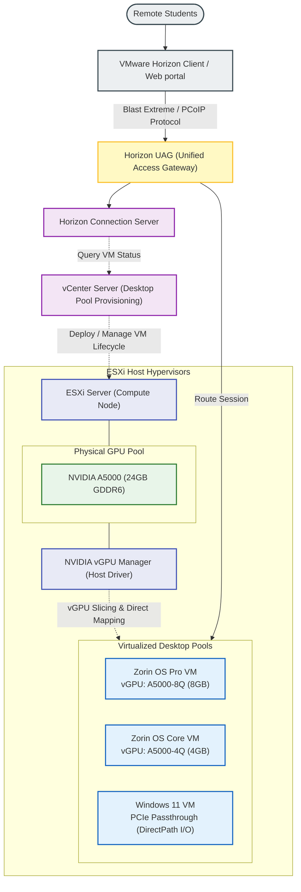

##### Technical Details
| Component | Technology | Description |
| :--- | :--- | :--- |
| **Connection Broker** | **VMware Horizon Connection Server** | Manages client connections, user authentication, and routes sessions to available desktops. |
| **Gateway Access** | **Horizon UAG (Unified Access Gateway)** | Secure edge gateway proxying client traffic into the internal VDI network. |
| **GPU Virtualization** | **NVIDIA vGPU Manager (VIB)** | Kernel-level driver installed on ESXi host to slice physical GPU memory and cores. |
| **Hardware Acceleration** | **NVIDIA A5000 24GB GPUs** | Physical PCIe graphics cards providing hardware rendering resources. |
| **Direct Device Mapping** | **PCIe DirectPath I/O Passthrough** | Bypasses hypervisor overhead to map a physical GPU directly to a single high-performance VM. |
| **Virtual Desktops** | **Zorin OS & Windows 11** | Optimized template VMs pre-installed with Horizon Agent for remote desktop delivery. |

---

#### 2.3. Enterprise VoIP & High-Capacity Call Center

##### Use Case
Architecting, securing, and operating a high-capacity, multi-tenant Call Center infrastructure capable of processing massive concurrent inbound/outbound calls for various enterprise branches and educational institutions.

##### Problem / Scenario & Solution
**Problem:** Managing a PBX system handling 180+ active agents with high call volumes while securing the VoIP gateway against persistent external SIP brute-force scans and preventing audio packet loss or call dropped issues.
**Solution:** Deployed FreeSWITCH and FusionPBX on a secure Debian OS. Hardened security by configuring **Fail2ban** to parse FreeSWITCH log events and dynamically block offending IPs via **iptables/nftables** rules, and isolated telco SIP traffic using multi-table routing. Unified Let's Encrypt SSL/TLS certificates across both **Internal** (WebRTC/WSS port `7443`) and **External** (SIP-TLS port `5081`) profiles to guarantee zero mismatch during TLS handshakes. Integrated custom **Lua scripts** within the XML dialplan to dynamically map outbound Caller IDs (campaign masking) and track QoS metrics. Exposed the FreeSWITCH **Event Socket Layer (ESL)** to allow CRM integration for instant client record popups.

##### Architecture Diagram
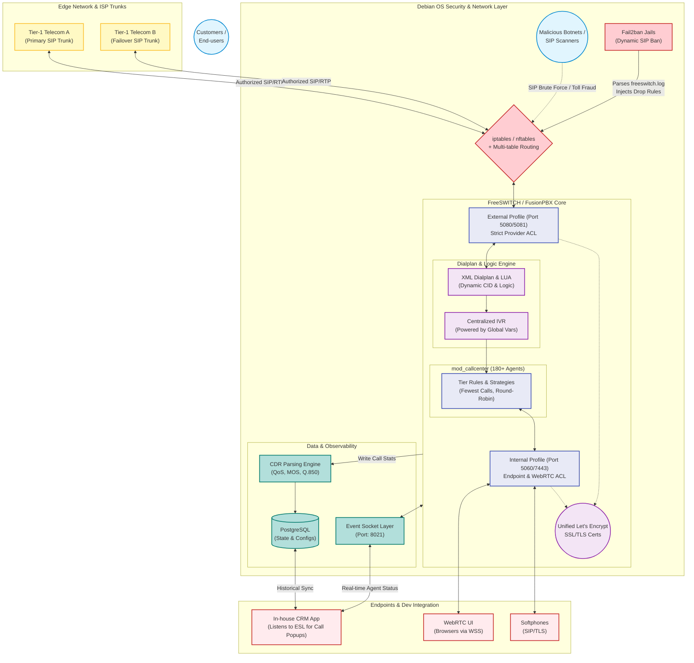

##### Technical Details
| Component | Technology | Description |
| :--- | :--- | :--- |
| **VoIP Engine** | **FreeSWITCH / FusionPBX** | Core PBX handling SIP signaling, WebRTC gateways, media routing, and call queues. |
| **Operating System** | **Debian Linux** | Secure, stable platform with multi-table routing for telco trunk isolation. |
| **Border Security** | **Fail2ban + iptables/nftables** | Dynamic firewall rules blocking unauthorized SIP brute-force attempts. |
| **Transport Security** | **SIP-TLS & WebRTC (WSS)** | Secured signaling using unified Let's Encrypt certificates. |
| **CRM Integration** | **FreeSWITCH Event Socket (ESL)** | Programmatic socket bridge triggering real-time client popups in custom CRM. |
| **Dialplan Scripting** | **Lua (mod_lua)** | Script hook injecting dynamic routing and Caller ID masking. |

```xml
<!-- Example: Advanced Outbound Dialplan with Lua Injection -->
<extension name="ENTERPRISE-OUTBOUND-ROUTING" continue="false">
    <condition field="${user_exists}" expression="false"/>
    <condition field="destination_number" expression="^(\d{10,11})$">
        <!-- 1. Dev/CRM Integration: Exporting UUID and Account Codes -->
        <action application="set" data="sip_h_X-accountcode=${accountcode}"/>
        <action application="export" data="call_direction=outbound"/>
        <action application="export" data="sip_h_X-Call_UUID=${uuid}"/>
        
        <!-- 2. Lua Script Injection: Synchronize exact answer time for CRM billing -->
        <action application="export" data="execute_on_answer=lua reset_answered_time.lua ${uuid}"/>
        
        <!-- 3. QoS Preparation & Dynamic CID Mapping -->
        <action application="set" data="rtp_jitter_buffer=true"/>
        <action application="unset" data="call_timeout"/>
        <action application="set" data="hangup_after_bridge=true"/>
        
        <!-- Injecting Masked/Dynamic Outbound Caller ID -->
        <action application="set" data="effective_caller_id_number=$${global_outbound_caller_id}"/>
        
        <!-- 4. Bridge to Tier-1 Provider SIP Gateway -->
        <action application="bridge" data="sofia/gateway/provider-primary-gateway/$1"/>
    </condition>
</extension>
```

---

#### 2.4. Hybrid Directory Services & Microsoft 365 Cloud Automation

##### Use Case
Automating identity lifecycle management, secure hybrid directory synchronization, and unified compliance auditing across on-premise Active Directory and Microsoft 365.

##### Problem / Scenario & Solution
**Problem:** Manually provisioning hundreds of staff and lecturers across local Active Directory and Microsoft 365 is slow and highly prone to naming collisions, mismatched attributes, and duplicate cloud accounts. Additionally, IT teams must generate local timesheet mappings (Mitaco), coordinate remote email/SMS login delivery, and perform compliance security audits on active email/chat histories.
**Solution:** Developed a modular Python automation suite. The engine parses HR source data, normalizes usernames (e.g. given name + initials of middle/surname, duplicate resolution by appending employee codes like `trinhdtn2813`), and provisions LDAP accounts under correct OUs (e.g., `OU=GIANGVIEN`, `OU=USER_NHANVIEN_HNAAU`). It automatically exports attendance-system CSV mappings, emails credentials, and triggers Azure AD Connect Delta Sync on the sync server using **WinRM (Remote PowerShell)**. Provisions/licenses cloud accounts using Microsoft Graph API, maps memberships to Microsoft Teams and Exchange distribution groups, and resolves sync conflicts via **Hard-Matching** (remapping cloud `onPremisesImmutableId` to local `objectGUID` in Base64). Built `ediscovery.py` to audit mailboxes/Teams and `user-check.py` to audit OneDrive.

##### Architecture Diagram
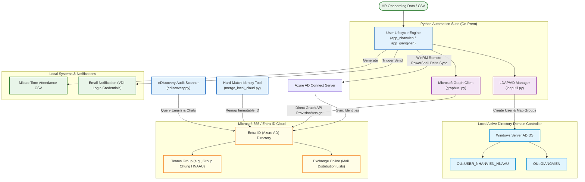

##### Technical Details
| Component | Technology / Script | Description |
| :--- | :--- | :--- |
| **AD provisioning** | **`python-ldap`** | Establish simple bind over LDAPS, creates users in nested OUs with UTF-16LE password profiles. |
| **Cloud Provisioning** | **`Office365-REST-Python-Client`** | Integrates with Microsoft Graph API using App-Only client credentials flow. |
| **AD Sync Trigger** | **`pywinrm` (WinRM NTLM)** | Remote execution triggering `Start-ADSyncSyncCycle -PolicyType Delta` on the AD Sync server. |
| **Identity Hard-Matching**| **`merge_local_cloud.py`** | Remaps the cloud `onPremisesImmutableId` to match the local user's Base64 `objectGUID` to resolve conflicts. |
| **Compliance Auditing** | **`ediscovery.py`** | CLI tool performing OData searches across mailboxes, Teams, and chats, exporting reports to CSV. |
| **OneDrive Analyzer** | **`user-check.py`** | Scans OneDrive quotas and recursively maps folder sizes to isolate large files. |

##### Automation Scripts Implementation

###### 1. Identity Hard-Matching Script (`merge_local_cloud.py`)
This script resolves AD-to-Cloud synchronization conflicts by converting the local Active Directory user's binary `objectGUID` string into a Base64 string and mapping it to the Entra ID user's `onPremisesImmutableId` via the Microsoft Graph API.

```python
import base64
import requests

def convert_guid_to_immutable_id(object_guid_hex: str) -> str:
    """Converts a standard Active Directory hex objectGUID string to Base64 format."""
    clean_hex = object_guid_hex.replace("-", "").replace(" ", "")
    guid_bytes = bytes.fromhex(clean_hex)
    return base64.b64encode(guid_bytes).decode("utf-8")

def update_cloud_immutable_id(access_token: str, user_upn: str, immutable_id: str):
    """Updates the onPremisesImmutableId attribute of a user in Microsoft Entra ID."""
    url = f"https://graph.microsoft.com/v1.0/users/{user_upn}"
    headers = {
        "Authorization": f"Bearer {access_token}",
        "Content-Type": "application/json"
    }
    payload = {
        "onPremisesImmutableId": immutable_id
    }
    response = requests.patch(url, headers=headers, json=payload)
    if response.status_code == 204:
        print(f"[SUCCESS] Merged {user_upn} -> Immutable ID: {immutable_id}")
    else:
        print(f"[ERROR] Failed to update {user_upn}. Code: {response.status_code}, Body: {response.text}")
```

###### 2. Compliance Audit Scanner (`ediscovery.py`)
A command-line script utilizing Microsoft Graph API's OData query features to scan a user's mailbox and Teams chat logs for target keywords, exporting compliance results directly to a CSV report.

```python
import csv
import requests

def scan_user_mailbox(access_token: str, user_upn: str, search_keyword: str, output_path: str):
    """Scans a user's mailbox using OData $search and exports matches to a CSV file."""
    url = f"https://graph.microsoft.com/v1.0/users/{user_upn}/messages"
    headers = {
        "Authorization": f"Bearer {access_token}",
        "Content-Type": "application/json"
    }
    params = {
        "$search": f'"{search_keyword}"',
        "$select": "subject,sender,receivedDateTime,hasAttachments,webLink"
    }
    response = requests.get(url, headers=headers, params=params)
    if response.status_code == 200:
        messages = response.json().get("value", [])
        with open(output_path, mode="w", newline="", encoding="utf-8") as csv_file:
            writer = csv.writer(csv_file)
            writer.writerow(["Subject", "Sender", "Received Date", "Has Attachments", "Web Link"])
            for msg in messages:
                sender_email = msg.get("sender", {}).get("emailAddress", {}).get("address", "Unknown")
                writer.writerow([
                    msg.get("subject"),
                    sender_email,
                    msg.get("receivedDateTime"),
                    msg.get("hasAttachments"),
                    msg.get("webLink")
                ])
        print(f"[SUCCESS] Compliance scan completed. Results exported to: {output_path}")
    else:
        print(f"[ERROR] Scan failed. Code: {response.status_code}, Body: {response.text}")
```

###### 3. OneDrive Disk Space & File Size Analyzer (`user-check.py`)
This script checks a user's OneDrive quota utilization and lists large files exceeding a target threshold, helping administrators identify storage-heavy users.

```python
import requests

def analyze_onedrive_storage(access_token: str, user_upn: str, size_threshold_mb: int = 100):
    """Inspects a user's OneDrive quota and lists files larger than the specified threshold."""
    url = f"https://graph.microsoft.com/v1.0/users/{user_upn}/drive"
    headers = {"Authorization": f"Bearer {access_token}"}
    
    # Get Drive Quota details
    drive_resp = requests.get(url, headers=headers)
    if drive_resp.status_code != 200:
        print(f"[ERROR] Could not fetch drive quota. Code: {drive_resp.status_code}")
        return
        
    quota = drive_resp.json().get("quota", {})
    total_gb = quota.get("total", 0) / (1024**3)
    used_gb = quota.get("used", 0) / (1024**3)
    print(f"User: {user_upn} | Quota Total: {total_gb:.2f} GB | Used: {used_gb:.2f} GB ({quota.get('used', 0)/(quota.get('total', 1))*100:.1f}%)")

    # Search for large files
    threshold_bytes = size_threshold_mb * 1024 * 1024
    search_url = f"{url}/root/search(q='')"
    params = {
        "$filter": f"size gt {threshold_bytes}",
        "$select": "name,size,webUrl"
    }
    search_resp = requests.get(search_url, headers=headers, params=params)
    if search_resp.status_code == 200:
        large_files = search_resp.json().get("value", [])
        print(f"Large Files Found (> {size_threshold_mb} MB):")
        for item in large_files:
            file_mb = item.get("size", 0) / (1024**2)
            print(f" - {item.get('name')} ({file_mb:.2f} MB) -> {item.get('webUrl')}")
    else:
        print(f"[ERROR] Large file query failed. Code: {search_resp.status_code}, Body: {search_resp.text}")

---

### 3. DevOps & Automation Infrastructure

#### 3.1. Enterprise Application Lifecycle & CI/CD Pipelines

##### Use Case
End-to-end development, automation, and release management of enterprise applications with strict security and platform compliance.

##### Problem / Scenario & Solution
**Problem:** Ensuring secure, repeatable, and automated building, signing, and publishing of cross-platform applications without exposing secure Keystore files or manual developer builds.
**Solution:** Designed and maintained a multi-stage **GitLab CI/CD pipeline** running on dedicated self-hosted runners. The pipeline automates the retrieval of security keys, builds production Android App Bundles (AAB) using **Flutter**, runs automated testing, uploads build artifacts to the **GitLab Package Registry**, and deploys directly to internal and production tracks of the **Google Play Console** using **Fastlane**.

##### Architecture Diagram
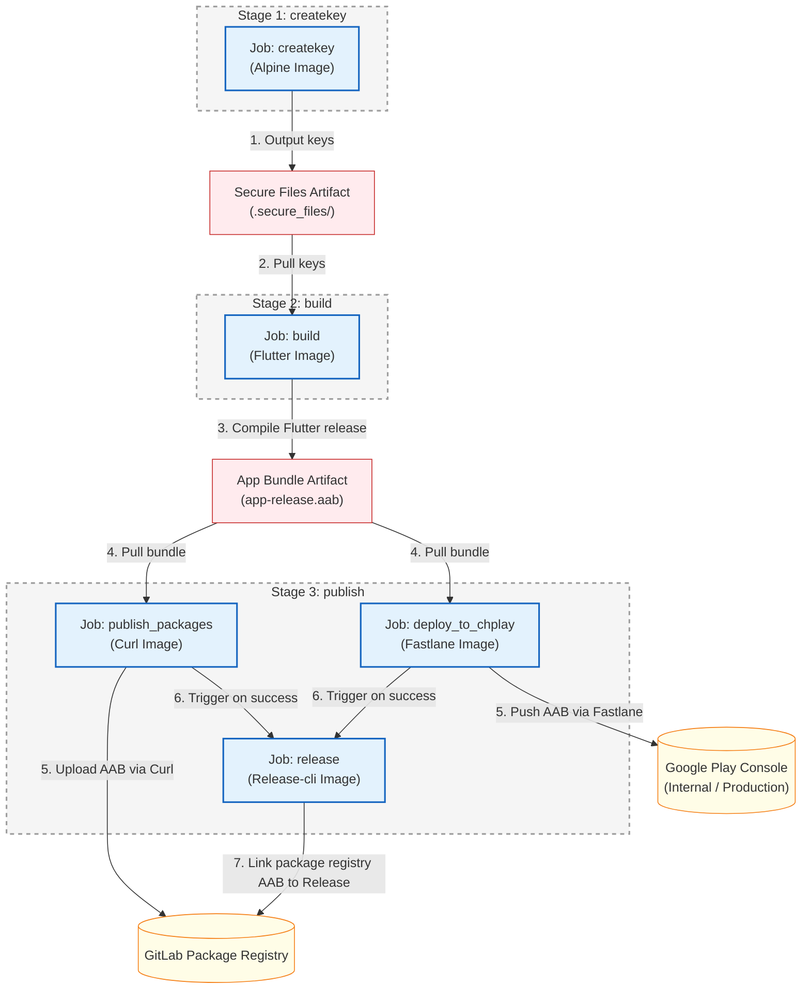

##### Technical Details
```yaml
variables:
  FLUTTERVER: 3.19.5

stages:
  - createkey
  - build
  - publish

createkey:
  stage: createkey
  image: "alpine:latest"
  before_script:
    - echo "Install bash and curl"
    - apk add --no-cache bash curl
  variables:
    GIT_STRATEGY: clone
  script:
    - chmod +x ./scripts/download-secure
    - bash ./scripts/download-secure
  tags:
    - flutter-runner
  only:
    - tags
  artifacts:
    expire_in: 1 hour
    paths:
      - .secure_files/

build:
  stage: build
  image: "instrumentisto/flutter:${FLUTTERVER}"
  needs:
    - createkey
  variables:
    GIT_STRATEGY: clone
  before_script:
    - flutter pub global activate rps
    - export PATH="$PATH":"$HOME/.pub-cache/bin"
  script:
    - rps reset
    - rps generate all
    - cp .secure_files/* ./android/app/
    - echo "storeFile=./upload-keystore.jks" >> android/key.properties
    - echo "storePassword=${passwordKeyandStore}" >> android/key.properties
    - echo "keyPassword=${passwordKeyandStore}" >> android/key.properties
    - echo "keyAlias=${keyAlias}" >> android/key.properties
    - "APP_VERSION=$(grep -o 'version: [0-9]\\+\\.[0-9]\\+\\.[0-9]\\+' pubspec.yaml | awk '{print $2}')"
    - BUILD_NUMBER=$(TZ=UTC date -d "$CI_JOB_STARTED_AT" "+%Y%m%d%M")
    - flutter build appbundle --build-name=${APP_VERSION} --build-number=${BUILD_NUMBER} --release
  artifacts:
    expire_in: 1 hour
    paths:
      - build/app/outputs/bundle/release/app-release.aab
  dependencies:
    - createkey
  tags:
    - flutter-runner
  only:
    - tags

publish_packages:
  stage: publish
  needs: 
    - build
  image: curlimages/curl:latest
  dependencies: 
    - build
  script:
      - cp -r build/app/outputs/bundle/release ./
      - 'curl --header "JOB-TOKEN: $CI_JOB_TOKEN" --upload-file ./release/app-release.aab "${CI_API_V4_URL}/projects/${CI_PROJECT_ID}/packages/generic/drift-survivors/${CI_COMMIT_TAG}/app-release.aab"'
  only:
    - tags
  tags:
    - flutter-runner

deploy_to_chplay:
  stage: publish
  image: cijumbo/fastlane:2.220.0
  variables:
    GIT_STRATEGY: clone
  dependencies:
    - build
  needs: 
    - build
  before_script:
    - cp -r build/app/outputs/bundle/release ./
    - apt install -y curl bash
    - chmod +x ./scripts/download-secure
    - bash ./scripts/download-secure
    - cp ./.secure_files/google_play_service_account.json ./google_play_api_key.json  
    - bundle update fastlane
  script: 
    - "APP_VERSION=$(grep -o 'version: [0-9]\\+\\.[0-9]\\+\\.[0-9]\\+' pubspec.yaml | awk '{print $2}')"
    - bundle exec fastlane supply --track internal --aab  ./release/app-release.aab --json_key ./google_play_api_key.json --package_name ${Packages_name}
    - bundle exec fastlane supply --track internal --track_promote_to production --changes_not_sent_for_review false  --json_key ./google_play_api_key.json  --package_name ${Packages_name}
  after_script:
    - rm ./google_play_api_key.json
  tags:
    - flutter-runner
  only:
    - tags

release:
  stage: publish
  needs: 
    - publish_packages
    - deploy_to_chplay
  image: registry.gitlab.com/gitlab-org/release-cli:latest
  before_script:
    - apk add git
  script:
    - echo "Creating release $CI_COMMIT_TAG..."
  release:
    tag_name: $CI_COMMIT_TAG
    description: |
      Changes:
      $(git log $(git describe --abbrev=0 --tags --exclude=$CI_COMMIT_TAG).$CI_COMMIT_TAG --oneline --no-decorate --reverse | sed "s/^[^ ]* /- /g")
    assets:
      links:
        - name: AAB
          url: ${CI_API_V4_URL}/projects/${CI_PROJECT_ID}/packages/generic/drift-survivors/${CI_COMMIT_TAG}/app-release.aab
          link_type: package
  only:
    - tags
  tags:
    - flutter-runner
```

---

#### 3.2. On-Demand Container Provisioning & Traefik Edge Ingress

##### Use Case
Scaling independent, isolated worker/service container instances on-demand while automating Layer 7 routing, subdomain mapping, and TLS certificate generation for multi-tenant applications.

##### Problem / Scenario & Solution
**Problem:** Scaling dynamically-provisioned user workspaces where each user session requires a dedicated docker container. Traditional dynamic updates to a single massive docker-compose file cause long re-evaluation delays (~15-30 seconds).
**Solution:** Developed a micro-orchestration system using a Python Flask API, Redis, and the Portainer API. When a user requests a session, the API deploys an isolated **Micro-Stack** (individual standalone docker-compose file) via Portainer API endpoints, reducing deployment times to **1-2 seconds**. Configured **Traefik** as the edge reverse proxy, which dynamically discovers the new container's labels via the Docker provider, maps a unique subdomain, and requests SSL certificates from Let's Encrypt.

##### Architecture Diagram


##### Technical Details
| Component | Technology | Description |
| :--- | :--- | :--- |
| **API Gateway & Logic** | **Python Flask (asyncio, PyYAML)** | Handles dynamic session management, parses Docker Compose configurations, and integrates with the orchestrator API. |
| **State Storage & Cache**| **Redis** | Caches session tokens, active execution locks, and temporary verification states to prevent request collision. |
| **Orchestration Client** | **Portainer API** | Programmatically provisions standalone **Micro-Stacks** (standalone compose files) via the Portainer API (`POST /api/stacks/create/standalone/string`), resolving monolithic compose re-evaluation overhead (~15-30s reduced to sub-second). |
| **Edge Ingress Proxy** | **Traefik (Docker Provider)** | Dynamically registers routing paths, binds subdomains, handles SSL challenge via Let's Encrypt (HTTP/DNS challenge), and manages client traffic. |
| **Worker Environment** | **Docker Container** | An isolated workspace instance running on-demand microservices for a specific authenticated user. |

```yaml
networks:
  custom_network:
    name: app_cloud_system_custom_network
    external: true

services:
  account-${phone_number}:
    image: enterprise/app-service:latest
    networks:
      - custom_network
    labels:
      - "traefik.enable=true"
      - "traefik.http.services.service-${service_id}.loadbalancer.server.port=5001"
      - "traefik.http.routers.service-${service_id}-https.rule=Host(`service-${service_id}.domain.com`)"
      - "traefik.http.routers.service-${service_id}-https.entrypoints=websecure"
      - "traefik.http.routers.service-${service_id}-https.tls=true"
      - "traefik.http.routers.service-${service_id}-https.tls.certresolver=letsencrypt"
```
