### 📌 Tổng quan (Overview)

Thư mục này đóng vai trò là hồ sơ năng lực (portfolio) tổng hợp những kinh nghiệm thực tế của tôi trong thiết kế, triển khai và vận hành các giải pháp hạ tầng Mạng (Network), ảo hóa Hệ thống (System) và tự động hóa quy trình DevOps ở quy mô doanh nghiệp (production-grade).

---

### 1. Hạ tầng Mạng (Network Infrastructure)

#### 1.1. Chuyển tiếp Dữ liệu Hỗn hợp Layer 3 & MPLS (MPLS & Hybrid Layer 3/MPLS Data Forwarding)

##### Use Case
Đảm bảo giao tiếp an toàn, cô lập và tốc độ cao giữa các Văn phòng Chi nhánh và switch Core/vCenter ở Trụ sở chính (HO) sử dụng hai tuyến đường truyền WAN dự phòng (Nhà cung cấp A và Nhà cung cấp B) với cấu trúc chuyển tiếp khác nhau.

##### Problem / Scenario & Solution
**Bài toán:** Các máy trạm tại văn phòng chi nhánh cần truy cập vào các Máy ảo (VM) trên cụm vCenter tại Trụ sở chính. Hệ thống phải đảm bảo tính dự phòng mạng và phân tách lưu lượng quản trị khỏi các subnet dữ liệu thông thường bằng cách sử dụng hai nhà cung cấp WAN với thiết kế mạng khác nhau.
**Giải pháp:** Thiết kế một cấu trúc chuyển tiếp hỗn hợp (hybrid forwarding topology) qua hai nhà cung cấp dịch vụ mạng (ISP). Nhà cung cấp A đóng vai trò là một đường truyền MPLS L2VPN tiêu chuẩn, mang các khung quản trị/DHCP dạng bridge về Core HO. Nhà cung cấp B triển khai một cấu trúc hỗn hợp: Định tuyến Layer 3 qua một subnet WAN (gateway `10.90.97.249`) để chuyển tiếp các subnet dữ liệu thông thường sử dụng định tuyến động (**RIP v2** hoặc static routes) để quảng bá các prefix của chi nhánh, kết hợp với một đường truyền MPLS L2VPN (next-hop `192.168.1.10`) để truyền tải các khung quản trị không được gắn tag (untagged). Các dịch vụ DHCP được lưu trữ động trên một VM chuyên dụng chạy trên **cụm ESXi 4-host** được quản lý bởi vCenter.

##### Sơ đồ Kiến trúc (Architecture Diagram)
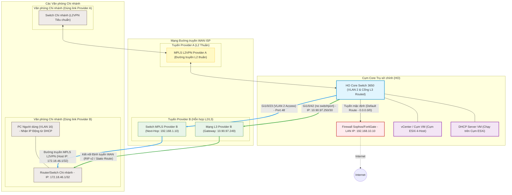

##### Chi tiết Kỹ thuật (Technical Details)
| Thành phần | Công nghệ | Mô tả |
| :--- | :--- | :--- |
| **Tuyến chính (Provider A)** | **MPLS L2VPN Tunnel** | Đường truyền Layer 2 VPN thuần túy mang các frame quản lý và DHCP được bridge trực tiếp về HO Core. |
| **Tuyến phụ (Provider B)** | **Hỗn hợp WAN (L3 / L2VPN)** | Định tuyến Layer 3 cho subnet dữ liệu qua gateway `10.90.97.249` và đường truyền L2VPN qua next-hop `192.168.1.10`. |
| **Giao thức Định tuyến** | **RIP v2 & Định tuyến tĩnh** | Quảng bá và cập nhật động các subnet và prefix của chi nhánh về Core HO. |
| **Hạ tầng DHCP** | **DHCP VM chạy trên vCenter** | Cấp phát IP động cho chi nhánh từ máy ảo DHCP chạy trực tiếp trên cụm ESXi 4-host của HO. |
| **Switch Định tuyến Biên** | **Cisco Catalyst 3650** | Switch Layer 3 tại HO kết thúc các đường trunk WAN và điều phối chính sách định tuyến động. |

---

#### 1.2. Ngăn chặn Vòng lặp Layer 2: Giao thức Spanning Tree (STP) & Gộp liên kết LACP (L2 Loop Prevention: Spanning Tree Protocol & Link Aggregation LACP)

##### Use Case
Ngăn chặn bão broadcast (broadcast storm) và vòng lặp Layer 2 trong môi trường mạng doanh nghiệp chia nhiều VLAN, đồng thời đảm bảo tính dự phòng của liên kết vật lý và cân bằng tải lưu lượng.

##### Problem / Scenario & Solution
**Bài toán:** Trong mạng văn phòng chi nhánh, một máy trạm ở phòng tư vấn thuộc VLAN 150 nhận sai IP DHCP từ VLAN 204. Kết quả chẩn đoán phát hiện một switch trong Phòng IT (IT Room) thiếu cấu hình Spanning Tree Protocol (STP) và có một vòng lặp vật lý tự cắm nối giữa cổng thuộc VLAN 150 và cổng thuộc VLAN 204. Sự rò rỉ broadcast domain này làm gói tin DHCP Discover bị nhân bản liên tục giữa các VLAN, tạo ra tình trạng tranh chấp (race condition) và gói tin cấp IP của VLAN 204 phản hồi về trước.
**Giải pháp:** Triển khai **Rapid Spanning Tree Protocol (Rapid-PVST+)** trên toàn bộ hệ thống switch, cấu hình switch Core làm Root Bridge bằng cách điều chỉnh priority. Bật **BPDU Guard** và **PortFast** trên toàn bộ các cổng access kết nối thiết bị đầu cuối để khóa cổng ngay lập tức nếu nhận được BPDU lạ. Để tối ưu băng thông và dự phòng liên kết cho máy chủ, cấu hình **EtherChannel** sử dụng giao thức LACP ở chế độ Active, thuật toán cân bằng tải dựa trên địa chỉ IP nguồn/đích (`src-dst-ip hash`).

##### Sơ đồ Chuỗi Bão Broadcast (Broadcast Storm Sequence Diagram)
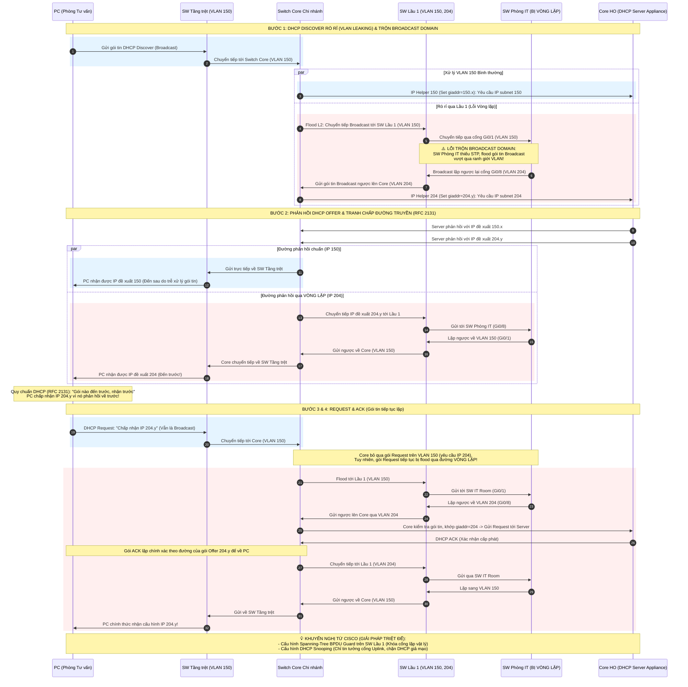

##### Chẩn đoán Rò rỉ DHCP & Lưu lượng Broadcast bằng tcpdump
Khi chẩn đoán tình trạng rò rỉ DHCP hoặc kiểm tra các vấn đề broadcast trên máy trạm client, máy admin hoặc máy chủ, bạn có thể sử dụng công cụ `tcpdump` trực tiếp trên interface mạng (ví dụ: `en6`) để bắt và phân tích các gói tin DHCP (sử dụng giao thức Bootstrap Protocol qua cổng UDP 67 và 68):

```bash
# 1. Bắt gói tin DHCP tiêu chuẩn: Hiển thị thông tin cơ bản của các yêu cầu/phản hồi DHCP trên interface en6
sudo tcpdump -i en6 -n port 67 or port 68

# 2. Bắt gói tin DHCP chi tiết (Verbose): Hiển thị chi tiết các trường tùy chọn bootp (như Transaction ID, Client IP, Server Name, Bootp Flags, giaddr)
sudo tcpdump -i en6 -n -v port 67 or port 68
```
Phương pháp này giúp kỹ sư kiểm tra trường `giaddr` (IP của gateway chuyển tiếp) để xác định gói tin DHCP Discover có bị rò rỉ và tràn qua các VLAN khác hay không (phát hiện việc gộp broadcast domain ngoài ý muốn), hoặc phát hiện các DHCP server giả mạo (rogue DHCP server) đang cùng phản hồi trong mạng.

##### L2 Loop Prevention: Spanning Tree Protocol (STP) & Link Aggregation (LACP)

###### Kiến thức Lý thuyết Cisco Spanning Tree Protocol (STP / CCNA Reference) — Tích hợp Toàn bộ

Mô hình mạng STP 3 switch (Core / Distribution / Access) là trung tâm — các khối lý thuyết xung quanh đóng vai trò bổ trợ, giải thích cách mô hình vận hành:
   
   ```mermaid
   graph TD
       classDef root fill:#ffebee,stroke:#c62828,stroke-width:2.5px,color:#000;
       classDef child fill:#e1f5fe,stroke:#0288d1,stroke-width:2px,color:#000;
       classDef rolebox fill:#f5f5f5,stroke:#9e9e9e,stroke-width:1px,color:#000;
       classDef costbox fill:#fff3e0,stroke:#e65100,stroke-width:1px,color:#000;
       classDef protect fill:#f3e5f5,stroke:#6a1b9a,stroke-width:1px,color:#000;
       classDef entbox fill:#e0f2f1,stroke:#00695c,stroke-width:1px,color:#000;

       subgraph TOPO ["🧩 Mô hình Mạng STP 3 Switch (Trung tâm)"]
           ROOT["Core Switch (Root Bridge)<br/>Bridge Priority = 24576<br/><b>📤 Mọi cổng đều là DP</b>"]:::root
           DIST["Distribution Switch<br/><b>📥 Có 1 RP</b> duy nhất về Core"]:::child
           ACC["Access Switch<br/><b>📥 1 RP + 🚫 1 BP</b> (khóa phá loop)"]:::child
           ROOT ---|"📤 DP → 📥 RP"| DIST
           DIST ---|"📤 DP → 🚫 BP (Blocked)"| ACC
           ROOT ===|"📤 DP → 📤 DP (dự phòng)"| ACC
       end

       subgraph ROOT_ELEC ["🏆 Lý thuyết nền: Bầu chọn Root Bridge"]
           R1["BPDU (Bridge Protocol Data Unit) chứa Bridge ID"]
           R2["Bridge ID = Priority (mặc định 32768, bước 4096) + MAC (6 byte)"]
           R3["Switch có Bridge ID thấp nhất → Root Bridge"]
           R4["⚔️ Luôn gán priority 24576 cho Core chính,<br/>28672 cho Core phụ — không để mặc định"]
       end

       subgraph ROLES ["📋 3 Vai trò Cổng — Giải thích cho Topology bên trên"]
           ROLES_RP["📥 Root Port (RP)<br/>• Cổng duy nhất về Root<br/>• Trên mỗi Non-Root Switch<br/>• Chọn: Path Cost → Neighbor BID → Port ID"]
           ROLES_DP["📤 Designated Port (DP)<br/>• Cổng nói trên mỗi segment<br/>• Root Bridge: MỌI cổng là DP<br/>• Non-Root: cost thấp hơn → DP"]
           ROLES_BP["🚫 Blocked/Alternate Port (BP)<br/>• Chỉ nhận BPDU, không gửi/nhận dữ liệu<br/>• Failover: đường chính đứt → Forwarding<br/>(STP ~30s, RSTP ~1-5s)"]
       end

       subgraph COST ["📊 Path Cost — Yếu tố quyết định vai trò trên Topology"]
           C1["10 Mbps → 100 (802.1D) / 2,000,000 (RSTP)"]
           C2["100 Mbps → 19 / 200,000"]
           C3["1 Gbps → 4 / 20,000 ← 🏆 Phổ biến"]
           C4["10 Gbps → 2 / 2,000"]
       end

       subgraph SIMPLE ["💡 Hiểu đơn giản — Áp dụng vào Topology"]
           S1["Cost thấp = đường nhanh = được ưu tiên chọn"]
           S2["Distribution cost=4 vs Access cost=8 →<br/>Distribution gần Root hơn → DP bên Dist, BP bên Acc"]
           S3["Đường Dist→Core đứt → BP bên Access tự Forward →<br/>Mạng tự phục hồi (dự phòng tự nhiên)"]
       end

       subgraph MANUAL ["⚙️ Can thiệp Traffic Engineering"]
           TE1["① <b>spanning-tree cost 100</b> — Tăng cost → STP loại cổng"]
           TE2["② <b>spanning-tree port-priority 64</b> — Hạ priority → ưu tiên chọn"]
           TE3["③ <b>spanning-tree vlan 20 cost 100</b> — Chia VLAN 10 qua Link 1, VLAN 20 qua Link 2 (cân tải)"]
       end

       subgraph EDGE ["🛡️ Bảo vệ cổng Edge (Access)"]
           E1["PortFast: Bỏ qua Listening/Learning → Forwarding ngay"]
           E2["BPDU Guard: Nhận BPDU lạ → err-disable"]
           E3["Auto recovery: spanning-tree recovery cause bpduguard + interval 300"]
       end

       subgraph FIBER ["🔌 Bảo vệ Trunk & Cáp Quang"]
           F1["Root Guard (trên DP của Core) — BPDU tốt hơn → root-inconsistent"]
           F2["Loop Guard (trên RP/BP của Access) — Mất BPDU → loop-inconsistent"]
           F3["UDLD Aggressive (cả 2 đầu cáp) — Mất tín hiệu → err-disabled"]
           F4["⚠️ Root Guard & Loop Guard KHÔNG thể cấu hình cùng cổng"]
       end

       subgraph ENTERPRISE ["🏢 Mô hình Doanh nghiệp: StackWise + LACP"]
           ENT1["Core Stack: Core-01 (Priority 24576) + Core-02 (Priority 28672)"]
           ENT2["LACP Active: Gộp cổng vật lý → Port-Channel logic"]
           ENT3["src-dst-ip Hash: Cân bằng tải trên các link"]
           ENT4["Rapid-PVST+: STP riêng biệt cho từng VLAN"]
       end
   ```

##### Cấu hình Cisco Tham khảo

###### Edge Port Security (Cổng Access Biên)
```cisco
interface GigabitEthernet1/0/24
 description USER-PC-ACCESS
 switchport mode access
 switchport access vlan 150
 spanning-tree portfast
 spanning-tree bpduguard enable
 spanning-tree recovery cause bpduguard   ! Tự động khôi phục cổng err-disabled
 spanning-tree recovery interval 300      ! Khôi phục sau 5 phút (300 giây)
```

###### Trunk & Fiber Protection (Bảo vệ Đường Trunk & Cáp Quang)
```cisco
! --- Cấu hình trên Core Switch (Cổng hướng xuống) ---
interface GigabitEthernet1/0/1
 description TO-ACCESS-SWITCH-01
 switchport mode trunk
 spanning-tree guard root                  ! Bật Root Guard (Ngăn cướp ngôi Root)
 udld port aggressive                      ! Bật UDLD (Chống đứt cáp 1 chiều)

! --- Cấu hình trên Access Switch (Cổng hướng lên) ---
interface GigabitEthernet1/0/1
 description TO-CORE-SWITCH
 switchport mode trunk
 spanning-tree guard loop                  ! Bật Loop Guard (Chống Loop khi mất BPDU)
 udld port aggressive                      ! Bật UDLD (Chống đứt cáp 1 chiều)
```

##### Battle-Tested Spanning Tree Diagnostics & Fiber Failover Safeguards (Quy trình Debug CLI & Khôi phục sự cố)

Khi xảy ra Layer 2 Loop hoặc bão broadcast (Broadcast Storm), CPU của switch sẽ tăng vọt lên 99-100%, bảng MAC di chuyển liên tục (MAC Flapping) khiến mạng bị nghẽn hoàn toàn. Dưới đây là các công cụ và quy trình xử lý thực tế trên terminal của Cisco Switch:

###### 1. Giám sát Terminal và Log Hệ thống (Terminal Logging)
- **Terminal Monitor**: Khi kết nối qua SSH/Telnet, log hệ thống mặc định không hiển thị. Bắt buộc phải chạy lệnh sau để in log trực tiếp ra cửa sổ terminal hiện tại:
  ```bash
  Switch# terminal monitor
  ```
- **Tắt Monitor**: Để tắt in log trực tiếp:
  ```bash
  Switch# terminal no monitor
  ```
- **Logging Level**: Cấu hình mức độ log hiển thị chi tiết (debugging level) để thu thập thông tin:
  ```cisco
  Switch(config)# logging monitor debugging
  Switch(config)# logging console debugging
  ```
- **Xem Log Buffer**: Khi console/terminal bị đơ do nghẽn, kiểm tra bộ nhớ đệm log là cách an toàn nhất:
  ```bash
  Switch# show logging
  ```

###### 2. Công cụ Debug STP thời gian thực (Cảnh báo: Ảnh hưởng hiệu năng)
- > [!WARNING]
  > **CẢNH BÁO NGUY HIỂM CPU**: Chạy các lệnh `debug` trên Control Plane trong khi xảy ra Broadcast Storm có thể làm Switch bị quá tải hoàn toàn và treo thiết bị (Crash). Luôn chuẩn bị sẵn lệnh tắt debug khẩn cấp.
- **Theo dõi sự kiện STP**:
  ```bash
  Switch# debug spanning-tree events        ! Xem sự thay đổi trạng thái cổng (Blocking -> Forwarding) và Topology Change Notifications (TCN)
  ```
- **Theo dõi gói tin BPDU**:
  ```bash
  Switch# debug spanning-tree bpdu          ! Xem chi tiết nội dung BPDU gửi/nhận (Chỉ nên bật khi cần trace switch lạ gửi BPDU)
  ```
- **Dừng debug khẩn cấp (Undebug)**:
  Khi CPU switch tăng cao hoặc log tràn màn hình, chạy ngay lệnh sau để tắt toàn bộ tiến trình debug:
  ```bash
  Switch# undebug all                      ! Tắt tất cả debug đang chạy
  ! Hoặc lệnh viết tắt nhanh:
  Switch# un all
  ```
- **Kiểm tra các tiến trình debug đang chạy**:
  ```bash
  Switch# show debugging
  ```

###### 3. Kiểm tra trạng thái STP & EtherChannel qua các lệnh Show
- **Xem tổng quan STP**:
  ```bash
  Switch# show spanning-tree summary       ! Xem chế độ STP (PVST/MST), số lượng port ở trạng thái Forwarding/Blocking
  ```
- **Xem chi tiết STP của một VLAN**:
  ```bash
  Switch# show spanning-tree vlan 150      ! Xem Root Bridge ID, Bridge ID của switch hiện tại, Port Cost và Port Role
  ```
- **Xác định nguồn phát TCN (Topology Change)**:
  ```bash
  Switch# show spanning-tree detail | include ieee|occur|from|is
  ! Output sẽ chỉ ra cổng nào vừa up/down khiến STP phải tính toán lại cây
  ```
- **Kiểm tra trạng thái EtherChannel/LACP**:
  ```bash
  Switch# show etherchannel summary        ! Xem trạng thái Port-Channel (yêu cầu trạng thái 'U' - Up và 'P' - Bundled in Port-Channel)
  ```
- **Kiểm tra thông tin đối tác LACP**:
  ```bash
  Switch# show lacp neighbor               ! Xem thông tin LACP từ switch đối diện để đảm bảo cấu hình khớp (Active/Passive)
  ```
- **Kiểm tra trạng thái của từng cổng trong EtherChannel**:
  ```bash
  Switch# show etherchannel port           ! Xem chi tiết trạng thái của các cổng vật lý được gộp trong Port-Channel
  ```
- **Kiểm tra bảng địa chỉ MAC (MAC Address Table)**:
  ```bash
  Switch# show mac address-table           ! Xem bảng địa chỉ MAC tổng quát học được trên switch (gồm VLAN và port)
  Switch# show mac address-table address 001a.a1b2.c3d4  ! Tra cứu nhanh một địa chỉ MAC cụ thể đang nằm trên cổng nào
  ```
- **Kiểm tra cấu hình VLAN**:
  ```bash
  Switch# show vlan brief                  ! Xem danh sách các VLAN đang hoạt động và các cổng vật lý tương ứng
  ```
- **Kiểm tra thiết bị kết nối lân cận qua CDP & LLDP**:
  ```bash
  Switch# show cdp neighbors               ! Xem tóm tắt thông tin các thiết bị Cisco kết nối trực tiếp (switch, router)
  Switch# show cdp neighbors detail        ! Xem chi tiết thông tin lân cận (gồm cả địa chỉ IP quản trị của switch đối diện)
  ! Đối với các thiết bị hãng khác hoặc AP không dây (LLDP cần được bật toàn cục):
  Switch(config)# lldp run                 ! Kích hoạt giao thức LLDP trên toàn bộ switch
  Switch# show lldp neighbors              ! Xem chi tiết thiết bị lân cận không thuộc Cisco (như AP UniFi, server...)
  ```

---

#### 1.3. Dự phòng Gateway Đầu vào Layer 3 & Giám sát IP SLA WAN (L3 Ingress Gateway Redundancy & IP SLA WAN Tracking)

##### Use Case
Đảm bảo dự phòng liên kết WAN có tính sẵn sàng cao và tự động chuyển đổi tuyến đường động tại biên Layer 3 để ngăn ngừa mất kết nối (black-holing) khi cổng gateway ISP tiếp theo gặp sự cố.

##### Problem / Scenario & Solution
**Bài toán:** Định tuyến tĩnh cơ bản trên L3 Core Switch chỉ trỏ lưu lượng tới một gateway duy nhất. Nếu gateway này gặp sự cố hoặc mất kết nối WAN, cổng vật lý kết nối giữa switch và firewall vẫn giữ trạng thái `UP`, khiến tuyến tĩnh chính vẫn hoạt động trong bảng định tuyến và gây mất kết nối (black-holing). Hơn nữa, trong môi trường triển khai tường lửa dị thể (sử dụng 2 hãng khác nhau như FortiGate và Sophos), việc thiết lập cụm HA (Active-Passive) tiêu chuẩn là bất khả thi vì hai thiết bị khác hãng không thể đồng bộ phiên kết nối (session state) hay chạy chung giao thức heartbeat.
**Giải pháp:** Đặt hai firewall chạy độc lập trên các IP cổng LAN khác nhau: FortiGate (Chính) tại `192.168.10.1` và Sophos XG (Dự phòng) tại `192.168.10.2`.
1. **Dự phòng Gateway LAN (Switch Core):** Cấu hình **Cisco IP SLA Tracking** trên Switch Core để liên tục ping IP của Firewall Chính (`192.168.10.1`). Nếu Firewall Chính gặp sự cố vật lý hoặc lỗi phần mềm và ngừng phản hồi, Switch Core sẽ tự động rút tuyến tĩnh mặc định chính và chuyển hướng toàn bộ traffic sang Firewall Dự phòng (`192.168.10.2`, AD 10).
2. **Dự phòng Đường truyền WAN (Firewalls):** Thay vì giám sát thủ công trên Switch, mỗi firewall sẽ tự động chạy cơ chế **SD-WAN** (hoặc Link Monitor) để quản lý đa đường truyền ISP, thực hiện đo kiểm WAN SLA tới các DNS công cộng (như `8.8.8.8`) để tự động failover giữa đường WAN1 (chính) và WAN2 (dự phòng).

##### Dự phòng Gateway Đầu vào Layer 3 & SD-WAN WAN SLA
Switch Core L3 quản lý tính dự phòng ingress giữa hai thiết bị firewall khác hãng sử dụng Cisco IP SLA, trong khi từng firewall độc lập quản lý tính dự phòng egress hướng Internet thông qua tính năng SD-WAN SLA.

```cisco
! --- Cấu hình Cisco L3 Core Switch IP SLA & Routing cho 2 hãng Firewall ---
ip sla 1
 icmp-echo 192.168.10.1 source-interface GigabitEthernet1/0/1  ! Ping kiểm tra Firewall chính (FortiGate)
 threshold 250                                                ! Ngưỡng timeout (ms)
 timeout 1000                                                 ! Thời gian chờ phản hồi (ms)
 frequency 5                                                  ! Tần suất ping (giây)
exit
ip sla schedule 1 start-time now life forever

!
track 1 ip sla 1 reachability
 delay down 10 up 30                                         ! Chống dao động link: trễ down 10s, up 30s
exit

!
ip route 0.0.0.0 0.0.0.0 192.168.10.1 track 1                ! Tuyến chính đi qua FortiGate
ip route 0.0.0.0 0.0.0.0 192.168.10.2 10                     ! Tuyến dự phòng đi qua Sophos (AD 10)
```

```cisco
! --- Cấu hình SD-WAN Member & SLA Health Check trên FortiGate ---
config system sdwan
    config members
        edit 1
            set interface "wan1"
            set gateway 203.0.113.1                          ! Gateway ISP 1
        next
        edit 2
            set interface "wan2"
            set gateway 198.51.100.1                         ! Gateway ISP 2
        next
    end
    config health-check
        edit "DNS_SLA"
            set server "8.8.8.8"                             ! IP kiểm tra WAN SLA
            set members 1 2
            set proto ping
            set interval 5
            set failtime 3
            set recoverytime 5
        next
    end
end
```

##### L3 Ingress Redundancy & SLA Probe Topology
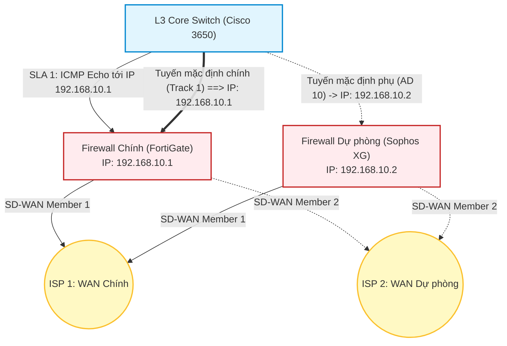

##### Chi tiết Kỹ thuật (Technical Details)
| Thành phần / Khái niệm | Công nghệ | Mô tả |
| :--- | :--- | :--- |
| **Dự phòng LAN-side Ingress** | **Cisco IP SLA Tracking** | Switch Core giám sát IP LAN của Firewall chính (`192.168.10.1`) và tự động chuyển hướng sang Firewall dự phòng (`192.168.10.2` AD 10) nếu mất kết nối. |
| **Dự phòng giữa 2 Hãng khác nhau** | **Tracked Static Routes** | Giải quyết vấn đề không thể chạy HA Cluster đồng bộ giữa FortiGate và Sophos bằng cách định tuyến động tại lớp Switch L3. |
| **Dự phòng WAN-side Egress** | **Firewall SD-WAN SLA** | Trên mỗi firewall, tính năng SD-WAN đo kiểm chất lượng link (ping tới `8.8.8.8`) để tự động điều phối traffic đi ra ngoài qua ISP 1 hoặc ISP 2. |

---

#### 1.4. Hạ tầng Mạng Không dây Doanh nghiệp Đa SSID (UniFi Deployment)

##### Use Case
Cung cấp quyền truy cập không dây bảo mật, mật độ cao và cô lập cho nhân viên và học viên/khách hàng trên các tầng văn phòng chi nhánh trong khi vẫn duy trì sự cô lập tuyệt đối đối với mặt phẳng quản trị (management plane).

##### Problem / Scenario & Solution
**Bài toán:** Thiết lập mạng không dây gồm nhiều điểm truy cập (AP) sử dụng các thiết bị **UAP AC LR** và **UniFi Network Controller** (chạy tại IP `192.168.1.252`) sao cho lưu lượng khách/học viên được cô lập hoàn toàn khỏi mạng nội bộ của nhân viên và giao diện quản trị của các AP.
**Giải pháp:** Cô lập lưu lượng quản trị AP vào **VLAN 8/9** (Mặt phẳng quản trị) và lưu lượng người dùng vào các VLAN riêng biệt (SSID `Nhanvien-WiFi` map với **VLAN 168**, và SSID `Hocvien-WiFi` / portal map với **VLAN 368**). Cấu hình các cổng access switch Cisco làm đường trunk với **Native VLAN 8/9** để phân phối các frame quản lý không tag đến AP để controller tự động nhận diện (zero-touch adoption) và cấp phát DHCP, đồng thời gắn tag (tagging) các VLAN 168 và 368 để đảm bảo an toàn và cô lập mạng.

##### Sơ đồ Kiến trúc (Architecture Diagram)
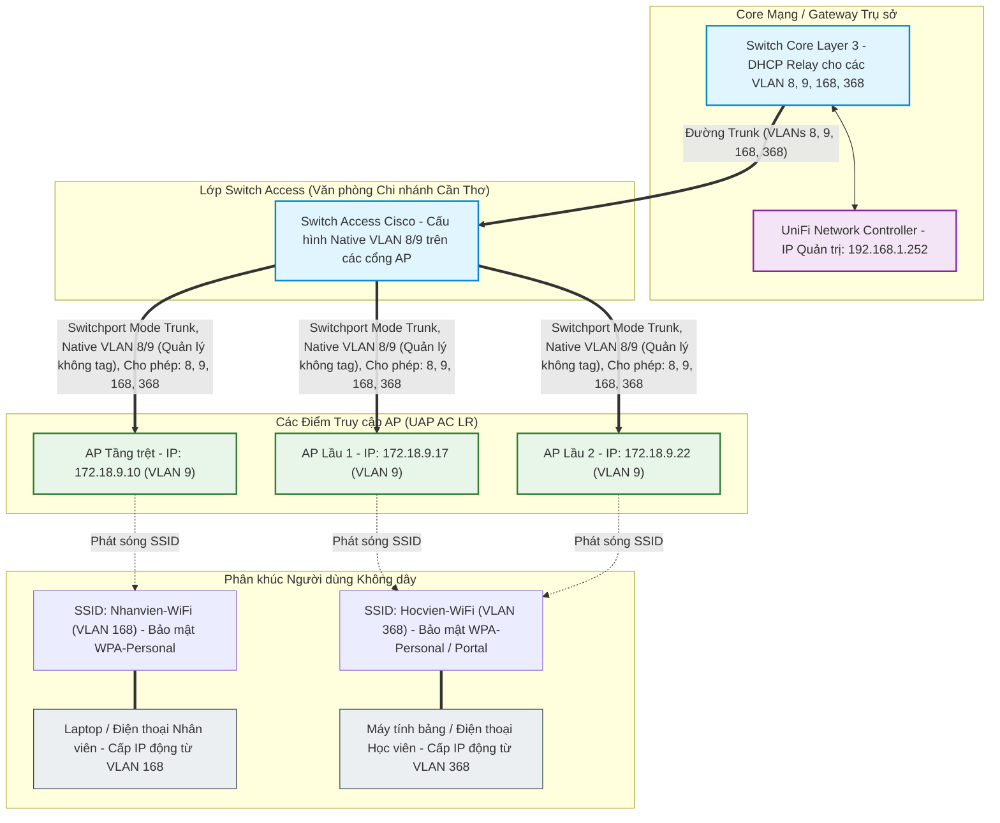

##### Chi tiết Kỹ thuật (Technical Details)
```cisco
! --- Cisco Switchport Configuration for UniFi APs ---
interface GigabitEthernet1/0/12
 description CONNECT-TO-UNIFI-AP-LR
 switchport trunk encapsulation dot1q
 switchport trunk native vlan 9      ! Management VLAN (APs nhận IP Quản trị không tag)
 switchport trunk allowed vlan 8,9,168,368
 switchport mode trunk
 spanning-tree portfast trunk       ! Kích hoạt PortFast giúp AP được nhận diện lập tức
```

---

#### 1.5. Biên Firewall Doanh nghiệp & Kỹ thuật NAT/PAT (FortiGate & Sophos Edge Firewall & NAT/PAT)

##### Use Case
Cho phép các thiết bị trong mạng nội bộ (LAN) truy cập Internet an toàn bằng cách ẩn địa chỉ IP nội bộ, đồng thời công khai các dịch vụ máy chủ nội bộ (Web, API, VoIP...) ra ngoài Internet thông qua cơ chế chuyển đổi địa chỉ NAT/PAT trên thiết bị tường lửa FortiGate và Sophos XG.

##### Problem / Scenario & Solution
**Bài toán:** Các máy tính và máy chủ trong mạng doanh nghiệp sử dụng dải IP tư nhân (RFC 1918) không thể định tuyến trên Internet. Khi gửi gói tin ra ngoài, chúng cần một cơ chế thay thế IP nguồn LAN thành IP công cộng (Public WAN IP). Ngược lại, doanh nghiệp sở hữu các máy chủ dịch vụ đặt trong vùng LAN (ví dụ: máy chủ Web chạy tại IP `192.168.10.50` cổng `TCP 8443`) cần được khách hàng từ ngoài Internet truy cập qua duy nhất một địa chỉ IP WAN công cộng của doanh nghiệp trên cổng bảo mật tiêu chuẩn (ví dụ: `TCP 443`) mà không làm lộ sơ đồ mạng LAN bên trong.
**Giải pháp:** Triển khai các chính sách chuyển đổi địa chỉ mạng (NAT) trên Firewall biên:
1. **Source NAT (SNAT / Masquerade) cho lưu lượng đi ra (Outbound):** Thay đổi địa chỉ IP nguồn private thành địa chỉ IP WAN public của firewall, sử dụng tính năng PAT (Port Address Translation) để nhiều thiết bị LAN dùng chung một IP public thông qua các port nguồn khác nhau.
2. **Destination NAT (DNAT / Port Forwarding) cho lưu lượng đi vào (Inbound):** Ánh xạ lưu lượng từ bên ngoài gửi tới IP WAN public của firewall trên cổng chỉ định, tự động chuyển hướng đến IP private và cổng dịch vụ của máy chủ nội bộ tương ứng.

##### Quy trình Hoạt động & Luồng Gói tin NAT (NAT Packet Flow)
Sơ đồ dưới đây mô tả sự thay đổi địa chỉ IP và Port của gói tin khi đi qua firewall biên:

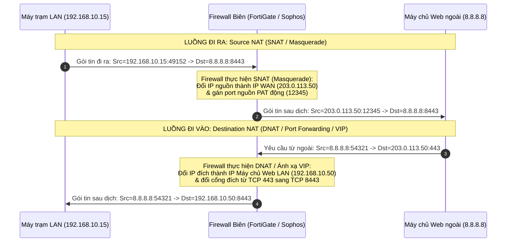

##### Triển khai cụ thể trên Thiết bị

###### 1. Cấu hình trên Firewall FortiGate
FortiGate quản lý Destination NAT thông qua đối tượng **Virtual IP (VIP)** và tích hợp cấu hình Source NAT trực tiếp vào chính sách bảo mật (Firewall Policy).

- **Khái niệm Source NAT (SNAT / Masquerade) trên FortiGate:**
  * **Masquerade (Sử dụng IP của cổng ra - Outgoing Interface Address):** Bật NAT trực tiếp trong Firewall Policy và chọn `Use Outgoing Interface Address`. Đây là cơ chế PAT động mặc định của FortiGate, phù hợp cho IP WAN động (DHCP, PPPoE). Khi link bị flap và đổi IP WAN, FortiGate sẽ xóa sạch bảng conntrack của interface đó để ép client kết nối lại bằng IP mới.
  * **SNAT Tĩnh (Dynamic IP Pool):** Chọn cấu hình `Use Dynamic IP Pool` (với chế độ Overload hoặc One-to-One) và gán lưu lượng đi ra các pool IP tĩnh public được định nghĩa sẵn. Yêu cầu IP WAN tĩnh cố định. Tải CPU rất thấp vì thiết bị không cần kiểm tra lại IP cổng WAN cho mỗi gói tin. Khi rớt link tạm thời, FortiGate giữ lại cache bảng conntrack để chờ phục hồi.
- **Destination NAT (Inbound Port Forwarding qua VIP):**
  Tạo đối tượng VIP định nghĩa IP WAN public, IP LAN private và cổng dịch vụ tương ứng, sau đó gọi VIP này trong chính sách bảo mật cho phép luồng WAN -> LAN.

```cisco
! --- Cấu hình FortiGate CLI cho NAT ---

! 1. Tạo đối tượng Destination NAT (Virtual IP kèm Port Forwarding)
config firewall vip
    edit "VIP_Web_Server"
        set extip 203.0.113.50                  ! IP WAN Public của Firewall
        set extport 443                         ! Cổng dịch vụ công khai ra ngoài Internet
        set mappedip 192.168.10.50              ! IP Private của máy chủ nội bộ
        set mappedport 8443                     ! Cổng thực tế máy chủ đang lắng nghe
        set portforward enable                  ! Cho phép chuyển dịch port (PAT)
        set protocol tcp                        ! Giao thức TCP
    next
end

! 2. Áp dụng Destination NAT vào Firewall Policy đi vào (WAN -> LAN)
config firewall policy
    edit 10
        set name "Cho_Phep_Inbound_HTTPS"
        set srcintf "wan1"
        set dstintf "internal"
        set srcaddr "all"
        set dstaddr "VIP_Web_Server"            ! Trỏ tới đối tượng VIP vừa tạo
        set action accept
        set schedule "always"
        set service "HTTPS"                     ! Cho phép cổng dịch vụ HTTPS đi vào
    next
end

! 3. Cấu hình Firewall Policy đi ra với SNAT/Masquerade (LAN -> WAN)
config firewall policy
    edit 20
        set name "LAN_ra_Internet"
        set srcintf "internal"
        set dstintf "wan1"
        set srcaddr "all"
        set dstaddr "all"
        set action accept
        set schedule "always"
        set service "ALL"
        set nat enable                          ! Kích hoạt Source NAT (IP Masquerade)
    next
end
```

###### 2. Cấu hình trên Firewall Sophos XG
Sophos XG tách biệt hoàn toàn bảng chính sách bảo mật (Firewall Rules) và bảng chính sách dịch địa chỉ (NAT Rules).

- **Khái niệm Source NAT (SNAT / Masquerade) trên Sophos XG:**
  * **Masquerade (SNAT Động):** Cấu hình trong NAT Rule với `Translated Source (SNAT) = MASQ`. Sophos sẽ tự động sử dụng IP của interface WAN ra. Phù hợp nhất cho IP WAN động (PPPoE/DHCP). Khi cổng PPPoE rớt và nhận lại IP mới, Sophos lập tức xóa sạch bảng conntrack của interface đó.
  * **SNAT Tĩnh:** Cấu hình `Translated Source (SNAT) = [IP Host Object / IP Range / IP Pool]`. Ánh xạ dải mạng LAN ra các địa chỉ IP tĩnh public cụ thể được chỉ định trước. Tải CPU thấp và giữ lại bảng conntrack chờ phục hồi khi xảy ra link flap.
- **Destination NAT (Inbound DNAT Rule):**
  Tạo một NAT Rule ánh xạ địa chỉ đích ban đầu (IP WAN) sang địa chỉ đích đã dịch (IP Máy chủ Web), đồng thời cấu hình chuyển dịch port trong phần dịch vụ (Original Service sang Translated Service).

```cisco
! --- Cấu trúc Logic Cấu hình Sophos XG ---

! 1. NAT Rule cho lưu lượng đi ra (LAN -> WAN IP Masquerade)
NAT Rule: "SNAT_LAN_to_WAN"
  Original Source: "LAN_Subnet"                ! Xác định dải mạng nội bộ nguồn gửi gói tin đi (ví dụ: 192.168.10.0/24)
  Translated Source: "MASQ"                     ! Tự động dịch chuyển IP nguồn thành IP cổng WAN đang hoạt động (Masquerade)
  Original Destination: "Any"                   ! Áp dụng cho mọi lưu lượng đi ra ngoài Internet
  Translated Destination: "Original"            ! Giữ nguyên địa chỉ IP đích ban đầu (không NAT đích)
  Original Service: "Any"                       ! Áp dụng cho mọi giao thức/cổng dịch vụ (TCP/UDP/ICMP)
  Translated Service: "Original"                ! Giữ nguyên cổng đích ban đầu (không đổi port)
  Inbound Interface: "LAN"                      ! Chỉ áp dụng cho gói tin đi vào từ cổng LAN
  Outbound Interface: "WAN"                     ! Chỉ áp dụng cho gói tin đi ra cổng WAN hướng Internet

! 2. NAT Rule cho lưu lượng đi vào (DNAT Port Forwarding)
NAT Rule: "DNAT_WAN_to_HTTPS_Server"
  Original Source: "Any"
  Translated Source: "Original"
  Original Destination: "WAN_Port_IP"           ! IP Public cổng WAN (203.0.113.50)
  Translated Destination: "Web_Server_IP"       ! IP Private của máy chủ (192.168.10.50)
  Original Service: "HTTPS_443"                 ! Cổng công khai ban đầu
  Translated Service: "Custom_8443"              ! Cổng dịch vụ thực tế trong LAN
  Inbound Interface: "WAN"
  Outbound Interface: "LAN"

! 3. Firewall Rule kèm theo (Cho phép lưu lượng đi qua Firewall)
Firewall Rule: "Allow_HTTPS_to_Server"
  Source Zone: "WAN"
  Source Networks: "Any"
  Destination Zone: "LAN"
  Destination Networks: "Web_Server_IP"         ! Phải trỏ tới IP private đã dịch
  Services: "Custom_8443"                       ! Cổng dịch vụ được phép truy cập
  Action: "Accept"
```

##### Chi tiết Kỹ thuật (Technical Details)
| Loại dịch địa chỉ | Tên thường gọi | Chức năng chính | Thành phần cấu hình (FortiGate) | Thành phần cấu hình (Sophos) |
| :--- | :--- | :--- | :--- | :--- |
| **Source NAT** | **IP Masquerade / SNAT** | Dịch IP private nội bộ thành IP public để truy cập Internet. | Policy: `set nat enable` | NAT Rule: `Translated Src = MASQ` |
| **Destination NAT** | **Port Forwarding / DNAT** | Ánh xạ IP public và cổng dịch vụ vào IP private của máy chủ nội bộ. | Virtual IP Object (VIP) | NAT Rule: `Translated Dst = Server` |
| **Port Address Translation** | **PAT / Overload** | Dịch chuyển nhiều IP nội bộ sang một IP public duy nhất bằng cách thay đổi cổng nguồn. | Ánh xạ port động tự động | Ánh xạ port động tự động |

### 2. Hạ tầng Hệ thống & Ảo hóa (System & Virtualization Infrastructure)

#### 2.1. Thiết kế Switch Phân phối ảo (vDS) & Lưu trữ vSAN Tập trung (Enterprise vDS & vSAN Clustered Storage)

##### Use Case
Thiết kế cấu trúc liên kết mạng ảo hóa và lưu trữ dự phòng, băng thông cao và độ trễ thấp để hỗ trợ cụm ESXi do vCenter quản lý, di chuyển máy ảo động (vMotion) và lưu trữ vSAN dạng cụm.

##### Problem / Scenario & Solution
**Bài toán:** Duy trì tính nhất quán của cấu hình virtual port group, hồ sơ bảo mật (security profiles) và gộp liên kết (LACP) trên 7 host ESXi trong khi vẫn cô lập lưu lượng nhạy cảm với độ trễ (vSAN) và lưu lượng migration (vMotion) khỏi các workload VM sản xuất.
**Giải pháp:** Cấu hình switch phân phối ảo trung tâm **vSphere Distributed Switch (vDS)** trên cụm 7 host ESXi để loại bỏ hiện tượng cấu hình sai lệch (drift). Triển khai switch ảo tiêu chuẩn **vSphere Standard Switch (vSS)** trên từng host riêng lẻ để cô lập các interface firewall biên (pfSense WAN/LAN). Thiết lập tính dự phòng đường truyền bằng cách sử dụng **gộp liên kết LACP (Active/Active)** qua các cổng vật lý 10G/25G SFP+ song song (`vmnic0` và `vmnic1`). Cấu hình VMkernel port chuyên dụng với **Jumbo Frames (MTU 9000)** cho lưu lượng lưu trữ vSAN (VLAN 30) và vMotion (VLAN 20) để tối đa hóa thông lượng và giảm thiểu tải CPU của host, đồng thời giữ VMkernel quản lý ESXi (Management) trên một VLAN riêng với MTU 1500.

##### Sơ đồ Kiến trúc (Architecture Diagram)
```mermaid
graph TD
    %% Styling Definitions
    classDef switch fill:#e1f5fe,stroke:#0288d1,stroke-width:2px;
    classDef host fill:#e8f5e9,stroke:#2e7d32,stroke-width:2px;
    classDef vds fill:#f3e5f5,stroke:#8e24aa,stroke-width:2px;
    classDef vss fill:#fff3e0,stroke:#ff9800,stroke-width:2px;
    classDef storage fill:#fff8e1,stroke:#ff8f00,stroke-width:2px;
    classDef vm fill:#eceff1,stroke:#37474f,stroke-width:1px;

    %% PHYSICAL SWITCHES
    subgraph Physical_Network ["Mạng Vật lý (Leaf-Spine)"]
        Switch_A["Switch Top-of-Rack A (Đường Trunk 10G/25G)"]:::switch
        Switch_B["Switch Top-of-Rack B (Đường Trunk 10G/25G)"]:::switch
    end

    %% vCENTER SERVER
    vCenter["vCenter Server (Quản lý Cụm Hoạt động)"]:::vds

    %% PHYSICAL ESXi HOSTS
    subgraph ESXi_Cluster ["Cụm Host ESXi"]
        subgraph ESXi_Node ["Một Instance Host ESXi"]
            %% Physical Uplinks
            vmnic0["Uplink Vật lý vmnic0 (10G SFP+)"]
            vmnic1["Uplink Vật lý vmnic1 (10G SFP+)"]
            vmnic2["Uplink Vật lý vmnic2 (1G Đồng)"]
            vmnic3["Uplink Vật lý vmnic3 (1G Đồng)"]
            
            %% vSphere Distributed Switch
            subgraph vDS_Switch ["vSphere Distributed Switch (vDS)"]
                direction TB
                Uplink_Group["Nhóm Uplink Phân phối (LACP Port Channel)"]
                
                %% vDS Port Groups
                pg_vsan["dvPortGroup-vSAN (VLAN Lưu trữ) - MTU 9000"]
                pg_vmotion["dvPortGroup-vMotion (VLAN Di chuyển VM) - MTU 9000"]
                pg_mgmt["dvPortGroup-Management (VLAN Quản trị) - MTU 1500"]
                pg_staff["dvPortGroup-Staff (VLAN Nhân viên) - MTU 1500"]
                pg_guest["dvPortGroup-Guest (VLAN Học viên/Khách) - MTU 1500"]
            end

            %% vSphere Standard Switch
            subgraph vSS_Switch ["vSphere Standard Switch (vSS)"]
                direction TB
                Standard_Uplink["Nhóm Uplink vSS (NIC Teaming)"]
                
                %% vSS Port Groups
                pg_pfsense_lan["PortGroup-Firewall_LAN (VLAN Mạng LAN)"]
                pg_pfsense_wan["PortGroup-Firewall_WAN (Không gắn tag)"]
            end
            
            %% VMkernel Adapters
            vmk0["vmk0 (IP Quản trị)"]
            vmk1["vmk1 (IP Lưu trữ vSAN)"]
            vmk2["vmk2 (IP Di chuyển vMotion)"]
        end
    end

    %% VIRTUAL MACHINES
    vCenter_VM["VM Thiết bị vCenter"]:::vm
    Firewall_VM["VM Firewall ảo (pfSense)"]:::vm
    Prod_VM["Các VM Sản xuất của Người dùng"]:::vm
    
    %% DATASTORES
    vSAN_DS[("Datastore dạng cụm vSAN Shared")]:::storage
    NFS_DS[("Kho Lưu trữ Backup Mạng (NFS)")]:::storage

    %% CONNECTIONS
    vCenter -. Quản lý .-> vDS_Switch
    vCenter -. Quản lý .-> vSS_Switch

    %% VM to Port Group mappings
    vCenter_VM --- pg_mgmt
    Prod_VM --- pg_staff
    Prod_VM --- pg_guest
    Firewall_VM --- pg_pfsense_lan
    Firewall_VM --- pg_pfsense_wan

    %% VMkernel to Port Groups
    vmk0 --- pg_mgmt
    vmk1 --- pg_vsan
    vmk2 --- pg_vmotion

    %% Storage connections
    vmk1 -. Lưu lượng Lưu trữ Độ trễ thấp .-> vSAN_DS
    vCenter_VM -. Network Backup .-> NFS_DS

    %% Port Groups to Uplinks
    pg_vsan ---> Uplink_Group
    pg_vmotion ---> Uplink_Group
    pg_mgmt ---> Uplink_Group
    pg_staff ---> Uplink_Group
    pg_guest ---> Uplink_Group

    pg_pfsense_lan ---> Standard_Uplink
    pg_pfsense_wan ---> Standard_Uplink

    %% Uplinks to Physical NICS
    Uplink_Group === vmnic0
    Uplink_Group === vmnic1
    Standard_Uplink === vmnic2
    Standard_Uplink === vmnic3

    %% Physical NICs to Physical Switches
    vmnic0 <== Trunk LACP ==> Switch_A
    vmnic1 <== Trunk LACP ==> Switch_B
    vmnic2 <== Đường Trunk ==> Switch_A
    vmnic3 <== Đường Trunk ==> Switch_B
```

##### Chi tiết Kỹ thuật (Technical Details)
| Thành phần | Công nghệ | Mô tả |
| :--- | :--- | :--- |
| **Nền tảng Hypervisor** | **VMware ESXi** | Phần mềm ảo hóa chạy trực tiếp trên máy chủ vật lý để phân phối tài nguyên tính toán ảo. |
| **Quản trị Tập trung** | **VMware vCenter Server** | Nền tảng quản lý tập trung điều phối tính năng HA, vMotion, cấu hình vDS và chính sách lưu trữ cho toàn cụm. |
| **Lưu trữ dạng cụm** | **VMware vSAN** | Giải pháp lưu trữ định nghĩa bằng phần mềm (SDS) gộp các ổ đĩa cục bộ của các host thành một datastore chia sẻ thống nhất. |
| **Mạng ảo hóa phân phối** | **vSphere Distributed Switch (vDS)** | Switch ảo phân phối tập trung đảm bảo tính nhất quán của port group, gộp LACP và gắn tag VLAN trên tất cả các host trong cụm. |
| **Switch ảo cục bộ** | **vSphere Standard Switch (vSS)** | Switch ảo cấp host cô lập các kết nối mạng của thiết bị mạng ảo cục bộ (ví dụ: firewall biên) khỏi mạng phân phối. |

---

#### 2.2. Hạ tầng Máy tính ảo (VDI) sử dụng vGPU & PCIe Passthrough (Virtualized Desktop Infrastructure (VDI) with vGPU & PCIe Passthrough)

##### Use Case
Cung cấp môi trường máy ảo đồ họa hiệu năng cao cho các lớp học online mà không cần trang bị các máy trạm vật lý đắt đỏ cho từng người dùng từ xa.

##### Problem / Scenario & Solution
**Bài toán:** Học viên các lớp học online cần máy tính ảo có khả năng chạy mượt các ứng dụng đồ họa nặng (như biên tập video, thiết kế, vẽ 3D) với độ trễ thấp. Việc gán cứng một card GPU vật lý cho duy nhất một VM là không khả thi và gây lãng phí tài nguyên nghiêm trọng.
**Giải pháp:** Triển khai hạ tầng máy tính ảo chuyên dụng **VMware Horizon** kết hợp công nghệ **NVIDIA vGPU**. Các card đồ họa vật lý (ví dụ: NVIDIA A5000 24GB lắp trên máy chủ Supermicro/Dell) được ảo hóa thông qua phần mềm quản lý **NVIDIA vGPU Manager** chạy trong nhân ESXi hypervisor, cho phép phân tách GPU vật lý thành các profile đồ họa ảo cụ thể (ví dụ: profile `A5000-8Q` hoặc `A5000-4Q`) và cấp phát động cho các máy ảo. Đối với các tác vụ yêu cầu sức mạnh tối đa, tính năng **PCIe Passthrough (DirectPath I/O)** sẽ ánh xạ trực tiếp GPU vật lý vào VM chỉ định. Các máy ảo chạy Zorin OS hoặc Windows 11 được clone tự động theo pool qua vCenter, giúp học viên từ xa kết nối an toàn qua Horizon Client sử dụng giao thức tối ưu Blast Extreme hoặc PCoIP.

##### Sơ đồ Kiến trúc (Architecture Diagram)
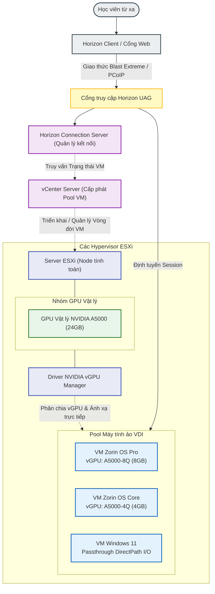

##### Chi tiết Kỹ thuật (Technical Details)
| Thành phần | Công nghệ | Mô tả |
| :--- | :--- | :--- |
| **Quản lý kết nối** | **VMware Horizon Connection Server** | Quản lý các kết nối của client, xác thực người dùng và điều phối session đến các desktop còn trống. |
| **Cổng truy cập biên** | **Horizon UAG (Unified Access Gateway)** | Gateway biên bảo mật đóng vai trò proxy chuyển tiếp lưu lượng client vào mạng VDI nội bộ. |
| **Ảo hóa GPU** | **NVIDIA vGPU Manager (VIB)** | Driver chạy ở cấp kernel trên ESXi host để chia nhỏ tài nguyên RAM và core của GPU vật lý. |
| **Tăng tốc phần cứng** | **NVIDIA A5000 24GB GPUs** | Card đồ họa vật lý PCIe cung cấp tài nguyên phần cứng render và tính toán. |
| **Ánh xạ trực tiếp thiết bị**| **PCIe DirectPath I/O Passthrough** | Ánh xạ trực tiếp card GPU vật lý vào một máy ảo duy nhất, bỏ qua lớp ảo hóa của hypervisor để đạt hiệu năng tối đa. |
| **Máy tính ảo** | **Zorin OS & Windows 11** | Các template máy ảo đã được tối ưu hóa và cài đặt Horizon Agent để phân phối giao diện người dùng. |

---

#### 2.3. Tổng đài Doanh nghiệp & Call Center Dung lượng lớn (Enterprise VoIP & High-Capacity Call Center)

##### Use Case
Thiết kế, bảo mật và vận hành hạ tầng tổng đài điện thoại (Call Center) dung lượng lớn hỗ trợ nhiều tenant (chi nhánh doanh nghiệp, trường học) xử lý lượng lớn cuộc gọi đồng thời (inbound/outbound).

##### Problem / Scenario & Solution
**Bài toán:** Quản lý hệ thống tổng đài phục vụ hơn 180 điện thoại viên với lưu lượng cuộc gọi cao, đồng thời phải bảo vệ hệ thống VoIP khỏi các đợt scan SIP và brute-force phá hoại từ bên ngoài, ngăn ngừa mất gói tin gây gián đoạn âm thanh hoặc rớt cuộc gọi.
**Giải pháp:** Triển khai FreeSWITCH và FusionPBX trên hệ điều hành Debian Linux. Tăng cường bảo mật bằng cách cấu hình **Fail2ban** quét log sự kiện FreeSWITCH và tạo các luật chặn IP động thông qua tường lửa **iptables/nftables**, đồng thời phân tách lưu lượng SIP nhà mạng qua cơ chế định tuyến đa bảng (multi-table routing). Đồng bộ hóa chứng chỉ Let's Encrypt SSL/TLS cho cả hai profile **Internal** (cổng WebRTC/WSS `7443`) và **External** (cổng SIP-TLS `5081`) để loại bỏ hoàn toàn lỗi xác thực TLS. Viết các kịch bản **Lua** tích hợp trong XML dialplan để tự động thay đổi Caller ID gọi ra (campaign masking) và theo dõi thông số chất lượng cuộc gọi (QoS). Cung cấp kết nối API qua **Event Socket Layer (ESL)** để tích hợp với hệ thống CRM nội bộ giúp hiển thị thông tin khách hàng tức thời (screen-popup) khi có cuộc gọi đến.

##### Sơ đồ Kiến trúc (Architecture Diagram)
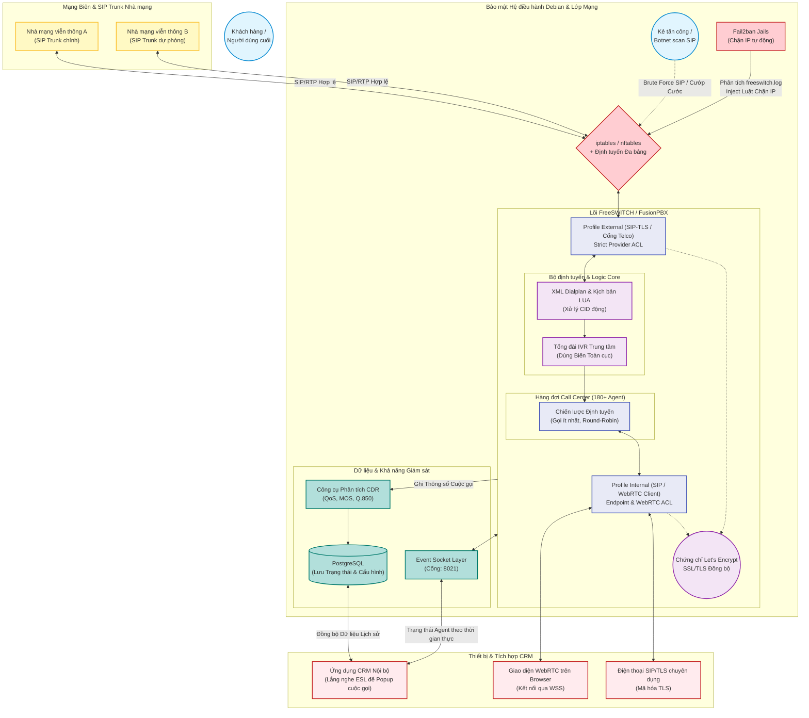

##### Chi tiết Kỹ thuật (Technical Details)
| Thành phần | Công nghệ | Mô tả |
| :--- | :--- | :--- |
| **Tổng đài lõi** | **FreeSWITCH / FusionPBX** | Tổng đài lõi xử lý báo hiệu SIP, WebRTC gateway, định tuyến thoại và hàng đợi cuộc gọi. |
| **Hệ điều hành** | **Debian Linux** | Hệ điều hành máy chủ bảo mật và ổn định cao, hỗ trợ định tuyến đa bảng để cô lập trunk telco. |
| **Bảo mật Biên** | **Fail2ban + iptables/nftables** | Luật tường lửa động tự động chặn các IP scan SIP trái phép. |
| **Bảo mật Truyền dẫn** | **SIP-TLS & WebRTC (WSS)** | Mã hóa tín hiệu thoại sử dụng chứng chỉ SSL Let's Encrypt đồng bộ. |
| **Tích hợp CRM** | **FreeSWITCH ESL (Event Socket)** | Cổng socket kết nối API thời gian thực để kích hoạt popup thông tin khách hàng trên CRM. |
| **Kịch bản Định tuyến** | **Lua (mod_lua)** | Chèn kịch bản xử lý cuộc gọi động và ẩn/đổi Caller ID gọi ra. |

```xml
<!-- Ví dụ: Dialplan Gọi ra Nâng cao chèn Script Lua -->
<extension name="ENTERPRISE-OUTBOUND-ROUTING" continue="false">
    <condition field="${user_exists}" expression="false"/>
    <condition field="destination_number" expression="^(\d{10,11})$">
        <!-- 1. Tích hợp CRM: Xuất mã UUID và Account Code -->
        <action application="set" data="sip_h_X-accountcode=${accountcode}"/>
        <action application="export" data="call_direction=outbound"/>
        <action application="export" data="sip_h_X-Call_UUID=${uuid}"/>
        
        <!-- 2. Chèn Script Lua: Đồng bộ thời gian trả lời cuộc gọi để CRM tính cước -->
        <action application="export" data="execute_on_answer=lua reset_answered_time.lua ${uuid}"/>
        
        <!-- 3. Chuẩn bị QoS & Map số Caller ID động -->
        <action application="set" data="rtp_jitter_buffer=true"/>
        <action application="unset" data="call_timeout"/>
        <action application="set" data="hangup_after_bridge=true"/>
        
        <!-- Chèn số Caller ID ẩn/động đại diện cho chiến dịch -->
        <action application="set" data="effective_caller_id_number=$${global_outbound_caller_id}"/>
        
        <!-- 4. Kết nối tới SIP Gateway của Nhà mạng -->
        <action application="bridge" data="sofia/gateway/provider-primary-gateway/$1"/>
    </condition>
</extension>
```

---

#### 2.4. Dịch vụ Thư mục Lai & Tự động hóa Đám mây Microsoft 365 (Hybrid Directory Services & Microsoft 365 Cloud Automation)

##### Use Case
Tự động hóa quản lý vòng đời tài khoản người dùng, đồng bộ hóa thư mục lai bảo mật và kiểm toán tuân thủ đồng nhất giữa Active Directory On-Premise và đám mây Microsoft 365.

##### Problem / Scenario & Solution
**Bài toán:** Việc cấp phát tài khoản thủ công cho hàng trăm nhân viên và giảng viên mới trên cả Active Directory nội bộ và Microsoft 365 diễn ra rất chậm, dễ bị trùng tên, sai lệch thuộc tính và tạo tài khoản rác trên cloud. Ngoài ra cần map mã chấm công (máy Mitaco), gửi thông tin tài khoản qua SMS/Email và thực hiện kiểm toán lịch sử chat/email tuân thủ an toàn thông tin.
**Giải pháp:** Phát triển bộ công cụ tự động hóa viết bằng Python. Engine sẽ phân tích dữ liệu nhân sự đầu vào, chuẩn hóa định dạng username (tên + chữ lót viết tắt, xử lý trùng tên bằng cách ghép mã nhân viên như `trinhdtn2813`), và tạo tài khoản LDAP trong các OU chính xác (ví dụ: `OU=GIANGVIEN`, `OU=USER_NHANVIEN_HNAAU`). Nó tự động kết xuất file CSV cho hệ thống máy chấm công Mitaco, gửi email thông tin tài khoản tự động cho quản lý và kích hoạt lệnh chạy Azure AD Connect Delta Sync trên server đồng bộ thông qua **WinRM (Remote PowerShell)**. Engine cấp phát và gán bản quyền cloud trực tiếp thông qua Microsoft Graph API, đồng bộ danh sách thành viên vào các nhóm Microsoft Teams và Exchange Online distribution groups, xử lý xung đột đồng bộ danh tính bằng kỹ thuật **Hard-Matching** (ánh xạ lại thuộc tính cloud `onPremisesImmutableId` khớp với Base64 `objectGUID` cục bộ). Xây dựng công cụ kiểm toán `ediscovery.py` để quét hộp thư/Teams và `user-check.py` để quét dung lượng OneDrive.

##### Sơ đồ Kiến trúc (Architecture Diagram)
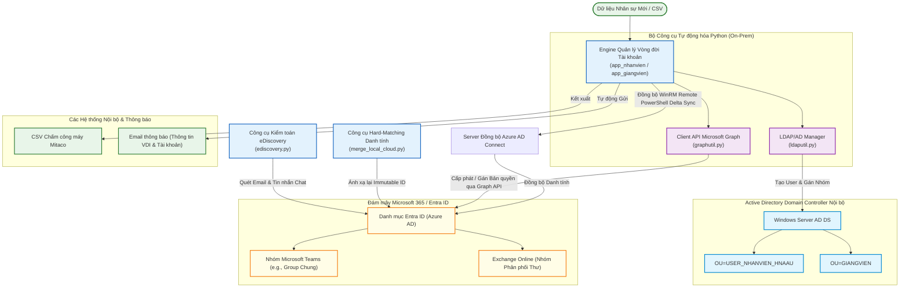

##### Chi tiết Kỹ thuật (Technical Details)
| Thành phần | Công nghệ / Kịch bản | Mô tả |
| :--- | :--- | :--- |
| **Cấp phát AD** | **`python-ldap`** | Thiết lập liên kết bảo mật LDAPS để tạo tài khoản trong các OU lồng nhau với mật khẩu mã hóa UTF-16LE. |
| **Cấp phát Cloud** | **`Office365-REST-Python-Client`** | Tích hợp API Microsoft Graph sử dụng luồng xác thực Client Credentials cấp ứng dụng. |
| **Đồng bộ AD Sync** | **`pywinrm` (WinRM NTLM)** | Thực thi từ xa lệnh `Start-ADSyncSyncCycle -PolicyType Delta` trên máy chủ đồng bộ AD Connect. |
| **Hard-Matching Danh tính**| **`merge_local_cloud.py`** | Ánh xạ lại `onPremisesImmutableId` trên cloud khớp với `objectGUID` của AD nội bộ để xử lý lỗi trùng/xung đột tài khoản. |
| **Kiểm toán Tuân thủ** | **`ediscovery.py`** | Tìm kiếm OData trên các hộp thư, Teams và chat để xuất báo cáo CSV phục vụ kiểm toán bảo mật. |
| **Phân tích OneDrive** | **`user-check.py`** | Quét dung lượng đĩa và phân tích cây thư mục để cô lập các tệp dung lượng quá khổ trên OneDrive của người dùng. |

##### Mã nguồn các tập lệnh tự động hóa (Automation Scripts)

###### 1. Tập lệnh Hard-Matching Danh tính (`merge_local_cloud.py`)
Tập lệnh này xử lý lỗi xung đột/đồng bộ tài khoản AD-Cloud bằng cách chuyển đổi thuộc tính nhị phân `objectGUID` của người dùng Active Directory nội bộ sang chuỗi Base64, sau đó ánh xạ thuộc tính này vào `onPremisesImmutableId` của Entra ID thông qua API Microsoft Graph.

```python
import base64
import requests

def convert_guid_to_immutable_id(object_guid_hex: str) -> str:
    """Chuyển đổi chuỗi Hex objectGUID của Active Directory sang định dạng chuỗi Base64."""
    clean_hex = object_guid_hex.replace("-", "").replace(" ", "")
    guid_bytes = bytes.fromhex(clean_hex)
    return base64.b64encode(guid_bytes).decode("utf-8")

def update_cloud_immutable_id(access_token: str, user_upn: str, immutable_id: str):
    """Cập nhật thuộc tính onPremisesImmutableId của tài khoản trên Microsoft Entra ID."""
    url = f"https://graph.microsoft.com/v1.0/users/{user_upn}"
    headers = {
        "Authorization": f"Bearer {access_token}",
        "Content-Type": "application/json"
    }
    payload = {
        "onPremisesImmutableId": immutable_id
    }
    response = requests.patch(url, headers=headers, json=payload)
    if response.status_code == 204:
        print(f"[THÀNH CÔNG] Đồng bộ {user_upn} -> Immutable ID: {immutable_id}")
    else:
        print(f"[LỖI] Không thể cập nhật {user_upn}. Code: {response.status_code}, Phản hồi: {response.text}")
```

###### 2. Tập lệnh Kiểm toán Tuân thủ (`ediscovery.py`)
Tập lệnh CLI sử dụng các truy vấn OData của Microsoft Graph API để quét hộp thư và tin nhắn Teams của người dùng theo từ khóa chỉ định, phục vụ công tác kiểm toán tuân thủ bảo mật và xuất báo cáo ra file CSV.

```python
import csv
import requests

def scan_user_mailbox(access_token: str, user_upn: str, search_keyword: str, output_path: str):
    """Quét hộp thư người dùng bằng OData $search và xuất các kết quả khớp ra file CSV."""
    url = f"https://graph.microsoft.com/v1.0/users/{user_upn}/messages"
    headers = {
        "Authorization": f"Bearer {access_token}",
        "Content-Type": "application/json"
    }
    params = {
        "$search": f'"{search_keyword}"',
        "$select": "subject,sender,receivedDateTime,hasAttachments,webLink"
    }
    response = requests.get(url, headers=headers, params=params)
    if response.status_code == 200:
        messages = response.json().get("value", [])
        with open(output_path, mode="w", newline="", encoding="utf-8") as csv_file:
            writer = csv.writer(csv_file)
            writer.writerow(["Tiêu đề", "Người gửi", "Ngày nhận", "Có tệp đính kèm", "Liên kết Web"])
            for msg in messages:
                sender_email = msg.get("sender", {}).get("emailAddress", {}).get("address", "Không rõ")
                writer.writerow([
                    msg.get("subject"),
                    sender_email,
                    msg.get("receivedDateTime"),
                    msg.get("hasAttachments"),
                    msg.get("webLink")
                ])
        print(f"[THÀNH CÔNG] Đã hoàn thành quét kiểm toán. Kết quả xuất ra: {output_path}")
    else:
        print(f"[LỖI] Quét thất bại. Code: {response.status_code}, Phản hồi: {response.text}")
```

###### 3. Tập lệnh Phân tích Dung lượng & Định vị Tệp lớn OneDrive (`user-check.py`)
Tập lệnh này kiểm tra tình trạng sử dụng dung lượng lưu trữ OneDrive của người dùng và lọc ra các tệp lớn vượt ngưỡng cấu hình, giúp quản trị viên cô lập các tệp dung lượng quá khổ.

```python
import requests

def analyze_onedrive_storage(access_token: str, user_upn: str, size_threshold_mb: int = 100):
    """Kiểm tra hạn mức OneDrive của người dùng và liệt kê các tệp lớn hơn ngưỡng chỉ định."""
    url = f"https://graph.microsoft.com/v1.0/users/{user_upn}/drive"
    headers = {"Authorization": f"Bearer {access_token}"}
    
    # Lấy thông tin hạn mức ổ đĩa
    drive_resp = requests.get(url, headers=headers)
    if drive_resp.status_code != 200:
        print(f"[LỖI] Không thể lấy thông tin hạn mức. Code: {drive_resp.status_code}")
        return
        
    quota = drive_resp.json().get("quota", {})
    total_gb = quota.get("total", 0) / (1024**3)
    used_gb = quota.get("used", 0) / (1024**3)
    print(f"User: {user_upn} | Tổng dung lượng: {total_gb:.2f} GB | Đã dùng: {used_gb:.2f} GB ({quota.get('used', 0)/(quota.get('total', 1))*100:.1f}%)")

    # Tìm kiếm các tệp lớn
    threshold_bytes = size_threshold_mb * 1024 * 1024
    search_url = f"{url}/root/search(q='')"
    params = {
        "$filter": f"size gt {threshold_bytes}",
        "$select": "name,size,webUrl"
    }
    search_resp = requests.get(search_url, headers=headers, params=params)
    if search_resp.status_code == 200:
        large_files = search_resp.json().get("value", [])
        print(f"Các tệp lớn tìm thấy (> {size_threshold_mb} MB):")
        for item in large_files:
            file_mb = item.get("size", 0) / (1024**2)
            print(f" - {item.get('name')} ({file_mb:.2f} MB) -> {item.get('webUrl')}")
    else:
        print(f"[LỖI] Truy vấn tệp lớn thất bại. Code: {search_resp.status_code}, Phản hồi: {search_resp.text}")

---

### 3. Hạ tầng DevOps & Tự động hóa (DevOps & Automation Infrastructure)

#### 3.1. Vòng đời Ứng dụng Doanh nghiệp & Pipeline CI/CD (Enterprise Application Lifecycle & CI/CD Pipelines)

##### Use Case
Quản lý vòng đời phát triển, tự động hóa và đóng gói phát hành các ứng dụng doanh nghiệp với các tiêu chuẩn bảo mật và nền tảng nghiêm ngặt.

##### Problem / Scenario & Solution
**Bài toán:** Đảm bảo việc build, ký và phát hành các ứng dụng đa nền tảng một cách an toàn, lặp lại và tự động mà không để lộ các tệp Keystore bảo mật hoặc phải build thủ công từ máy lập trình viên.
**Giải pháp:** Thiết kế và vận hành **pipeline GitLab CI/CD** nhiều giai đoạn chạy trên các GitLab Runner tự quản (self-hosted). Pipeline tự động lấy mã khóa bảo mật, build các gói phát hành Android App Bundle (AAB) sử dụng **Flutter**, chạy test tự động, tải các build artifact lên **GitLab Package Registry**, và triển khai trực tiếp đến các kênh test nội bộ (internal) và sản xuất (production) của **Google Play Console** thông qua **Fastlane**.

##### Sơ đồ Kiến trúc (Architecture Diagram)
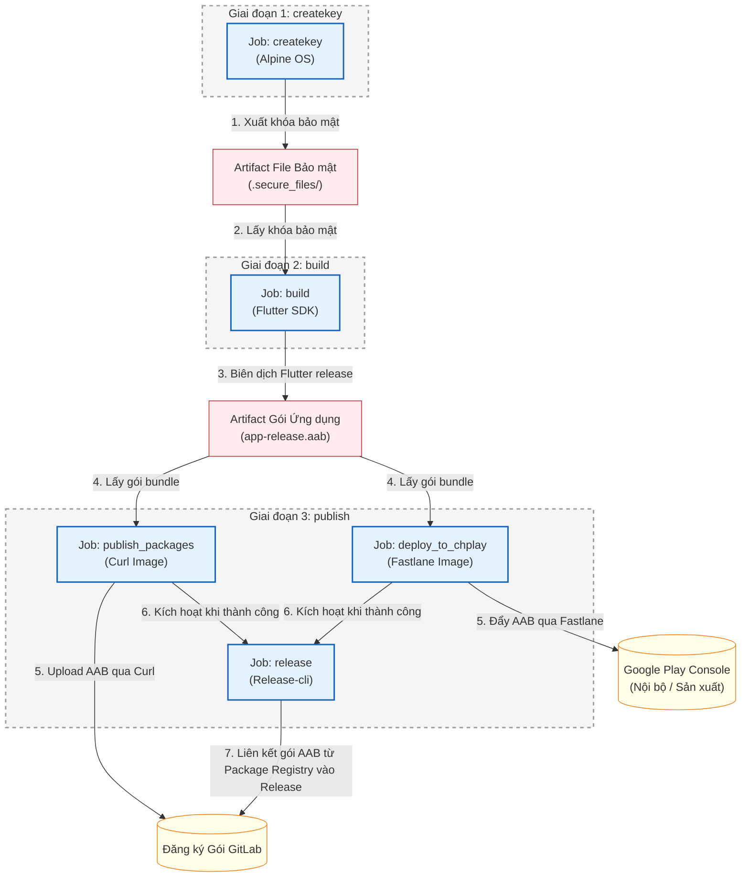

##### Chi tiết Kỹ thuật (Technical Details)
```yaml
variables:
  FLUTTERVER: 3.19.5

stages:
  - createkey
  - build
  - publish

createkey:
  stage: createkey
  image: "alpine:latest"
  before_script:
    - echo "Install bash and curl"
    - apk add --no-cache bash curl
  variables:
    GIT_STRATEGY: clone
  script:
    - chmod +x ./scripts/download-secure
    - bash ./scripts/download-secure
  tags:
    - flutter-runner
  only:
    - tags
  artifacts:
    expire_in: 1 hour
    paths:
      - .secure_files/

build:
  stage: build
  image: "instrumentisto/flutter:${FLUTTERVER}"
  needs:
    - createkey
  variables:
    GIT_STRATEGY: clone
  before_script:
    - flutter pub global activate rps
    - export PATH="$PATH":"$HOME/.pub-cache/bin"
  script:
    - rps reset
    - rps generate all
    - cp .secure_files/* ./android/app/
    - echo "storeFile=./upload-keystore.jks" >> android/key.properties
    - echo "storePassword=${passwordKeyandStore}" >> android/key.properties
    - echo "keyPassword=${passwordKeyandStore}" >> android/key.properties
    - echo "keyAlias=${keyAlias}" >> android/key.properties
    - "APP_VERSION=$(grep -o 'version: [0-9]\\+\\.[0-9]\\+\\.[0-9]\\+' pubspec.yaml | awk '{print $2}')"
    - BUILD_NUMBER=$(TZ=UTC date -d "$CI_JOB_STARTED_AT" "+%Y%m%d%M")
    - flutter build appbundle --build-name=${APP_VERSION} --build-number=${BUILD_NUMBER} --release
  artifacts:
    expire_in: 1 hour
    paths:
      - build/app/outputs/bundle/release/app-release.aab
  dependencies:
    - createkey
  tags:
    - flutter-runner
  only:
    - tags

publish_packages:
  stage: publish
  needs: 
    - build
  image: curlimages/curl:latest
  dependencies: 
    - build
  script:
      - cp -r build/app/outputs/bundle/release ./
      - 'curl --header "JOB-TOKEN: $CI_JOB_TOKEN" --upload-file ./release/app-release.aab "${CI_API_V4_URL}/projects/${CI_PROJECT_ID}/packages/generic/drift-survivors/${CI_COMMIT_TAG}/app-release.aab"'
  only:
    - tags
  tags:
    - flutter-runner

deploy_to_chplay:
  stage: publish
  image: cijumbo/fastlane:2.220.0
  variables:
    GIT_STRATEGY: clone
  dependencies:
    - build
  needs: 
    - build
  before_script:
    - cp -r build/app/outputs/bundle/release ./
    - apt install -y curl bash
    - chmod +x ./scripts/download-secure
    - bash ./scripts/download-secure
    - cp ./.secure_files/google_play_service_account.json ./google_play_api_key.json  
    - bundle update fastlane
  script: 
    - "APP_VERSION=$(grep -o 'version: [0-9]\\+\\.[0-9]\\+\\.[0-9]\\+' pubspec.yaml | awk '{print $2}')"
    - bundle exec fastlane supply --track internal --aab  ./release/app-release.aab --json_key ./google_play_api_key.json --package_name ${Packages_name}
    - bundle exec fastlane supply --track internal --track_promote_to production --changes_not_sent_for_review false  --json_key ./google_play_api_key.json  --package_name ${Packages_name}
  after_script:
    - rm ./google_play_api_key.json
  tags:
    - flutter-runner
  only:
    - tags

release:
  stage: publish
  needs: 
    - publish_packages
    - deploy_to_chplay
  image: registry.gitlab.com/gitlab-org/release-cli:latest
  before_script:
    - apk add git
  script:
    - echo "Creating release $CI_COMMIT_TAG..."
  release:
    tag_name: $CI_COMMIT_TAG
    description: |
      Changes:
      $(git log $(git describe --abbrev=0 --tags --exclude=$CI_COMMIT_TAG).$CI_COMMIT_TAG --oneline --no-decorate --reverse | sed "s/^[^ ]* /- /g")
    assets:
      links:
        - name: AAB
          url: ${CI_API_V4_URL}/projects/${CI_PROJECT_ID}/packages/generic/drift-survivors/${CI_COMMIT_TAG}/app-release.aab
          link_type: package
  only:
    - tags
  tags:
    - flutter-runner
```

---

#### 3.2. Cấp phát Container theo yêu cầu & Định tuyến Biên Traefik (On-Demand Container Provisioning & Traefik Edge Ingress)

##### Use Case
Mở rộng các container instance chạy dịch vụ/worker độc lập theo yêu cầu (on-demand), đồng thời tự động hóa định tuyến Layer 7, ánh xạ subdomain và tự động cấp phát chứng chỉ bảo mật SSL/TLS cho các ứng dụng multi-tenant.

##### Problem / Scenario & Solution
**Bài toán:** Mở rộng các không gian làm việc ảo của người dùng cấp phát động, trong đó mỗi session yêu cầu một container Docker độc lập. Việc cập nhật động các thay đổi vào một file docker-compose duy nhất có dung lượng lớn gây ra độ trễ tải lại rất cao (khoảng 15-30 giây).
**Giải pháp:** Phát triển một hệ thống điều phối micro-orchestration sử dụng Python Flask API, Redis và API Portainer. Khi người dùng yêu cầu một session mới, API sẽ triển khai một **Micro-Stack** riêng biệt (một file docker-compose độc lập cho từng user) thông qua các endpoint API của Portainer, giúp giảm thời gian triển khai xuống chỉ còn **1-2 giây**. Cấu hình **Traefik** làm proxy ngược ở biên (edge reverse proxy), tự động nhận diện các nhãn (labels) của container mới qua Docker provider, tự động map subdomain và gửi yêu cầu cấp chứng chỉ SSL đến Let's Encrypt.

##### Sơ đồ Kiến trúc (Architecture Diagram)
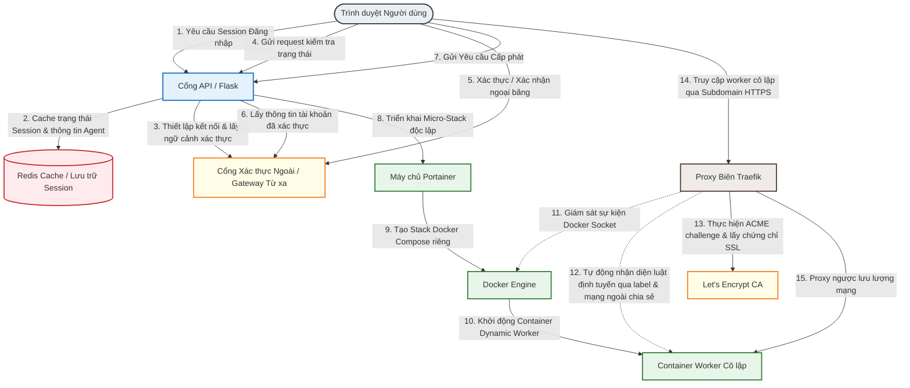

##### Chi tiết Kỹ thuật (Technical Details)
| Thành phần | Công nghệ | Mô tả |
| :--- | :--- | :--- |
| **API Gateway & Logic** | **Python Flask (asyncio, PyYAML)** | Xử lý quản lý session động, phân tích cấu hình Docker Compose và tích hợp với API điều phối. |
| **Lưu trữ trạng thái & Cache**| **Redis** | Lưu cache session token, khóa thực thi và các trạng thái xác minh tạm thời để tránh xung đột request. |
| **Client Điều phối** | **Portainer API** | Cấp phát lập trình các **Micro-Stacks** (file compose độc lập) qua API Portainer (`POST /api/stacks/create/standalone/string`), giải quyết độ trễ cập nhật của compose nguyên khối (~15-30s giảm xuống dưới một giây). |
| **Proxy ngược ở biên** | **Traefik (Docker Provider)** | Đăng ký động đường dẫn định tuyến, ràng buộc subdomain, tự động giải quyết SSL challenge qua Let's Encrypt (HTTP/DNS challenge) và quản lý lưu lượng client. |
| **Môi trường Worker** | **Docker Container** | Một instance không gian làm việc cô lập chạy các microservice theo yêu cầu cho từng người dùng đã xác thực. |

```yaml
networks:
  custom_network:
    name: app_cloud_system_custom_network
    external: true

services:
  account-${phone_number}:
    image: enterprise/app-service:latest
    networks:
      - custom_network
    labels:
      - "traefik.enable=true"
      - "traefik.http.services.service-${service_id}.loadbalancer.server.port=5001"
      - "traefik.http.routers.service-${service_id}-https.rule=Host(`service-${service_id}.domain.com`)"
      - "traefik.http.routers.service-${service_id}-https.entrypoints=websecure"
      - "traefik.http.routers.service-${service_id}-https.tls=true"
      - "traefik.http.routers.service-${service_id}-https.tls.certresolver=letsencrypt"
```
